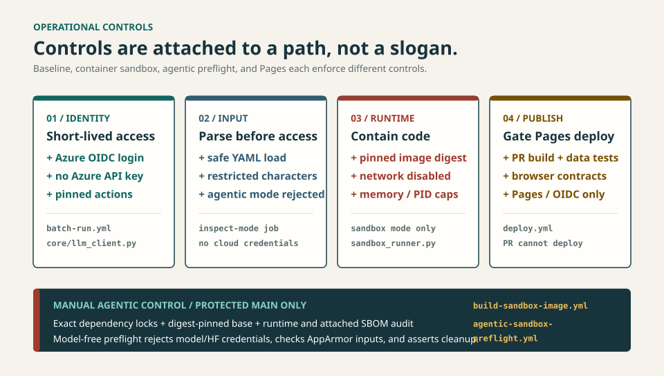

<p align="center">
  
</p>

<h1 align="center">GDPVal RealWorks</h1>

<p align="center">
  <strong>Benchmark LLMs on real expert work, not toy prompts.</strong><br/>
  <em>A reproducible experiment pipeline and evidence dashboard for the <a href="https://arxiv.org/abs/2510.04374">GDPVal</a> Gold Subset: 220 tasks across 9 sectors and 44 occupations.</em>
</p>

<p align="center">
  <a href="https://github.com/hyeonsangjeon/gdpval-realworks/actions/workflows/deploy.yml">
    
  </a>
  <a href="../../actions/workflows/batch-run.yml">
    
  </a>
  <a href="LICENSE">
    
  </a>
</p>

<p align="center">
  <a href="https://hyeonsangjeon.github.io/gdpval-realworks/"><strong>Live Dashboard</strong></a> |
  <a href="docs/first-experiment.md"><strong>First Experiment</strong></a> |
  <a href="batch-runner/sandbox/README.md"><strong>Sandbox &amp; Security</strong></a> |
  <a href="README_KR.md">한국어</a> |
  <a href="https://arxiv.org/abs/2510.04374">Paper</a>
</p>

---

## Start here

**[Live dashboard](https://hyeonsangjeon.github.io/gdpval-realworks/)** |
**[Three-task sample config](batch-runner/experiments/exp998_smoke_baseline_sample.yaml)** |
**[Run Batch workflow](../../actions/workflows/batch-run.yml)** |
**[Results and artifacts](docs/first-experiment.md#7-know-what-success-looks-like)**

- **See the evidence:** [open the live dashboard](https://hyeonsangjeon.github.io/gdpval-realworks/).
  A browser is enough.
- **Preview locally:** run `npm ci && npm run dev`. You need Git and Node.js 20+,
  but no cloud credentials.
- **Run three real tasks:** inspect the
  [sample config](batch-runner/experiments/exp998_smoke_baseline_sample.yaml),
  then follow the [beginner guide](docs/first-experiment.md) to launch the
  [Batch workflow](../../actions/workflows/batch-run.yml) in your fork.
  You need a fork, Azure OIDC, a Hugging Face (HF) write token, and a real API budget.

The local dashboard path does not need cloud credentials and does not call an
LLM:

```bash
git clone https://github.com/hyeonsangjeon/gdpval-realworks.git
cd gdpval-realworks
npm ci
npm run dev
```

> **Cloud-run boundary:** `dry_run: true` still calls the model, runs Self-QA,
> and can create or update the configured Hugging Face dataset. It skips Step 5
> validation, final result publication, and the result PR; it does not mean
> "free" or "no writes." This three-task smoke also skips Step 5 because of its
> sample size.

**[English first-run guide](docs/first-experiment.md)** |
**[한국어 첫 실행 가이드](docs/first-experiment_KR.md)** |
**[Batch Runner reference](batch-runner/README.md)**

---

## Why RealWorks

Many benchmarks stop at text answers. GDPVal asks models to complete work that
looks like the job: spreadsheets, reports, presentations, media, and other
reviewable files. The Gold Subset covers **220 tasks across 9 industry sectors
and 44 occupations**.

This repository turns those tasks into a repeatable loop:
**configure -> execute -> preserve evidence -> grade -> compare**. A YAML file
defines the intervention; GitHub Actions records the run; the dashboard keeps
results, failures, artifacts, and research notes inspectable.

It deliberately keeps four signals separate:

| Signal | What it proves | What it does not prove |
|---|---|---|
| Execution completion | The pipeline reached a terminal task state | The file is correct |
| Artifact integrity | Expected files exist and pass deterministic checks | The work satisfies every requirement |
| Self-QA | The generating model accepted or retried its own output | Independent quality |
| External grading | A separate rubric-based evaluation was recorded | Universal human agreement |

<p align="center">
  <a href="https://hyeonsangjeon.github.io/gdpval-realworks/">
    
  </a>
</p>
<p align="center"><em>Live evidence: experiment comparisons, failure analysis, external grades, and field notes.</em></p>

---

## System map

<p align="center">
  <picture>
    <source media="(max-width: 960px)" srcset="docs/images/readme-system-map-mobile.svg" />
    
  </picture>
</p>

Steps 0-7 own experiment execution and publication. External grading is a
separate pipeline, and the dashboard aggregates both without treating them as
the same measurement.

---

## Operational controls

<p align="center">
  <picture>
    <source media="(max-width: 960px)" srcset="docs/images/readme-trust-boundaries-mobile.svg" />
    
  </picture>
</p>

These are code-backed, path-specific controls, not a blanket security claim:

| Boundary | Enforced today | Evidence |
|---|---|---|
| Azure identity | The batch Azure path uses GitHub OIDC and does not inject `AZURE_OPENAI_API_KEY` | [`batch-run.yml`](.github/workflows/batch-run.yml), [`llm_client.py`](batch-runner/core/llm_client.py) |
| Configuration input | A no-credential job validates the experiment name and safely parses YAML before the credentialed job; agentic modes are rejected from the general batch path | [`batch-run.yml`](.github/workflows/batch-run.yml) |
| Container sandbox | Sandbox runs resolve an immutable image digest across relay jobs; Docker execution disables networking and applies resource limits | [`batch-run.yml`](.github/workflows/batch-run.yml), [`sandbox_runner.py`](batch-runner/core/sandbox_runner.py) |
| Agentic image supply chain | Manual protected-main publication requires immutable dependency locks, a digest-pinned base, runtime audit, and SBOM evidence | [`build-sandbox-image.yml`](.github/workflows/build-sandbox-image.yml) |
| Agentic containment preflight | A manual model-free job rejects model/HF credentials, requires an exact preloaded image and AppArmor input, runs containment tests, and asserts cleanup | [`agentic-sandbox-preflight.yml`](.github/workflows/agentic-sandbox-preflight.yml) |
| Dashboard publication | Pull requests aggregate, build, and run data/browser contracts; only push/manual deploy jobs receive Pages/OIDC permissions | [`deploy.yml`](.github/workflows/deploy.yml) |

The default three-task smoke config uses provider-hosted `code_interpreter`.
Docker sandbox and agentic controls apply only to their named paths. The general
batch workflow currently rejects agentic execution before cloud credentials are
used; the checked-in agentic workflow is a model-free preflight, not a paid run.

---

## First cloud experiment

Use the checked-in
[`exp998_smoke_baseline_sample.yaml`](batch-runner/experiments/exp998_smoke_baseline_sample.yaml)
only after changing `data.source` to a new dataset in your own Hugging Face
namespace.

From **Actions > Run GDPVal Batch Experiment**, use:

| Input | First-run value |
|---|---|
| `experiment_yaml` | `exp998_smoke_baseline_sample` |
| `experiment_name` | leave empty |
| `dry_run` | `true` |
| `relay_run` | `0` |
| `relay_lineage_id` | leave empty |
| `source_sha` | leave empty |
| `wall_timeout` | `290` |
| `sandbox_image_digest` | leave empty |

Expected behavior:

1. Step 0 reuses a valid target or fully validates the pinned source locally
  before creating and uploading a disposable Hugging Face dataset once. A
  partial target or ambiguous outcome aborts without retry or automatic deletion.
2. Step 1 selects three tasks deterministically.
3. Step 2 calls `gpt-5.2-chat`, creates files, and can retry same-model Self-QA.
4. Steps 3-4 write formatted results and a three-row Parquet artifact.
5. Step 5 is skipped because this is both a dry run and a three-task sample.
6. Step 6's primary report path makes up to two sequential `gpt-5.4-pro` calls;
  on error, it attempts one `gpt-5.2-chat` fallback call. Completed calls can
  be billed. Narrative failure is non-blocking only because a mandatory
  model-free report fallback and identity check run before publication.
7. Step 7 and the result PR are skipped by `dry_run: true`.

If the credentialed batch job reaches its final `always()` step, it attempts to
upload `batch-results-<run_id>` for inspection and retain it for 30 days. The
**[complete beginner guide](docs/first-experiment.md)** covers OIDC, required
secrets, cost boundaries, artifacts, and common failures.

---

## Execution modes

| Mode | Execution boundary | Use it for |
|---|---|---|
| `code_interpreter` | Provider-hosted code tools and file retrieval | The current Azure smoke path |
| `subprocess` | Generated Python runs in a host temporary directory | Legacy/local compatibility; review the trust boundary first |
| `sandbox` | Docker when available, with no network, resource caps, skills, verification, and render QA; `auto` can fall back locally | Reproducible document and multimodal work |
| `json_renderer` | The model emits a spec and a deterministic renderer creates files | Renderer-controlled A/B comparisons |

To require Docker rather than permit fallback, set `execution.sandbox.use_docker`
to `always`. See the **[sandbox operator guide](batch-runner/sandbox/README.md)**
before changing execution modes.

### Self-QA is not external grading

Self-QA asks the same model to inspect its own result and retry below a configured
threshold. It is an inference-time reflection gate. Independent rubric grading
is recorded by a separate pipeline and displayed as a separate signal.

---

## Dashboard

The **[live dashboard](https://hyeonsangjeon.github.io/gdpval-realworks/)** is a
static React application backed by generated repository data.

| View | What you can inspect |
|---|---|
| Leaderboard and trends | Experiment-level completion, latency, and external grade comparisons |
| Sector heatmap | Performance variation across 9 sectors |
| Experiment detail | All 220 task states, files, prompts, retries, and errors |
| Grading analysis | Evidence-linked rubric results and judge metadata |
| RealWorks Field Notes | Chronological engineering decisions with explicit evidence caveats |

Dashboard implementation details are in [`src/README.md`](src/README.md).

---

## Develop and verify

Dashboard checks require Node.js 20 or newer:

```bash
npm ci
npm run aggregate
npm run test:aggregate
npm run build
```

Backend unit tests do not require model credentials:

```bash
cd batch-runner
python -m venv .venv
source .venv/bin/activate
pip install -r requirements.txt
pytest
```

Integration tests, inference, grading, uploads, and workflow dispatches can use
cloud credentials or incur cost; run them only when that is your intent.

## Repository map

| Path | Responsibility |
|---|---|
| [`batch-runner/`](batch-runner/README.md) | Experiment configs, execution pipeline, grading, prompts, and tests |
| [`batch-runner/sandbox/`](batch-runner/sandbox/README.md) | Container image, execution controls, skills, verification, and render QA |
| [`src/`](src/README.md) | React dashboard pages, components, hooks, and data presentation |
| [`scripts/`](scripts/) | Deterministic aggregation and analysis tools |
| [`data/`](data/) | Checked-in experiment summaries and external grade records |
| [`.github/workflows/`](.github/workflows/) | Batch, grading, sandbox, validation, and Pages automation |

---

## References

- [GDPVal paper](https://arxiv.org/abs/2510.04374)
- [GDPVal dataset](https://huggingface.co/datasets/openai/gdpval)
- [OpenAI Evals](https://evals.openai.com/)
- [Azure OpenAI documentation](https://learn.microsoft.com/azure/ai-services/openai/)

## Author

**Hyeonsang Jeon**<br/>
Sr. Solution Engineer, Global Black Belt - AI Apps | Microsoft Asia, Korea<br/>
[GitHub](https://github.com/hyeonsangjeon) |
[Live Dashboard](https://hyeonsangjeon.github.io/gdpval-realworks/)

## License

MIT. See [`LICENSE`](LICENSE).