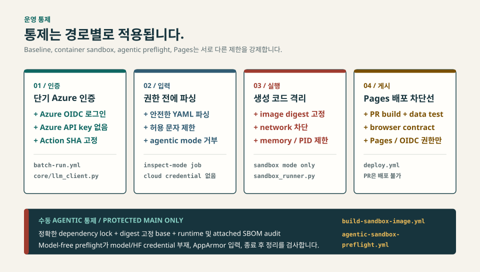

<p align="center">
  
</p>

<h1 align="center">GDPVal RealWorks</h1>

<p align="center">
  <strong>장난감 프롬프트가 아니라 실제 전문가 업무로 LLM을 벤치마크합니다.</strong><br/>
  <em><a href="https://arxiv.org/abs/2510.04374">GDPVal</a> Gold Subset의 9개 산업, 44개 직종, 220개 태스크를 위한 재현 가능한 실험 파이프라인과 근거 대시보드입니다.</em>
</p>

<p align="center">
  <a href="https://github.com/hyeonsangjeon/gdpval-realworks/actions/workflows/deploy.yml">
    
  </a>
  <a href="../../actions/workflows/batch-run.yml">
    
  </a>
  <a href="LICENSE">
    
  </a>
</p>

<p align="center">
  <a href="https://hyeonsangjeon.github.io/gdpval-realworks/"><strong>라이브 대시보드</strong></a> |
  <a href="docs/first-experiment_KR.md"><strong>첫 실험</strong></a> |
  <a href="batch-runner/sandbox/README.md"><strong>샌드박스와 보안</strong></a> |
  <a href="README.md">English</a> |
  <a href="https://arxiv.org/abs/2510.04374">논문</a>
</p>

---

## 여기서 시작하세요

**[라이브 대시보드](https://hyeonsangjeon.github.io/gdpval-realworks/)** |
**[3-task 샘플 config](batch-runner/experiments/exp998_smoke_baseline_sample.yaml)** |
**[Batch workflow 실행](../../actions/workflows/batch-run.yml)** |
**[결과와 아티팩트](docs/first-experiment_KR.md#7-성공-상태-확인)**

- **근거 보기:** [라이브 대시보드](https://hyeonsangjeon.github.io/gdpval-realworks/)를
  엽니다. 브라우저만 있으면 됩니다.
- **로컬 미리보기:** `npm ci && npm run dev`를 실행합니다. Git과 Node.js 20+가
  필요하지만 클라우드 인증 정보는 필요 없습니다.
- **실제 태스크 3개 실행:**
  [샘플 config](batch-runner/experiments/exp998_smoke_baseline_sample.yaml)를
  확인한 뒤 [초보자 가이드](docs/first-experiment_KR.md)에 따라
  내 fork의 [Batch workflow](../../actions/workflows/batch-run.yml)를
  실행합니다. fork, Azure OIDC, Hugging Face(HF) 쓰기 토큰, 실제 API 예산이
  필요합니다.

로컬 대시보드는 클라우드 인증 정보가 필요 없고 LLM을 호출하지 않습니다.

```bash
git clone https://github.com/hyeonsangjeon/gdpval-realworks.git
cd gdpval-realworks
npm ci
npm run dev
```

> **클라우드 실행 경계:** `dry_run: true`여도 모델 호출과 Self-QA를
> 실행하고, 설정한 Hugging Face 데이터셋을 만들거나 수정할 수 있습니다.
> Step 5 검증, 최종 결과 게시, 결과 PR을 건너뜁니다. "무료"나 "원격 쓰기
> 없음"을 뜻하지 않습니다. 이 3-task smoke는 sample size 때문에도 Step 5를
> 생략합니다.

**[한국어 첫 실행 가이드](docs/first-experiment_KR.md)** |
**[English first-run guide](docs/first-experiment.md)** |
**[Batch Runner 문서](batch-runner/README_KR.md)**

---

## 왜 RealWorks인가

많은 벤치마크는 텍스트 답변에서 끝납니다. GDPVal은 모델에게 실제 업무와
닮은 스프레드시트, 보고서, 프레젠테이션, 미디어 등 검토 가능한 파일을
만들게 합니다. Gold Subset은 **9개 산업, 44개 직종, 220개 태스크**를
포함합니다.

이 저장소는 해당 태스크를 반복 가능한 루프로 만듭니다.
**설정 -> 실행 -> 근거 보존 -> 채점 -> 비교**. YAML이 실험 변수를
정의하고, GitHub Actions가 실행 기록을 남기며, 대시보드는 결과, 실패,
산출물, 연구 기록을 함께 검토할 수 있게 합니다.

다음 네 가지 신호는 의도적으로 분리합니다.

| 신호 | 증명하는 것 | 증명하지 못하는 것 |
|---|---|---|
| 실행 완료 | 파이프라인이 태스크의 종료 상태에 도달함 | 파일이 정확함 |
| 산출물 무결성 | 예상 파일이 있고 결정적 검사를 통과함 | 모든 요구사항을 충족함 |
| Self-QA | 생성 모델이 자신의 출력을 수락하거나 재시도함 | 독립적인 품질 |
| 외부 채점 | 별도 루브릭 평가가 기록됨 | 모든 사람의 보편적 동의 |

<p align="center">
  <a href="https://hyeonsangjeon.github.io/gdpval-realworks/">
    
  </a>
</p>
<p align="center"><em>실험 비교, 실패 분석, 외부 채점, Field Notes를 연결한 실행 근거.</em></p>

---

## 시스템 맵

<p align="center">
  <picture>
    <source media="(max-width: 960px)" srcset="docs/images/readme-system-map-mobile-ko.svg" />
    
  </picture>
</p>

Step 0-7은 실험 실행과 게시를 담당합니다. 외부 채점은 별도 파이프라인이며,
대시보드는 두 결과를 집계하되 같은 측정값으로 취급하지 않습니다.

---

## 운영 통제

<p align="center">
  <picture>
    <source media="(max-width: 960px)" srcset="docs/images/readme-trust-boundaries-mobile-ko.svg" />
    
  </picture>
</p>

아래 내용은 포괄적인 보안 보장이 아니라 코드로 확인할 수 있는 경로별
통제입니다.

| 경계 | 현재 강제되는 내용 | 근거 |
|---|---|---|
| Azure identity | 배치의 Azure 경로는 GitHub OIDC를 사용하고 `AZURE_OPENAI_API_KEY`를 주입하지 않음 | [`batch-run.yml`](.github/workflows/batch-run.yml), [`llm_client.py`](batch-runner/core/llm_client.py) |
| 설정 입력 | 인증 정보 없는 job이 실험 이름을 검사하고 YAML을 안전하게 파싱한 뒤 credential job을 시작하며, 일반 배치 경로는 agentic mode를 거부함 | [`batch-run.yml`](.github/workflows/batch-run.yml) |
| Container sandbox | sandbox 실행은 relay 전체에 immutable image digest를 유지하며, Docker 실행은 network를 끄고 resource limit을 적용함 | [`batch-run.yml`](.github/workflows/batch-run.yml), [`sandbox_runner.py`](batch-runner/core/sandbox_runner.py) |
| Agentic image supply chain | 수동 protected-main 게시에 immutable dependency lock, digest-pinned base, runtime audit, SBOM 근거를 요구함 | [`build-sandbox-image.yml`](.github/workflows/build-sandbox-image.yml) |
| Agentic containment preflight | 수동 model-free job이 model/HF credential 부재, 정확한 preloaded image와 AppArmor 입력, containment test, 종료 후 정리를 검사함 | [`agentic-sandbox-preflight.yml`](.github/workflows/agentic-sandbox-preflight.yml) |
| Dashboard publication | PR에서 aggregate, build, data/browser contract를 실행하고 push/manual deploy job만 Pages/OIDC 권한을 받음 | [`deploy.yml`](.github/workflows/deploy.yml) |

기본 3-task smoke는 provider-hosted `code_interpreter`를 사용합니다. Docker
sandbox와 agentic 통제는 각각 이름이 붙은 경로에만 적용됩니다. 일반 배치
워크플로는 cloud credential을 사용하기 전에 agentic 실행을 거부하며,
체크인된 agentic 워크플로는 유료 실행이 아니라 model-free preflight입니다.

---

## 첫 클라우드 실험

체크인된
[`exp998_smoke_baseline_sample.yaml`](batch-runner/experiments/exp998_smoke_baseline_sample.yaml)을
사용하되, 먼저 `data.source`를 내 Hugging Face namespace의 새 dataset으로
바꾸세요.

**Actions > Run GDPVal Batch Experiment**에서 다음 값을 사용합니다.

| 입력 | 첫 실행 값 |
|---|---|
| `experiment_yaml` | `exp998_smoke_baseline_sample` |
| `experiment_name` | 빈 값 |
| `dry_run` | `true` |
| `relay_run` | `0` |
| `relay_lineage_id` | 빈 값 |
| `source_sha` | 빈 값 |
| `wall_timeout` | `290` |
| `sandbox_image_digest` | 빈 값 |

예상 동작은 다음과 같습니다.

1. Step 0이 일회성 Hugging Face dataset을 만들거나 `data/`가 있는 대상을
  재사용합니다. 기존 partial target은 자동 삭제 없이 중단합니다.
2. Step 1이 태스크 3개를 결정적으로 선택합니다.
3. Step 2가 `gpt-5.2-chat`을 호출하고 파일을 만든 뒤 같은 모델의 Self-QA를 재시도할 수 있습니다.
4. Step 3-4가 포맷된 결과와 3-row Parquet artifact를 만듭니다.
5. dry run이면서 3-task sample이므로 Step 5를 건너뜁니다.
6. Step 6의 기본 report 경로는 `gpt-5.4-pro`를 순차적으로 최대 2회 호출하고,
  오류 시 `gpt-5.2-chat` fallback을 1회 시도합니다. 완료된 호출은 과금될
  수 있습니다. Narrative 실패 자체는 막지 않지만, 게시 전에 model-free
  report fallback과 identity 검증을 반드시 통과해야 합니다.
7. `dry_run: true`이므로 Step 7과 결과 PR을 건너뜁니다.

인증된 batch job이 마지막 `always()` 단계에 도달하면
`batch-results-<run_id>` artifact 업로드와 30일 보관을 시도합니다. OIDC,
필수 secret, 비용 경계, artifact, 자주 발생하는 오류는
**[한국어 전체 가이드](docs/first-experiment_KR.md)**에서 설명합니다.

---

## 실행 모드

| 모드 | 실행 경계 | 적합한 용도 |
|---|---|---|
| `code_interpreter` | Provider-hosted code tool과 파일 회수 | 현재 Azure smoke 경로 |
| `subprocess` | 생성된 Python을 host 임시 디렉터리에서 실행 | 레거시/로컬 호환. 먼저 신뢰 경계를 검토해야 함 |
| `sandbox` | 가능하면 Docker를 사용하고 network 차단, resource cap, skill, verification, render QA 적용. `auto`는 로컬 fallback 가능 | 재현 가능한 문서·멀티모달 작업 |
| `json_renderer` | 모델은 spec을 내고 결정적 renderer가 파일 생성 | renderer가 통제된 A/B 비교 |

Docker fallback을 허용하지 않으려면 `execution.sandbox.use_docker`를
`always`로 설정합니다. 실행 모드를 바꾸기 전에
**[sandbox 운영 가이드](batch-runner/sandbox/README.md)**를 읽으세요.

### Self-QA는 외부 채점이 아닙니다

Self-QA는 산출물을 만든 같은 모델에게 결과를 검사하게 하고 설정한
threshold 아래에서 재시도합니다. inference-time reflection gate입니다.
독립 루브릭 채점은 별도 파이프라인에서 기록하고 별도 신호로 표시합니다.

---

## 대시보드

**[라이브 대시보드](https://hyeonsangjeon.github.io/gdpval-realworks/)**는
저장소에서 생성한 데이터를 읽는 정적 React 애플리케이션입니다.

| 화면 | 확인할 수 있는 것 |
|---|---|
| Leaderboard와 trends | 실험별 완료율, latency, 외부 채점 비교 |
| Sector heatmap | 9개 산업의 성능 차이 |
| Experiment detail | 220개 태스크 상태, 파일, prompt, retry, error |
| Grading analysis | 근거가 연결된 rubric 결과와 judge metadata |
| RealWorks Field Notes | 근거의 한계를 명시한 시간순 엔지니어링 의사결정 |

구현 상세는 [`src/README_KR.md`](src/README_KR.md)에 있습니다.

---

## 개발과 검증

대시보드 검증에는 Node.js 20 이상이 필요합니다.

```bash
npm ci
npm run aggregate
npm run test:aggregate
npm run build
```

백엔드 unit test는 model credential 없이 실행할 수 있습니다.

```bash
cd batch-runner
python -m venv .venv
source .venv/bin/activate
pip install -r requirements.txt
pytest
```

Integration test, inference, grading, upload, workflow dispatch는 cloud
credential을 사용하거나 비용을 발생시킬 수 있습니다. 의도한 경우에만
실행하세요.

## 저장소 구조

| 경로 | 역할 |
|---|---|
| [`batch-runner/`](batch-runner/README_KR.md) | 실험 설정, 실행 파이프라인, 채점, prompt, test |
| [`batch-runner/sandbox/`](batch-runner/sandbox/README.md) | Container image, 실행 통제, skill, verification, render QA |
| [`src/`](src/README_KR.md) | React dashboard page, component, hook, data presentation |
| [`scripts/`](scripts/) | 결정적 집계와 분석 도구 |
| [`data/`](data/) | 체크인된 실험 요약과 외부 채점 기록 |
| [`.github/workflows/`](.github/workflows/) | Batch, grading, sandbox, validation, Pages 자동화 |

---

## 참고 자료

- [GDPVal 논문](https://arxiv.org/abs/2510.04374)
- [GDPVal 데이터셋](https://huggingface.co/datasets/openai/gdpval)
- [OpenAI Evals](https://evals.openai.com/)
- [Azure OpenAI 문서](https://learn.microsoft.com/azure/ai-services/openai/)

## 저자

**전현상 (Hyeonsang Jeon)**<br/>
Sr. Solution Engineer, Global Black Belt - AI Apps | Microsoft Asia, Korea<br/>
[GitHub](https://github.com/hyeonsangjeon) |
[라이브 대시보드](https://hyeonsangjeon.github.io/gdpval-realworks/)

## 라이선스

MIT. 자세한 내용은 [`LICENSE`](LICENSE)를 참고하세요.