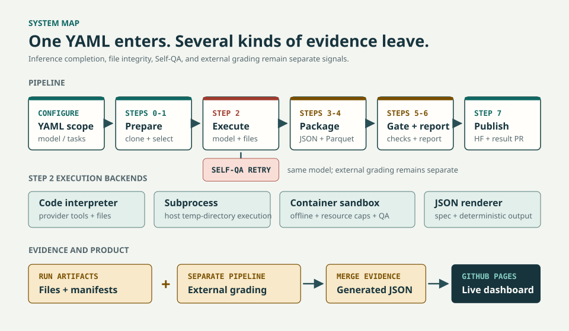

# GDPVal Batch Runner

A Python pipeline that runs LLM experiments on the [OpenAI GDPVal](https://huggingface.co/datasets/openai/gdpval) Gold Subset (220 tasks) and uploads results to HuggingFace.

## Start here

- **See published evidence:** [open the live dashboard](https://hyeonsangjeon.github.io/gdpval-realworks/).
- **Inspect the smallest real run:** open
  [`exp998_smoke_baseline_sample.yaml`](experiments/exp998_smoke_baseline_sample.yaml).
- **Launch the supported cloud path:** use
  [Run GDPVal Batch Experiment](../../../actions/workflows/batch-run.yml)
  with `experiment_yaml=exp998_smoke_baseline_sample`.
- **Find the outputs:** read
  [Results and artifacts](../docs/first-experiment.md#7-know-what-success-looks-like).

For a first run, follow the [beginner guide](../docs/first-experiment.md). It is
the canonical setup path for Azure OIDC, a disposable Hugging Face target, cost
boundaries, and the three-task smoke test.

## Architecture

<picture>
  <source media="(max-width: 960px)" srcset="../docs/images/readme-system-map-mobile.svg" />
  
</picture>

## Quick Start

### Recommended: GitHub Actions

1. Fork this repository and edit only `data.source` in the
   [three-task sample config](experiments/exp998_smoke_baseline_sample.yaml) to
   point to a new disposable dataset in your Hugging Face namespace.
2. Configure the five repository secrets and required identity variables listed in the
   [beginner guide](../docs/first-experiment.md#5-add-repository-secrets).
3. Open the
  [Batch workflow](../../../actions/workflows/batch-run.yml) in your fork on
  `main`, enter `exp998_smoke_baseline_sample`, and leave the internal relay
   fields at their defaults.
4. Start with `dry_run: true` only after reading the boundary below.

> `dry_run: true` still performs Step 0, calls the model, runs Self-QA, and may
> write relay checkpoints. It skips Step 5, final Step 7 publication, and the
> result pull request. It is not a free or no-write simulation.

### Local step-by-step debugging

This path requires Python 3.11, Azure CLI login, a real model budget, and a
disposable Hugging Face target already configured in the sample YAML. It still
calls the model and writes to Hugging Face in Step 0.

```bash
cd batch-runner
python3 -m venv .venv
source .venv/bin/activate
pip install -r requirements.txt
az login

export HF_TOKEN="<dedicated-hf-write-token>"
export AZURE_AI_ROUTE_PROFILE="project-ci"
export AZURE_OPENAI_V1_ENDPOINT="https://<foundry-resource>.services.ai.azure.com/openai/v1/"
export FOUNDRY_PROJECT_ENDPOINT="https://<foundry-resource>.services.ai.azure.com/api/projects/<project-name>"
CONFIG="experiments/exp998_smoke_baseline_sample.yaml"

bash step0_bootstrap.sh "$CONFIG"
bash step1_prepare_tasks.sh "$CONFIG"
bash step2_run_inference.sh condition_a
bash step3_format_results.sh
bash step4_fill_parquet.sh

# The 3-task smoke skips Step 5. Generate a model-free, unpublished report.
bash step6_report.sh --no-narrative --dry-run
```

Do not run Step 7 just to test setup. If you intentionally want to publish the
three-row smoke result, first replace the unpublished self-report with
`bash step6_report.sh --no-narrative`, then run
`bash step7_upload_hf.sh --test`. Step 7 rejects a dry-run or stale report and
requires its repository, prepared fingerprint, Step 2 result fingerprint,
run-specific publication generation, ordered task IDs, and result task set to
match the current workspace. A new Step 1 invalidates a prior finalized run,
while relay legs retain the initial generation. The parquet submitter
text/files/URLs/URIs must also equal the current Step 2 result before Step 7
CAS-replaces remote `data/**`, `deliverable_files/**`, and `self_report.json`.

## Authentication and environment variables

| Variable | Required | Description |
|----------|----------|-------------|
| `HF_TOKEN` | Cloud publication | Dedicated Hugging Face write token used by bootstrap, relay persistence, and Step 7 |
| `AZURE_AI_ROUTE_PROFILE` | Azure | `direct-v1` for direct inference, or `project-ci` to route only Code Interpreter through the Foundry project |
| `AZURE_OPENAI_V1_ENDPOINT` | Azure | Direct OpenAI-compatible `/openai/v1/` endpoint on the approved Azure/Foundry resource |
| `FOUNDRY_PROJECT_ENDPOINT` | `project-ci` | Foundry project endpoint ending in `/api/projects/<project-name>` |
| `AZURE_OPENAI_LEGACY_ENDPOINT` | Rollback only | Dated Azure OpenAI resource endpoint; never used by the supported direct/project workflows |
| `AZURE_AI_ALLOW_LEGACY_ROLLBACK` | Rollback only | Must be exactly `1` to authorize the `legacy-rollback` profile |
| `AZURE_CLIENT_ID` | GitHub Actions + Azure | Entra application client ID for OIDC |
| `AZURE_TENANT_ID` | GitHub Actions + Azure | Entra directory tenant ID for OIDC |
| `AZURE_SUBSCRIPTION_ID` | GitHub Actions + Azure | Azure subscription ID for `azure/login` |
| `AZURE_AI_EXPECTED_CLIENT_ID` | GitHub Actions + Azure | Independent repository variable for the approved OIDC client ID |
| `AZURE_AI_EXPECTED_TENANT_ID` | GitHub Actions + Azure | Independent repository variable for the approved OIDC tenant ID |
| `AZURE_AI_EXPECTED_SUBSCRIPTION_ID` | GitHub Actions + Azure | Independent repository variable for the approved Azure subscription ID |
| `AZURE_AI_EXPECTED_LEGACY_ACCOUNT` | Strict rollback only | Exact account parsed from `AZURE_OPENAI_LEGACY_ENDPOINT` |
| `OPENAI_API_KEY` | OpenAI | Native OpenAI API key |
| `ANTHROPIC_API_KEY` | Anthropic | Anthropic API key |

The supported path rejects `AZURE_OPENAI_ENDPOINT`, `AZURE_OPENAI_API_KEY`,
`AZURE_API_KEY`, `AZURE_OPENAI_AD_TOKEN`, and `AZURE_CLIENT_SECRET`. It uses
`azure/login` or local `az login` with `DefaultAzureCredential` and the
`https://ai.azure.com/.default` scope. Inference, narrative, and grading use the
direct v1 route; only Code Interpreter uses the project route under
`project-ci`. The separately authorized `legacy-rollback` profile uses the
dated Azure OpenAI client and its required
`https://cognitiveservices.azure.com/.default` audience; token preflight checks
the audience selected by each typed route.

GitHub Actions supplies the endpoint through the `FOUNDRY_PROJECT_ENDPOINT`
repository secret and maps it to the identically named typed runtime variable;
it never injects the deprecated `AZURE_OPENAI_ENDPOINT` runtime environment
variable.

CI always requires `AZURE_AI_EXPECTED_CLIENT_ID`,
`AZURE_AI_EXPECTED_TENANT_ID`, `AZURE_AI_EXPECTED_SUBSCRIPTION_ID`, and
`AZURE_AI_EXPECTED_DIRECT_ACCOUNT`; `project-ci` additionally requires
`AZURE_AI_EXPECTED_PROJECT_ACCOUNT` and `AZURE_AI_EXPECTED_PROJECT_NAME`.
An explicitly authorized strict `legacy-rollback` run requires
`AZURE_AI_EXPECTED_LEGACY_ACCOUNT` instead of the direct/project account
variables.
Configured secrets are compared before login, then the active account and
Azure AI token claims are checked after login. Route fingerprints do not attest
Azure SKU, PTU assignment, or provisioned capacity; verify those separately
before paid capacity-sensitive experiments.

## Pipeline Steps

### Step 0: Bootstrap (`step0_bootstrap.sh`)

- Accepts an experiment YAML path and reads the target from `data.source`:
  `bash step0_bootstrap.sh experiments/exp998_smoke_baseline_sample.yaml`
- Classifies the target read-only first. For a missing target, prepares and
  validates the pinned source completely before creating the public HF dataset;
  create and upload are each attempted at most once, with no automatic retry or
  deletion after an uncertain upload.
- Downloads local snapshot to `data/gdpval-local/`
- Pins one full `openai/gdpval` revision and downloads only its base data plus
  parquet-declared references into fresh staging. Before upload it verifies the
  exact source columns, ordered task prompt/taxonomy/rubric/reference assignment
  projection, complete physical reference tree, and every reference SHA-256/size.
- Persists the source-derived schema-v4 `step0_needs_files_manifest.json` before
  stripping deliverables, then validates its exact task IDs, active policy,
  signal fields, summary, source projection, and ordered reference records.
- Validates: 220 rows, rubric columns present, and exact regular reference files.
  Step 2 and each upload/copy boundary recheck those bytes before any model or
  generated-code execution
- Reuses an existing target only when it already contains a `data/` path;
  otherwise it aborts without automatic deletion. A reused target must also
  contain the canonical manifest; Step 0 never regenerates it from stripped
  data. Every run downloads the target's exact full-SHA HEAD into fresh staging
  and validates the canonical target columns, projection, manifest, reference
  tree, and empty submitter state before replacing the previous local snapshot.
  Use a new disposable target or remove the inspected partial/legacy repository
  explicitly.

### Step 1: Prepare Tasks (`step1_prepare_tasks.py`)

Reads experiment YAML config → loads dataset → applies filters (sector, sample_size) → saves task list + condition configs to `workspace/step1_tasks_prepared.json`.

### Step 2: Run Inference (`step2_run_inference.py`)

Reads prepared tasks → calls the LLM for each task → saves condition-specific
checkpoints such as `workspace/step2_inference_progress_condition_a.json` and
final results such as `workspace/step2_inference_results_condition_a.json`.
Condition A also writes legacy aliases for compatibility. Multi-round resume
re-runs `error`/`qa_failed` tasks automatically. Existing progress identity is
validated before provider-client or executor construction, so a stale or
malformed local resume cannot spend model budget.

### Step 3: Format Results (`step3_format_results.py`)

Converts inference output into structured JSON + Markdown report under `results/<exp_id>/`.

### Step 4: Fill Parquet (`step4_fill_parquet.py`)

Revalidates the full source parquet against the schema-v4 manifest and reference
bytes, then merges `deliverable_text` and `deliverable_files` while preserving
the authenticated source columns (prompt, rubric, taxonomy, and references).

### Step 5: Validate (`step5_validate.py`)

Pre-upload integrity checks: 220 rows, required columns, deliverable file paths, etc.

### Step 6: Generate Report (`step6_report.py`)

Reads `workspace/result.json`, validates its experiment identity, and writes a
strictly pre-grading report under `results/<experiment_id>/report/`:

- **`report_data.json`** — structured self-report data
- **`report.md`** — human-readable execution summary

For the workspace-owned result, `report_data.json` is also copied to
`workspace/upload/self_report.json` for Step 7. HTML generation is disabled.
External grading remains a separate pipeline.

The default narrative path attempts up to two `gpt-5.6-sol` calls with
`reasoning=max`. Its 1.05M context window is a deployment capability rather
than a separate request parameter. Any setup, call, parse, or route-validation
failure immediately produces a model-free report; no experiment-model fallback
is called. The workflow verifies model, effort, runtime fingerprint, and report
identity before publication.

Production grading defaults to `grading_configs/default_v2_sol_max.yaml`: the
main tool-calling judge, visual perception, and bounded finalization retry use
GPT-5.6 Sol Max; audio perception remains on `gpt-audio-1.5`. The gpt-5.4 and
legacy text-extract configs remain explicit historical comparison identities.
`grade-run.yml` defaults to a model-free dry run. Paid grading additionally
requires `paid_approval: true` and approval in the protected `grading`
environment. Continuations preserve the approval input and exact run identity,
but each newly dispatched chunk requires a fresh protected Environment approval.

### Step 7: Upload to HuggingFace (`step7_upload_hf.sh`)

Requires regular, identity-bound `self_report.json` and
`inference_provenance.json`, revalidates every published row's source projection
and exact deliverable tree, then CAS-replaces remote `data/**`,
`deliverable_files/**`, and `self_report.json` while deleting any stale
`step2_inference_results.json`. It publishes only `README.md`,
`cost_ledger.jsonl`, `data/train-*.parquet`, `deliverable_files/**`,
`inference_provenance.json`, and
`self_report.json` with the Step 0 validated target HEAD as the HF CAS parent.
If another run changed the target, publication fails instead of overwriting it.
The self-report identity must match the prepared/result fingerprints,
publication generation, and ordered task identity; each task summary and
deliverable list must equal the validated Step 2 result projection. The
endpoint-free sidecar must match the verified experiment, source, task identity,
and typed route fingerprints.
`reference_files/**` remains from the duplicated base. The Markdown report is
committed through the result pull request, not uploaded as a report directory to
Hugging Face.

## Experiment YAML Configuration

Configs live in `experiments/`. Use the checked-in
[`exp998_smoke_baseline_sample.yaml`](experiments/exp998_smoke_baseline_sample.yaml)
for the first three-task run. Before launching it, change only the owner in
`data.source` and keep the repository name equal to the YAML stem:

```yaml
experiment:
  id: "exp998_smoke_baseline_sample"

data:
  source: "YOUR_HF_USERNAME/exp998_smoke_baseline_sample"
  filter:
    sector: null
    occupation: null
    sample_size: 3

condition_a:
  model:
    provider: "azure"
    deployment: "gpt-5.2-chat"
  qa:
    enabled: true
    max_retries: 3
    min_score: 6

execution:
  mode: "code_interpreter"
  max_retries: 5
  resume_max_rounds: 3
```

The real sample file contains the complete prompt and Self-QA contract. The
general Batch workflow is single-condition and rejects `condition_b` before
credentials. Run separately versioned experiment configs when comparing two
conditions.

Required and optional preprocessors both participate in credential and route
planning. Every configured Azure preprocessor deployment is included in the
strict route preflight, while configured OpenAI or Anthropic preprocessors,
including optional ones, require the corresponding repository secret.
`optional` does not remove a configured provider from credential discovery.

## Execution Modes

### `code_interpreter` — Azure OpenAI Responses API (Recommended)

The primary execution mode, powered by the **Azure OpenAI Responses API with built-in Code Interpreter**.

- The model autonomously writes and executes Python code inside a **secure, sandboxed container** managed by Azure OpenAI
- File generation (Excel, PDF, Word, PowerPoint, images) happens in the provider-managed sandbox, reducing host-code execution and local dependency risk; normal cloud, prompt, data, and output-review risks still apply
- The Responses API streams tool calls (`code_interpreter`) in real-time, and generated files are retrieved via the Files API
- Supports iterative code execution: the model can inspect outputs, fix errors, and retry — all within a single API call
- Available only through the **Azure Foundry project route**; native OpenAI and other providers must use another execution mode

> This is the recommended mode for production use with Azure OpenAI, providing the safest and most capable file generation workflow.

### `subprocess` — Local Code Execution

For providers that don't support the Responses API (e.g., Anthropic).

- LLM generates Python code → executed in an **isolated temp directory** with whitelisted environment variables
- Requires local Python packages (openpyxl, reportlab, etc.) to be installed
- Suitable for any model provider

### `json_renderer` — Fair Cross-Model Comparison

Designed for controlled A/B testing across different models.

- LLM outputs a **JSON specification** describing the deliverable structure
- A **fixed Python renderer** (same code for all models) converts the spec into files
- Eliminates code generation skill as a variable — isolates the model's understanding of the task
- Suitable for any model provider

### `sandbox` — Containerized, Skill-Aware Multimodal Execution

The container evolution of `subprocess`. Adds three capabilities on top of local
code execution (see [`sandbox/README.md`](sandbox/README.md)):

- **Container isolation** — generated `solution.py` runs in a disposable Docker
  container (`--network none`, `--memory`, `--pids-limit`, `no-new-privileges`)
  built from `requirements.txt` + system tools (ffmpeg, poppler, tesseract,
  libreoffice, graphviz, GDAL, …). Falls back to the hardened local subprocess
  when Docker is unavailable (`use_docker: auto`).
- **Per-task dependency discovery** (`core/dependency_resolver.py`) — derives the
  pip packages each task needs from reference-file extensions, task keywords, and
  the generated code's imports, and flags anything missing from the image.
- **Agent Skills** (`skills/` + `core/skills_registry.py`) — famous-library
  toolkits for audio/video/document/image/data are selected per task, documented
  in the prompt, and mounted in the sandbox, giving generated code *vision*
  (video frame-by-frame, image OCR) and *hearing* (audio FFT/sampling/loudness).
- **Output control loop** (`core/deliverable_contract.py`,
  `core/artifact_verifier.py`, `core/output_qa.py`) — skills perceive the
  *inputs*; this layer verifies the *outputs*. Before codegen a deterministic
  **deliverable contract** declares what file(s) the task should produce; after
  execution the generated artifacts are selected (reference files excluded),
  **verified** (non-empty, openable, correct type), and **render-QA'd** (PDF/Office
  rasterized to PNG with blank-page detection; optional LLM vision QA behind
  `output_qa.vision.enabled`). Blocking failures trigger a **bounded repair loop**
  that feeds the concrete failure back to the model (default 1 retry). Every run
  writes a `manifest.json` recording the contract, dependency probe, per-attempt
  status, and `final_status` (`ok` / `repaired_ok` / `failed_*`).
- Pairs with the `video_analyzer` (vision) and `audio_analyzer` (hearing)
  preprocessors. See `experiments/exp026_sandbox_skills_multimodal.yaml`.

Build the image once, then select the mode:

```bash
bash sandbox/build.sh           # builds gdpval-sandbox:latest
```

```yaml
execution:
  mode: sandbox
  timeout: 1200                  # exec ceiling; 4K/video renders need >720s
  sandbox:
    image: gdpval-sandbox:latest
    use_docker: auto             # auto | never | always
    memory_gb: 8                 # video-heavy (4K) tasks; 5 GB OOM-killed a 657 MB clip
    cpus: 2.0
    max_skills: 5
    repair:                      # bounded output repair loop
      enabled: true
      max_attempts: 1
    output_qa:                   # verify + render the generated deliverables
      enabled: true
      render: true
      max_pages_per_artifact: 3
      blank_page_threshold: 0.999
      vision:                    # optional LLM vision QA (off by default)
        enabled: false
    manifest:                    # per-run manifest.json
      enabled: true
    cache:                       # cache rendered PNGs / perception by sha256
      enabled: true
```

> **Sandbox codegen safety:** keep `condition.model.reasoning_effort` at
> `low` for `sandbox` mode. gpt-5.4 draws hidden reasoning tokens from the *same*
> completion budget as the visible code, so `high` — and even `medium` on
> reference-heavy tasks — can consume nearly the whole budget on reasoning,
> emptying the visible output ("No Python code found") and exceeding the 480s
> LLM-client timeout. A post-hardening probe on a representative task measured
> `medium` at 31,146/32,768 completion tokens (95%, intermittently empty) vs
> `low` at 10,139/32,768 (31%, stable, finish=stop). `SandboxRunner` still warns
> at construction if `high` is paired with a `code_generation` budget below
> 32768. See
> `tasks/0702_thursday/sandbox_post_hardening_docker_verification_pr57.md`.

| Mode | Compatible Providers | Security | Best For |
|------|---------------------|----------|----------|
| `code_interpreter` | Azure Foundry project route | Sandboxed (cloud) | Production runs, complex file generation |
| `subprocess` | Any | Isolated temp dir | Non-OpenAI models |
| `sandbox` | Any | Container (`--network none`) + local fallback | Multimodal/skill-aware, reproducible execution |
| `json_renderer` | Any | No code execution | Fair cross-model comparison |

## Multi-Provider Support

`step2_run_inference.py` reads `condition["model"]["provider"]` to select the client:

| Provider | SDK | Env Variable |
|----------|-----|--------------|
| `azure` / `azure_openai` | `OpenAI` direct v1; Code Interpreter uses `AIProjectClient` | Typed route env + `DefaultAzureCredential` (`az login` locally, OIDC in CI) |
| `openai` | `OpenAI` | `OPENAI_API_KEY` |
| `anthropic` | `AnthropicClient` wrapper | `ANTHROPIC_API_KEY` |

All providers return a normalized response shape (`response.choices[0].message.content`).

## Project Structure

```text
batch-runner/
├── step0_bootstrap.sh ... step7_upload_hf.sh
├── core/                         # config, clients, executors, validation
├── experiments/                  # versioned YAML experiment configs
├── prompts/                      # prompt templates
├── workspace/                    # checkpoints and upload staging
├── results/<experiment_id>/      # formatted outputs and report/
└── tests/                        # model-free unit and contract tests
```


## Data Flow

Each step reads from `workspace/` (JSON files), not from prior Python objects. Steps are independently restartable.

```text
experiment YAML
  -> workspace/step1_tasks_prepared.json
  -> workspace/step2_inference_{progress,results}_<condition>.json
  -> workspace/result.json + results/<experiment_id>/
  -> workspace/upload/{data,deliverable_files,inference_provenance.json,self_report.json}
  -> result PR (report.md) + Hugging Face allowlist + Actions artifact
```


## Testing

```bash
# Mock tests only (default, no API keys needed)
pytest

# Integration tests (requires HF_TOKEN and real data)
pytest -m integration

# All tests
pytest -m ""

# Single file
pytest tests/test_llm_client.py -v

# With coverage
pytest --cov=core --cov-report=html
```

Default: `-m "not integration"` — integration tests are skipped by default.

## Important Notes

- **o-series models** (`gpt-5.x`, `o3`, `o4`) do not support the `temperature` parameter. Passing `temperature=0` causes a 400 error.
- **`needs_files` gate**: Tasks where the rubric expects file deliverables will fail if no files are produced, triggering a retry.
- **Resume behavior**: Step 2 saves each condition separately and only re-executes `error`/`qa_failed` tasks from that condition's checkpoint.
- **HF upload**: Step 7 CAS-replaces remote `data/**`, `deliverable_files/**`, and `self_report.json`, deletes any stale `step2_inference_results.json`, then uploads only the explicit allowlist documented below. `reference_files/**` is preserved.
- **`code_interpreter` mode** is the recommended Azure execution mode, using the typed Foundry project route for secure, sandboxed file generation. Native OpenAI, Anthropic, and other providers must use `subprocess` or `json_renderer`.
- **Reflection loop**: When Self-QA score is below `min_score`, the retry prompt includes a structured critique (`[REFLECTION]` block) with the previous attempt's summary, itemized issues, and improvement suggestions. This follows the [Reflection agentic pattern](https://www.promptingguide.ai/techniques/reflexion). Each reflection attempt is tracked as `reflection_attempts` in the result object.

## GitHub Actions

The pipeline runs via
[Run GDPVal Batch Experiment](../../../actions/workflows/batch-run.yml)
(`workflow_dispatch`). Launch it from the trusted `main` workflow definition.
The preflight rejects any non-`main` ref or mismatched workflow/event SHA before
checkout and cloud access.

### Workflow Parameters

| Parameter | What it does | Default | When to change |
|-----------|-------------|---------|----------------|
| `experiment_yaml` | Config filename without `.yaml` | *(required)* | Set to a tracked config stem |
| `experiment_name` | Optional display name; empty means read it from YAML | *(empty)* | Usually leave empty |
| `dry_run` | Skip Step 5, final Step 7 publication, and result PR; model/HF setup still run | `false` | Use for the first smoke only after reading the cost/write warning |
| `relay_run` | Internal relay leg counter | `0` | Leave unchanged on a manual run |
| `relay_lineage_id` | Stable identity forwarded across relay legs | *(empty)* | Internal; leave empty on leg 0 |
| `source_sha` | Initial `main` commit required by every relay leg | *(empty)* | Internal; leave empty on leg 0 |
| `wall_timeout` | `condition_a` Step 2 checkpoint watchdog, `0..290` minutes; `0` delegates to `execution.wall_timeout` in YAML and disables only when both are `0` | `290` | Keep the default unless debugging relay behavior |
| `sandbox_image_digest` | Immutable sandbox image forwarded across relay legs | *(empty)* | Internal; the workflow resolves it when needed |

### Three-task smoke input

```
experiment_yaml:       exp998_smoke_baseline_sample
experiment_name:       <empty>
dry_run:               true
relay_run:             0
relay_lineage_id:      <empty>
source_sha:            <empty>
wall_timeout:          290
sandbox_image_digest:  <empty>
```

### How Relay Runs Work

Long experiments can approach the GitHub Actions job limit. Step 2 checks its
watchdog between tasks; when it observes the deadline, it saves a checkpoint
and forwards a stable lineage into the next relay leg:

```
Run 1 (you trigger):
  → Runs tasks → reaches the configured wall timeout
  → Uploads one content-addressed generation to the exact `data.source`
  → Advances `current.json` only after the generation revision and every
    progress/deliverable SHA-256 + size are verified
  → Auto-triggers Run 2 (relay_run=1)

Run 2 (auto-triggered):
  → Restores only the marker's immutable payload revision and exact file set
  → Validates lineage, the complete ordered task set, prepared fingerprint,
    sandbox image digest, and every referenced deliverable before Azure login
  → Continues unfinished tasks → completes
  → Steps 3–7 run normally → PR created
```

This is best-effort rather than reserved handoff time: one long in-flight task
or earlier setup can consume the remaining step/job lifetime.

The experiment config bounds relay attempts. The workflow pins the initial
`main` commit in `source_sha`; a relay fails before checkout if `main` changed.
Missing, malformed, or incomplete checkpoints fail the continuation instead of
silently rerunning every task.

After Step 0, a non-mutating HF authorization check proves that the exact
`data.source` is writable before task preparation, Azure login, or model spend.
Step 0 first authenticates the pinned source projection and complete declared
reference tree, then proves the reusable target's exact HEAD before local
installation. It records every parquet-declared reference as a unique regular,
non-symlink path with SHA-256 and byte size. Step 2 and each executor recheck the
same identity immediately before upload or copy; any missing, changed, or
uncopyable input aborts before a model/container/subprocess starts.
Code Interpreter deletes provider-side input file IDs after each task on a
best-effort basis. A failed deletion may remain subject to the provider's file
retention policy, so the disposable target must not contain sensitive material.

Before Step 7 performs remote cleanup, publication requires exactly the
canonical GDPVal parquet shard, task-owned `deliverable_files/<task_id>/...`
paths, canonical `@main` URLs/URIs, and byte-for-byte equality between every
parquet-declared output and the local upload tree. Step 4 and Step 7 both
recheck source semantics against manifest v4 after model execution. Publication
also requires the current HF HEAD to equal the Step 0 validated HEAD and a valid
local `self_report.json`; concurrent drift fails without mutation. Failed tasks
cannot inherit submitter text or file metadata from a reused target.

Checkpoint generations live under a source/lineage-scoped `_checkpoint/` path.
Successful cleanup removes that lineage from the dataset's current tree with an
exact-HEAD CAS commit bound to the restored expected generation; a mismatched
cleanup lineage or generation fails finality. Failed uploads or cleanup can
leave orphan generations, and path deletion does not erase prior Hugging Face
revisions or stored history. Use only a disposable public target with
non-sensitive inputs and outputs; inspect or delete the dataset explicitly if
historical retention is unacceptable.
Do not manually populate `relay_run`, `relay_lineage_id`, `source_sha`, or
`sandbox_image_digest`.

GitHub concurrency is not used as a durable queue. Do not dispatch overlapping
runs that share one `data.source`; checkpoints and destructive publication use
that same Hugging Face target.

## Results and publication

- Step 2 checkpoints and final inference JSON live in `workspace/`.
- Step 3 writes formatted outputs under `results/<experiment_id>/`.
- Step 6 writes `report_data.json` and `report.md` under
  `results/<experiment_id>/report/`, then stages `self_report.json` for HF.
- Step 7 publishes only `README.md`, `data/train-*.parquet`,
  `deliverable_files/**`, `inference_provenance.json`, `self_report.json`, and,
  when the run recorded one, `cost_ledger.jsonl`.
  The endpoint-free provenance sidecar contains experiment, source, prepared
  input, ordered task, and typed route fingerprints; it contains no endpoint
  URL or credential. It is provenance only and does not attest SKU, PTU, or
  provisioned capacity.
- `cost_ledger.jsonl` is the per-call audit sidecar behind the cost receipts.
  Publication is bidirectional: the file is refused unless `self_report.json`
  declares it at exactly that path, and a declared ledger whose bytes do not
  hash to the declared SHA-256 fails the run instead of being uploaded. It
  records usage-derived cost estimates, never prompts, responses, API keys, or
  invoice amounts.
- Full Step 2 inference JSON stays in the 30-day Actions artifact and is never
  in the HF allowlist. Step 7 deletes a stale remote
  `step2_inference_results.json` left by an older publisher.
- Step 7 writes a receipt only after verifying the publication revision. The
  read-only finality check recomputes the receipt-bound plan and verifies that
  final `main` is either that publication or, for a resumed run, exactly one
  expected-generation cleanup commit above it; it then confirms HEAD did not
  advance during verification.
- A non-dry workflow proves a one-file result PR containing `report.md` before
  Step 7 modifies Hugging Face.
- The workflow uploads `batch-runner/workspace/` and `batch-runner/results/` for
  30 days. After download, the archive root exposes `workspace/` and `results/`.

External rubric grading is a separate workflow and is not implied by Self-QA or
the Step 6 pre-grading report.
