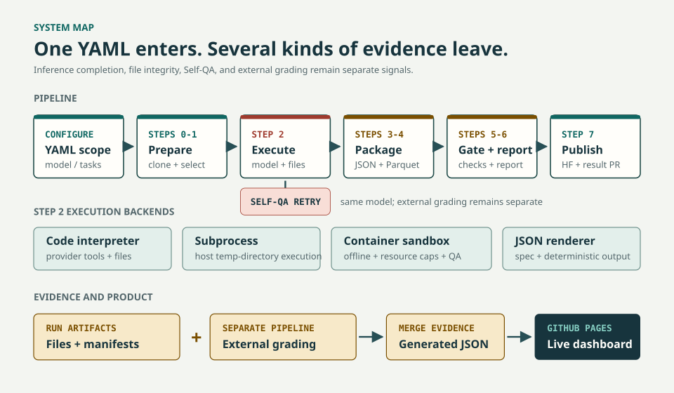

# GDPVal Batch Runner

A Python pipeline that runs LLM experiments on the [OpenAI GDPVal](https://huggingface.co/datasets/openai/gdpval) Gold Subset (220 tasks) and uploads results to HuggingFace.

## Start here

- **See published evidence:** [open the live dashboard](https://hyeonsangjeon.github.io/gdpval-realworks/).
- **Inspect the smallest real run:** open
  [`exp998_smoke_baseline_sample.yaml`](experiments/exp998_smoke_baseline_sample.yaml).
- **Launch the supported cloud path:** use
  [Run GDPVal Batch Experiment](../../../actions/workflows/batch-run.yml)
  with `experiment_yaml=exp998_smoke_baseline_sample`.
- **Find the outputs:** read
  [Results and artifacts](../docs/first-experiment.md#7-know-what-success-looks-like).

For a first run, follow the [beginner guide](../docs/first-experiment.md). It is
the canonical setup path for Azure OIDC, a disposable Hugging Face target, cost
boundaries, and the three-task smoke test.

## Architecture

<picture>
  <source media="(max-width: 960px)" srcset="../docs/images/readme-system-map-mobile.svg" />
  
</picture>

## Quick Start

### Recommended: GitHub Actions

1. Fork this repository and edit only `data.source` in the
   [three-task sample config](experiments/exp998_smoke_baseline_sample.yaml) to
   point to a new disposable dataset in your Hugging Face namespace.
2. Configure the five repository secrets and required identity variables listed in the
   [beginner guide](../docs/first-experiment.md#5-add-repository-secrets).
3. Open the
  [Batch workflow](../../../actions/workflows/batch-run.yml) in your fork on
  `main`, enter `exp998_smoke_baseline_sample`, and leave the internal relay
   fields at their defaults.
4. Start with `dry_run: true` only after reading the boundary below.

> `dry_run: true` still performs Step 0, calls the model, runs Self-QA, and may
> write relay checkpoints. It skips Step 5, final Step 7 publication, and the
> result pull request. It is not a free or no-write simulation.

### Local step-by-step debugging

This path requires Python 3.11, Azure CLI login, a real model budget, and a
disposable Hugging Face target already configured in the sample YAML. It still
calls the model and writes to Hugging Face in Step 0.

```bash
cd batch-runner
python3 -m venv .venv
source .venv/bin/activate
pip install -r requirements.txt
az login

export HF_TOKEN="<dedicated-hf-write-token>"
export AZURE_AI_ROUTE_PROFILE="project-ci"
export AZURE_OPENAI_V1_ENDPOINT="https://<foundry-resource>.services.ai.azure.com/openai/v1/"
export FOUNDRY_PROJECT_ENDPOINT="https://<foundry-resource>.services.ai.azure.com/api/projects/<project-name>"
CONFIG="experiments/exp998_smoke_baseline_sample.yaml"

bash step0_bootstrap.sh "$CONFIG"
bash step1_prepare_tasks.sh "$CONFIG"
bash step2_run_inference.sh condition_a
bash step3_format_results.sh
bash step4_fill_parquet.sh

# The 3-task smoke skips Step 5. Generate a model-free, unpublished report.
bash step6_report.sh --no-narrative --dry-run
```

Do not run Step 7 just to test setup. If you intentionally want to publish the
three-row smoke result, first replace the unpublished self-report with
`bash step6_report.sh --no-narrative`, then run
`bash step7_upload_hf.sh --test`. Step 7 rejects a dry-run or stale report and
requires its repository, prepared fingerprint, Step 2 result fingerprint,
run-specific publication generation, ordered task IDs, and result task set to
match the current workspace. A new Step 1 invalidates a prior finalized run,
while relay legs retain the initial generation. The parquet submitter
text/files/URLs/URIs must also equal the current Step 2 result before Step 7
CAS-replaces remote `data/**`, `deliverable_files/**`, and `self_report.json`.

## Authentication and environment variables

| Variable | Required | Description |
|----------|----------|-------------|
| `HF_TOKEN` | Cloud publication | Dedicated Hugging Face write token used by bootstrap, relay persistence, and Step 7 |
| `AZURE_AI_ROUTE_PROFILE` | Azure | `direct-v1` for direct inference, or `project-ci` to route only Code Interpreter through the Foundry project |
| `AZURE_OPENAI_V1_ENDPOINT` | Azure | Direct OpenAI-compatible `/openai/v1/` endpoint on the approved Azure/Foundry resource |
| `FOUNDRY_PROJECT_ENDPOINT` | `project-ci` | Foundry project endpoint ending in `/api/projects/<project-name>` |
| `AZURE_OPENAI_LEGACY_ENDPOINT` | Rollback only | Dated Azure OpenAI resource endpoint; never used by the supported direct/project workflows |
| `AZURE_AI_ALLOW_LEGACY_ROLLBACK` | Rollback only | Must be exactly `1` to authorize the `legacy-rollback` profile |
| `AZURE_CLIENT_ID` | GitHub Actions + Azure | Entra application client ID for OIDC |
| `AZURE_TENANT_ID` | GitHub Actions + Azure | Entra directory tenant ID for OIDC |
| `AZURE_SUBSCRIPTION_ID` | GitHub Actions + Azure | Azure subscription ID for `azure/login` |
| `AZURE_AI_EXPECTED_CLIENT_ID` | GitHub Actions + Azure | Independent repository variable for the approved OIDC client ID |
| `AZURE_AI_EXPECTED_TENANT_ID` | GitHub Actions + Azure | Independent repository variable for the approved OIDC tenant ID |
| `AZURE_AI_EXPECTED_SUBSCRIPTION_ID` | GitHub Actions + Azure | Independent repository variable for the approved Azure subscription ID |
| `AZURE_AI_EXPECTED_LEGACY_ACCOUNT` | Strict rollback only | Exact account parsed from `AZURE_OPENAI_LEGACY_ENDPOINT` |
| `OPENAI_API_KEY` | OpenAI | Native OpenAI API key |
| `ANTHROPIC_API_KEY` | Anthropic | Anthropic API key |

The supported path rejects `AZURE_OPENAI_ENDPOINT`, `AZURE_OPENAI_API_KEY`,
`AZURE_API_KEY`, `AZURE_OPENAI_AD_TOKEN`, and `AZURE_CLIENT_SECRET`. It uses
`azure/login` or local `az login` with `DefaultAzureCredential` and the
`https://ai.azure.com/.default` scope. Inference, narrative, and grading use the
direct v1 route; only Code Interpreter uses the project route under
`project-ci`. The separately authorized `legacy-rollback` profile uses the
dated Azure OpenAI client and its required
`https://cognitiveservices.azure.com/.default` audience; token preflight checks
the audience selected by each typed route.

GitHub Actions supplies the endpoint through the `FOUNDRY_PROJECT_ENDPOINT`
repository secret and maps it to the identically named typed runtime variable;
it never injects the deprecated `AZURE_OPENAI_ENDPOINT` runtime environment
variable.

CI always requires `AZURE_AI_EXPECTED_CLIENT_ID`,
`AZURE_AI_EXPECTED_TENANT_ID`, `AZURE_AI_EXPECTED_SUBSCRIPTION_ID`, and
`AZURE_AI_EXPECTED_DIRECT_ACCOUNT`; `project-ci` additionally requires
`AZURE_AI_EXPECTED_PROJECT_ACCOUNT` and `AZURE_AI_EXPECTED_PROJECT_NAME`.
An explicitly authorized strict `legacy-rollback` run requires
`AZURE_AI_EXPECTED_LEGACY_ACCOUNT` instead of the direct/project account
variables.
Configured secrets are compared before login, then the active account and
Azure AI token claims are checked after login. Route fingerprints do not attest
Azure SKU, PTU assignment, or provisioned capacity; verify those separately
before paid capacity-sensitive experiments.

## Pipeline Steps

### Step 0: Bootstrap (`step0_bootstrap.sh`)

- Accepts an experiment YAML path and reads the target from `data.source`:
  `bash step0_bootstrap.sh experiments/exp998_smoke_baseline_sample.yaml`
- Classifies the target read-only first. For a missing target, prepares and
  validates the pinned source completely before creating the public HF dataset;
  create and upload are each attempted at most once, with no automatic retry or
  deletion after an uncertain upload.
- Downloads local snapshot to `data/gdpval-local/`
- Pins one full `openai/gdpval` revision and downloads only its base data plus
  parquet-declared references into fresh staging. Before upload it verifies the
  exact source columns, ordered task prompt/taxonomy/rubric/reference assignment
  projection, complete physical reference tree, and every reference SHA-256/size.
- Persists the source-derived schema-v4 `step0_needs_files_manifest.json` before
  stripping deliverables, then validates its exact task IDs, active policy,
  signal fields, summary, source projection, and ordered reference records.
- Validates: 220 rows, rubric columns present, and exact regular reference files.
  Step 2 and each upload/copy boundary recheck those bytes before any model or
  generated-code execution
- Reuses an existing target only when it already contains a `data/` path;
  otherwise it aborts without automatic deletion. A reused target must also
  contain the canonical manifest; Step 0 never regenerates it from stripped
  data. Every run downloads the target's exact full-SHA HEAD into fresh staging
  and validates the canonical target columns, projection, manifest, reference
  tree, and empty submitter state before replacing the previous local snapshot.
  Use a new disposable target or remove the inspected partial/legacy repository
  explicitly.

#### Local transport of the registered originals

`codex_ci_input_bundle.py produce` verifies an existing local original parquet,
the two declared references and the full canonical schema4 Step0 before making
a deterministic archive. It does not generate Step0 or acquire a missing input.
`import` requires an independently supplied archive SHA256 and a new absent
private output root whose parent already exists outside the source checkout.
Archive/member checks, genuine input readers and installed readback precede
the ready marker. An interrupted reservation is retained and cannot be adopted
or retried in place.

The local CLI validates the catalog/envelope input pins and derives the fixed
score-free cohort without compiling a comparison dispatch/grading plan.
Original revision, parquet, catalog, task order, prompt/reference identities
and canonical Step0 checks remain in force. The shared comparison attester is
unchanged. Credentialed intake still uses the full-source `_registered()` and
`import_bundle()` path; the local CLI does not waive its authority requirements.

Run only under separately authorized, token-free/offline local conditions. The
following argument forms are documentation, not authorization to repeat a
completed transfer or import; keep actual input paths and bytes private:

```bash
python codex_ci_input_bundle.py produce --dataset-parquet "$PRIVATE_PARQUET" --reference-root "$PRIVATE_REFERENCES" --step0-manifest "$PRIVATE_STEP0" --out "$NEW_PRIVATE_ARCHIVE"
python codex_ci_input_bundle.py import --bundle "$PRIVATE_ARCHIVE" --expected-sha256 "$APPROVED_ARCHIVE_SHA256" --out "$NEW_PRIVATE_OUTPUT"
```

The metadata receipt is not publication clearance, even when its sensitive-field
screen is false. Local materialization does not prove CI-read authority, served
identity, wire consumption, native caps or comparison launch readiness. See the
[local-input correction record](https://github.com/hyeonsangjeon/gdpval-realworks/blob/5fcf254f4146734493e7390b110ad56189c836ae/tasks/LATEST_TASK_RESULT/README.md#project5-local-original-input-registration-correction--2026-10-04) for the bounded
proof, real-import identities and remaining gates.

#### Prospective source profile for local comparison preparation

The [local-source profile](experiments/execution_envelope/gpt54_sandboxv2_codex_comparison_local_source.yaml)
uses the existing comparison schema, model/effort, input identities, task order,
ABBA20, run IDs and limits. It changes only the reviewed runtime source bindings,
the three local preparation helper fingerprints, the two capture-module bindings,
the workflow-gate binding and the actual full grader template closure. The later
launch-refusal and metadata-verifier changes do not alter that closure. The historical
manifest and compiler remain
unchanged; the template closure is not a materialized-grader identity or a
grading result.

After separate fixed-HEAD review and authorization, use the preparer's existing
`--manifest` argument to select the tracked profile. This argument fragment is
documentation, not permission to prepare or run a comparison:

```text
--manifest batch-runner/experiments/execution_envelope/gpt54_sandboxv2_codex_comparison_local_source.yaml
```

The CLI accepts that repository-relative path or its absolute path inside
`--repository`. Local preparation/verification APIs accept the same
repository-relative string as `manifest_path`. The top-level
`gpt54_disposable_checkout` forwards it to `gpt54_run_config_bundle` and
`gpt54_run_input_bundle`; direct helper calls must use the same selection.
The caller's full reviewed commit must contain the
regular tracked manifest blob. Its bytes, source pins, detached checkout HEAD
and existing `manifest_file.path`/digest evidence must agree. External paths,
URLs, traversal, symlink substitution and unreviewed bytes are refused.

Omitting the API keyword preserves the historical path. Direct runtime callers
and Actions workflows do not select this profile; the local workflow API/CLI
selection is described below. Existing canonical Step0 checks,
no-clobber publication, reservations and quarantine remain in force. The
[source-profile proof](https://github.com/hyeonsangjeon/gdpval-realworks/blob/fd903b96dc8d4622470b6971fde820334c16396b/tasks/LATEST_TASK_RESULT/README.md#project5-prospective-local-preparation-source-profile--2026-10-04)
uses genuine current-source compilation and synthetic preparation fixtures,
not the private originals. Real local preparation needs a separate instruction;
credentialed CI authority, dispatch, native call/token caps and launch gates
remain unresolved.

#### Independently anchored prospective-profile verification

`gpt54_disposable_checkout.verify_runtime_checkout` accepts the optional
`expected_reviewed_source_sha` keyword for a read-only, model-free mode. The
caller must supply a full lowercase 40-hex commit SHA independently of the
checkout and its markers. Never obtain this expected value from their HEAD,
environment, manifest or fallback. It is review metadata, not launch approval.

```python
verify_runtime_checkout(
    checkout=prepared_root,
    run_id=registered_run_id,
    condition=registered_condition,
    expected_reviewed_source_sha=independently_reviewed_full_sha,
)
```

The held ready marker and actual detached HEAD must match that expected commit;
its tree is checked independently. Bound bytes from the fixed config-ready
marker supply `manifest_file.path` only as a locator. The selected execution_envelope
YAML must be a regular tracked blob at the expected commit, with identical
working-file bytes, size and digest. Config-marker and manifest metadata are
each bounded to 1 MiB; local Git uses its existing 60-second command bound,
closed environment and disabled transport. A matching rewritten marker set
cannot substitute an unreviewed manifest or commit.

Config/input verification uses the same selected path. Quarantine, reservations,
held directories and final rereads remain enforced. The API writes nothing and
returns only the unchanged canonical preparation marker. An omitted or `None`
anchor retains the historical path; it does not discover the prospective
profile. Refs, tags, malformed anchors, unsafe paths and mismatched bytes refuse.

The local workflow gate below supplies its independently validated request SHA.
Direct runtime callers do not supply this keyword. The unconditional comparison
launch refusal below is unchanged. The [anchored-verifier proof](https://github.com/hyeonsangjeon/gdpval-realworks/blob/3419e7db30784bd89034b95253f9f4698acae6f2/tasks/LATEST_TASK_RESULT/README.md#project5-independently-anchored-prospective-profile-verification--2026-10-05)
uses temporary Git and synthetic inputs, not private originals or evidence of
runtime equivalence. A changed-source preparation requires separate fixed-HEAD
review and direction; the consumed earlier artifact cannot be relabeled.

#### Model-free workflow profile handoff

`gpt54_workflow_gate.prepare_workflow_execution` accepts the optional
repository-relative `manifest_path` and retains it in the prepared metadata.
The local CLI accepts the same locator with `--manifest-path`. Omitting either
keeps the historical path and its current-source refusals. This argument fragment
is documentation, not authorization for a preparation or dispatch:

```text
--manifest-path batch-runner/experiments/execution_envelope/gpt54_sandboxv2_codex_comparison_local_source.yaml
```

This is not a GitHub workflow input or an experiment/launch control.
`WorkflowRequest` keeps its exact input/event/source schema. The source HEAD,
event SHA and workflow SHA must agree with its independent reviewed SHA. The
existing preparer machinery binds the selected regular tracked YAML blob to
that commit, then checks the same path and bytes throughout local preparation.
Untracked or altered manifests, external paths, URLs, traversal and link
substitutions refuse without fallback.

`verify_workflow_execution` forwards `request.reviewed_source_sha` as
`expected_reviewed_source_sha`; no target HEAD or marker supplies that anchor.
The config marker's bound manifest path/size/digest must match the caller's
selected source blob. Commands and cwd remain bound to the compiled run, and
source/marker identities, both HEADs, held directories, reservations and
quarantine are checked before evidence is returned. The JSON evidence shape is
unchanged, and verification writes nothing.

`require_workflow_launch` still revalidates and refuses the false compiler
launch flags; this gate has no dispatcher. Even after valid model-free
preparation, the local CLI returns status 2 through that mandatory refusal.
Both direct comparison runtime guards remain unchanged. The [workflow handoff
proof](https://github.com/hyeonsangjeon/gdpval-realworks/blob/882868ccf4e2ddeeab56cf7d02ba4ba9edba6fd2/tasks/LATEST_TASK_RESULT/README.md#project5-model-free-workflow-profile-handoff--2026-10-05)
uses synthetic original inputs and real temporary Git/source validators,
not private inputs or an executed comparison. Actual Actions/capture profile
selection, native call/token caps, dispatcher, credentialed-CI input authority
and launch authorization remain unresolved.

#### Separate prospective time-budget registration

The [time-budget registration](experiments/execution_envelope/gpt54_sandboxv2_codex_time_budget_v1.yaml)
defines study `gpt54_sandboxv2_codex_time_budget_v1`. It asks which tested GPT-5.4
configuration produces usable, graded work within the same external generation
time budget. This is a configuration-bundle comparison, not isolated harness
causality or equal native compute. It does not replace either existing comparison
manifest or pool outcomes with the closed 30-cell/8-cell studies.

The same five approved tasks, GPT-5.4/direct-v1/xhigh binding, two repeats in ABBA
order and inference concurrency 1 give at most 20 generation observations. Its
four run IDs begin `gpt54_time_budget_v1_`, distinct from the old comparison.
Each observation has one external attempt, with no external replay, resume or
retry after failure. The registered deadline is 1200 elapsed seconds from first
generation start, including waits and native internal recovery. At the deadline,
request interruption and allow at most 20 additional seconds of local cleanup,
recorded separately. The 1220-second maximum planned host lifecycle is neither
a remote billing bound nor a server-side cancellation guarantee.

Native model-attempt/repeated-request counts and input/output/written tokens are
observation-only when available; missing values remain explicitly unavailable.
Cumulative snapshots are differenced, and cached-input/reasoning breakdowns are
not added again to their parent totals. Native retries and partial usage remain
visible. There is no shared native request/token or money hard-cap claim. V2's
9-turn/8192-output settings remain named V2-specific settings; a Codex native
turn is not the equivalent unit. All existing template bytes remain sealed.

`gpt54_time_budget_comparison.compile_registration` validates this versioned
policy separately. Its prospective API requires both independent source roots
and full review anchors together:

```python
compile_registration(
    plan,
    runtime_root=runtime_root,
    expected_reviewed_source_sha=reviewed_runtime_sha,
    frozen_grader_root=frozen_grader_root,
    expected_grader_source_sha="882868ccf4e2ddeeab56cf7d02ba4ba9edba6fd2",
)
```

The caller supplies review metadata independently of either checkout. Detached
HEAD/tree checks, tracked regular blobs, held directories and final rereads bind
runtime R to its 42 prospective source pins, including the reused held-directory
publication helper. Frozen F supplies the unchanged
37-pin local-source profile and the actual whole grader TEMPLATE closure
`37e1791da757a247eaf513352425128eb5c1772f3f6c814d1432b5eb665d48ce`, at tree
`45d024f15c8d4b90ec6c65a4dacdbaa16c41f9ca`. Changed runtime core cannot claim
that judge identity. A materialized grader needs its actual config path/bytes
and a distinct fingerprint. When grading is eventually wired, it must execute
from F-derived source, not from R while hashing F. No grader is materialized or
run by this API.

The omitted-argument compiler and local CLI retain the historical path and refuse
the advanced runtime source. There is no new CLI enablement flag. Unknown fields,
contradictory hard caps, changed scope and ambiguous YAML still refuse. Compiled
evidence separates intent, optional host-control implementation and false launch
authority; it supplies no commands, runtime configs or preparation recipes.

`gpt54_time_budget_comparison.prepare_observation_handoff` is the separate,
model-free API for one registered run/task. It takes the same explicit R/F
anchors plus `input_registration_root`, `expected_input_source_sha` and the
repository-relative `input_registration_path`. An old registration may supply
only its dataset/cohort facts after exact equality checks against this study.
Its tracked regular blob, catalog and envelope are checked against the supplied
input-source commit; it cannot supply launch authority or old run identities.
The caller also supplies `dataset_parquet`, `reference_root`, `destination`,
`run_id` and `task_id`. Codex requires `step0_manifest`; V2 requires it to be
absent and does not read it. All inputs must already exist locally.

The new destination contains `configuration.json`, `task.json`, only the
selected task's `reference_files/` members, and a final `preparation.json`.
The configuration envelope holds actual template-derived factory settings,
the GPT-5.4/direct-v1/xhigh binding and a required observation-control identity.
V2 retains its local settings but does not inherit the old stage plan's dollar
approvals or escalation. The task payload is a V2 `TaskToRun` projection or
Codex `run` arguments; it excludes rubric and expert-answer bodies. Reference
paths are relative to the handoff directory. The full pinned parquet and, for
Codex, canonical Step0 bytes are verified but are not copied into the packet.
No grader config, provider instance, command, admission or generation clock is
created. This envelope is not a standalone CLI execution config.

The final marker binds study/run/condition/repeat/task, registration digest,
R commit/tree, frozen F/template identity, condition template and generated
config digests, input-registration source and verified input-byte identities.
Held-directory/no-clobber publication retains a sibling
`.time-budget-preparation-reserved.json` file. Existing, partial or changed
destinations refuse; final source/input/member rereads precede readiness.
Preparation evidence is not launch authority: all execution flags and existing
launch gates remain closed.

`gpt54_time_budget_comparison.consume_observation_handoff` consumes exactly one
handoff through the existing factories. It requires the same explicit source
and input arguments, `preparation_directory`, an independently retained
`expected_preparation_identity` (`sha256` and `size`), `run_id`, `task_id` and a
private `observation_directory`. The expected identity must not be read from
the marker being checked. The consumer reconstructs the exact configuration,
task, references and marker, verifies the reservation and complete member set,
and rereads held sources, inputs and directories before any output or admission.

Startup is denied unless the trusted caller supplies
`require_execution_direction(binding)`. That checker must match the immutable
preparation/observation/R/F binding and canonical preparation/admission paths
against a separate source-bound execution direction, then return `None` or
raise on refusal. It is not a marker-controlled approval bit. The consumer's
default remains denied; the V2 and Codex callables below install concrete
checkers and dependencies. The consumer itself adds no workflow entrypoint.
Changing
the preparation path or admission store is not a way to obtain another attempt.

After the checker and final rereads, a no-clobber sibling
`.time-budget-consumed.json` permanently consumes the handoff, including failed
or abandoned startup. One `TimeBudgetObservation` then reserves admission.
V2 receives that same control through `build_runner_factory.observation_for`,
with caller-supplied `v2_backend_factory` and `v2_voice_for(config, budget)`.
Codex receives it through `CodexAgentRunner.observation_control`, with
`codex_provider_for(config)`. Both use verified reference paths and the prepared
model-safe arguments; no factory is imported from marker text. The result is
the existing runner envelope plus `handoff_preparation_identity` and the
control's `time_budget_observation` record. Construction failures use that
control's existing cleanup deadline and cannot renew the observation. Preparing
or validating a packet is not execution permission.

The callable `gpt54_time_budget_v2_observation.run_first_v2_observation` and its
CLI serve **only** run `gpt54_time_budget_v1_v2_r1`, `sandbox_v2`, repeat 1, and
one explicitly selected task from that run's verified five-task registration.
All other runs, conditions, repeats and unregistered tasks refuse. Task1
`02aa1805-c658-4069-8a6a-02dec146063a` and Task2
`0112fc9b-c3b2-4084-8993-5a4abb1f54f1` remain permanently consumed/uncertain;
Task3 `2ea2e5b5-257f-42e6-a7dc-93763f28b19d` and Task4
`3baa0009-5a60-4ae8-ae99-4955cb328ff3` are consumed with canonical errors.
No Task5, other live cell or replay is authorized here. The callable
installs the existing same-host `AgenticV2FixtureBackend` (its limited tools are not a
microVM), `AzureFoundryVoice`, and typed Azure inference client. Client creation
and connection waits begin inside supervised generation; the client closes
through the existing shared cleanup control. The registered
`hjeon-fdpo-foundry-eus2` / `gdpval-realworks` / `direct-v1` / GPT-5.4 / `xhigh`
mapping and V2's 9-turn/8192-output settings are unchanged. The existing approved
OIDC connection must already be configured; the adapter does not change it.

This command shape is documentation, **not permission to run it**. Every value
must come from a separately issued exact-source execution direction, including
independent preparation, registration, input and host identities:

```bash
python batch-runner/gpt54_time_budget_v2_observation.py \
  --run-id gpt54_time_budget_v1_v2_r1 \
  --task-id REGISTERED_TASK_ID \
  --runtime-root /reviewed/R --reviewed-source-sha R_COMMIT --reviewed-source-tree R_TREE \
  --frozen-grader-root /frozen/F --grader-source-sha 882868ccf4e2ddeeab56cf7d02ba4ba9edba6fd2 \
  --input-registration-root /anchored/I --input-source-sha I_COMMIT \
  --input-registration-path batch-runner/experiments/execution_envelope/gpt54_sandboxv2_codex_comparison_local_source.yaml \
  --registration-sha256 REGISTRATION_SHA256 --input-sha256 INPUT_BINDING_SHA256 \
  --preparation-directory /private/prepared --preparation-sha256 PREPARATION_SHA256 --preparation-size PREPARATION_BYTES \
  --dataset-parquet /private/original.parquet --reference-root /private/references \
  --observation-directory /private/exclusive-host-state --destination /private/new-result \
  --direction /private/direction.json --direction-sha256 INDEPENDENT_DIRECTION_SHA256 \
  --host-sha256 INDEPENDENT_HOST_SHA256
```

The direction is a strict JSON object: `direction_version` is
`gpt54-time-budget-first-v2-direction-v1`, `purpose` is
`execute_one_registered_observation`, and `execution_binding` is the exact
`ObservationExecutionBinding` object (including its canonical `observation_json`
string). `host_sha256` is independently supplied too. Integer
`not_before_unix` / `expires_unix` bound the admission decision, not generation.
`paths` must exactly name `direction`, `preparation`, `runtime_root`,
`frozen_grader_root`, `input_registration_root`, `dataset_parquet`,
`reference_root`, `observation_directory`, `destination`, `input_source_sha`,
`input_registration_path`, and `backend_workspace`. All filesystem paths are
absolute; `input_registration_path` is relative to its source root, and
`backend_workspace` is the destination's sibling with `.time-budget-v2-work`
appended. Missing/extra fields, changed bindings, stale directions and consumed
observations refuse. The file cannot supply its own trusted expected digest.

`execution_host_identity(R_COMMIT)["instance_sha256"]` exposes only a digest of
boot/namespace/user and any CI instance identity for that independent direction.
It is metadata, not a platform probe or proof of support. Actual admission still
requires the exclusive single-threaded Linux host described below. Prospective
parquet validation disables parser background reads; libraries that leave
native threads active still cause host refusal. Legacy input parsing is unchanged.

The result destination must be new with an existing private parent. It receives
`step2_inference_results.json` last and
`upload/deliverable_files/<task-id>/<verified-relative-file>` for any returned
artifacts. A sibling `.time-budget-result-reserved.json` binds the exact result
bytes; interrupted/partial publication is not reusable. The canonical Step2
fingerprint covers the actual terminal control, preparation/R/F/input/config
bindings, outcome and usage availability. Cached/reasoning tokens remain subsets;
missing usage and native-attempt/repeated-request/written-token counters are
explicitly unavailable, not zero or hard caps. Failed/missing outcomes remain
error rows; pre-admission refusal produces no study row. These bytes can feed
`prepare_observation_grading` with independent result/input identities, but this
entrypoint neither grades nor uploads. No real input, provider, host or live-run
acceptance follows from a passing synthetic test.

The leader-verified Task3 readout (`37546159098` / attempt 1, artifact
`11450457583`) reports `time_budget_observation_non_success`, runner success
and verification both false, no runner error code, and no deliverables.
Cleanup and host reuse were confirmed. Reported usage is 2913 input / 326
output tokens; cached input 0 and reasoning output 302 are subsets. The
construction, Responses invocation and completed-response counters are each
1, with model binding `matched`. These counters do not establish native model
attempts, price or score. The original tool/model reply is not in the safe
projection, so the first failure remains unknown.

A separate synthetic reproduction at accepted main
`d7aad7abc1e1626e72178f9e8d85090a63825cd2` / tree
`749155e1f967699036f887bbf58a6bddbde2aa0c` confirmed typed
`AzureFoundryVoice` write/finalize success and exact faithful second-request
construction. It also demonstrated that the consumer overwrites a verifiable
`artifact_not_openable` failure with control reason `failed`, causing capture
to reject the receipt. Its **2 passed in 14.34s**, wrapper **14.933481s**,
are reproduction assertions, not a fix proof or an explanation of Task3's
original error. Artifacts: `/tmp/v2-real-voice-boundary-repro.nWLuBtNR/`.

The original verified-failure correction and regression were pinned at
`7e6e441fa64dcca804b23383b43bd90830844247` / tree
`12117a30c37d53a38c7cf407f1fc60b8e27f4b4b`. The one correction selector
reported **2 failed in 6.35s**, exit 1, wrapper **6.956347s**: both cases
stopped at preparation's `runtime_source_roles` guard because that registration
still pinned the prior compiler bytes. Neither reached the correction. No
pin bypass or retry followed that failure. Its artifacts remain at
`/tmp/v2-real-voice-boundary-proof.TnBlJliY/`.

After inspecting `93c5cbb931ea0a3db1cb63f9bd0e89bea72132a1` / tree
`ee85d1c5771012fec362823da61268997df2f53e`, the leader authorized the two
prospective compiler bindings to advance to the verified corrected bytes.
All other parsed registration fields remain identical. The full seal changes
from `f3337bd80a168cf42b37314b425f5f5b221049fa87c1c15e2338de3441e0ae05` to
`3dde5f2f62e8ada29c883e1ef0eb555c969987f710b437af50c513ac9b52d22f`.
Historical observations retain the old seal; this is runtime provenance, not
a new study condition. The consumer correction itself is unchanged.

Continuation `e3ad928bf02b99e080a6a5924a4ebda75b156adf` / tree
`fe3d097ca4d6632478494e67d57f0f9be48e52b8` reported **2 failed, 5 passed in
13.79s**, exit 1, wrapper **14.574513s**. The four historical-readout cases
and affected workflow check passed. Both real-voice cases cleared the primary
replay/capture assertions and then failed at duplicate refusal: actual
`result_destination_exists`, expected `direction_observation_already_consumed`.
The existing destination guard precedes the consumed-state guard. The later
effects/byte-preservation assertions were not reached, so neither boundary
test is a pass. No code/assertion change or retry followed. Artifacts:
`/tmp/pr765-registration-readout-proof.HFBa6hyS/`.

After reviewing `67602c50fd1add61956bd767d0f568ae072df0bd` / tree
`5bb1a3f3191d15ec42c7a6eb3e6ef50402a6d0f4`, the leader authorized only
the duplicate test correction. At test-only commit
`be92f1f399934ece7ba4aee3887d4d7fe052139a` / tree
`94124a3a8a42af45e3c8f3a6be0ade3944378581`, the selector reported **2 passed in
10.64s**, exit 0, wrapper **11.238067s**, running only the two full voice
nodes once. Each case checks exact `result_destination_exists` for the
original destination, then exact `direction_observation_already_consumed`
with only the destination changed to an unused sibling. After each refusal,
effects, permanent consumed/claimed bytes and original result/deliverable
bytes stay unchanged; the alternate destination and reservation stay absent.
All preceding assertions and all production/registration/workflow bytes are
unchanged. Artifacts and final HEAD/tree are at
`/tmp/pr765-duplicate-guards-proof.sHfFVypx/` and its `handoff.json`.
The earlier 2-failed/5-passed invocation remains failed; its five passes were
not repeated or aggregated with this proof. All four invocations retain
their separate scope under offline Python 3.10.12, 300s+5s/no-`-x`, 30s Git
bounds and synthetic inputs/transports. The voice kernel fixture is not a
real-host positive. Only the three evidence records change after the latest
proof. Final review/CI and independently directed live execution remain
gates; no historical Task3 cause, price or score is inferred. Frozen
F/TEMPLATE, the old profile and its 37 pins, the registered model/prompt,
9-turn/8192 settings, 1200+20, one attempt and twenty planned observations
are unchanged. Task1-Task3 stay consumed. See the
[full evidence record](../tasks/LATEST_TASK_RESULT/README.md) for exact source,
readout and artifact identities.

The leader's later Task4 readout (`37561844854` / attempt 1, artifact
`11457461122`) matched the canonical result from run `37559598835` / attempt 1.
Both error fields are `path_not_directory`; runner verification is true,
runner success is false, the required file is missing and there are no
deliverables. Admission, cleanup and host reuse are confirmed; terminal reason
is `failed`, without interruption. Reported usage is 2462 input / 570 output
tokens, with cached input 0 and reasoning output 546 as subsets. The client
construction, Responses invocation and completed-response counters are each
1, with model binding `matched`; native attempts, cost and score remain
unknown. The original requested path is not in this safe projection.

The declared workspace root is `"."`. A model-free directory regression was
first pinned at
`473c04d51bd3db4ee7d23bdc81abd23fd587dae2` / tree
`fe14ba39b269782b59607f440a62e4818bb7af68`, from accepted main
`4c5a32f7a0347081867fb95f94fc712bc0032ff6` / tree
`6800b87747919ea571c7908ae2b951d15a30fe20`. Its first invocation stopped before
behavior: **0 collected, 1 error in 0.75s**, exit 4; wrapper **1.121007s**.
The parametrized test function omitted its `case` argument; no backend or
verifier assertion ran. That collection failure remains separate evidence at
`/tmp/v2-directory-root-proof.Pi7089uf/`, with its original completion
HEAD/tree in `handoff.json`; log SHA256 is
`dd81ffbb50e1b2f3b8f4dab28b7cc056b42976bd0c87f57f0e38514cfb116d44`.

After the leader reviewed that completion at
`bdf2bbe729527b7ae057c8db44d13f2ad985e38d` / tree
`37a7a1c6413ce02734338c072aee84f61e1b1c96`, only the missing function argument
changed. Tested commit `207604585333e73b2fce72bb55f9c4fc10236019` / tree
`62d9a24bacd876ba7ff0502018cde640be89ff7f` preserves every other test byte.
One offline Python 3.10.12 invocation of
`tests/test_time_budget_v2_directory_root.py::test_time_budget_v2_directory_root`
reported **5 passed, 5 warnings in 0.99s**, exit 0, wrapper **1.408577s**,
under the existing 300s+5s/no-`-x` and 30s Git bounds. Through the real
dispatcher/backend and provenance verifiers, empty `"."` lists no entries,
then lists the synthetic file after a write. File-as-directory and missing
directory give exact `path_not_directory`, traversal gives `invalid_arguments`,
and an unsafe initial symlink gives `compute_start_failed` at startup with
zero tool events. Outside bytes and cleanup checks pass; forged traces are
rejected. The five `record_property`/xunit2 warnings are retained unchanged.
No deterministic empty-root defect was demonstrated on this source.

New artifacts and final HEAD/tree are in
`/tmp/v2-directory-root-continuation-proof.Tj987B1r/` and its `handoff.json`;
log SHA256 is
`60b7d7636dbb610fb574170da048037a0f5e8909babf8746765eb91cd055b85e`.
Only the three evidence records change after this proof. This is a test-only
regression, not a production fix, historical Task4 diagnosis or real-host
kernel proof. Review and final CI remain required. Runtime, workflow, prompt,
source pins, frozen F, the twenty planned observations and 1200+20 limits
remain unchanged. Task1-Task4 remain consumed; no replay, Task5 or further
live-cell authority is established. Full Task4 result/readout identities are
in the evidence record linked above.

##### One registered Codex time-budget observation

[`gpt54_time_budget_codex_observation.py`](gpt54_time_budget_codex_observation.py)
provides `run_codex_observation` and a CLI for one explicitly selected task in
`gpt54_time_budget_v1_codex_r1` or `gpt54_time_budget_v1_codex_r2`. The repeat
must match the run, the condition is `codex`, and the task must belong to the
registered five-task cohort. This is the Codex arm of the existing 20-observation
study, not a scheduler, controller, extra repeat or new experiment.

The callable supplies concrete `CodexProviderSettings` to the existing consumer,
which constructs the real `CodexAgentRunner` with the same
`TimeBudgetObservation`. It preserves GPT-5.4/direct-v1/xhigh, the null requested
context-window override, pinned SDK/CLI 0.147.0, isolated existing auth command,
zero configured request/stream retries, one external attempt, concurrency 1,
1200-second generation and the shared 20-second cleanup. Native recovery is
still inside that generation deadline; zero retry settings do not claim a bound
on every native recovery or a model-call count. There is no loopback provider,
personal API key or fallback endpoint in the production route.

Command shape, **not a live authorization**; the leader or trusted controller
must supply the independent values after final source review and acceptance:

```bash
GDPVAL_CODEX_RUN_ROOT="$NATIVE_RUN_ROOT" \
  JE_ARROW_MALLOC_CONF=background_thread:false "$OBSERVATION_PYTHON" \
  "$RUNTIME_ROOT/batch-runner/gpt54_time_budget_codex_observation.py" \
  --run-id "$RUN_ID" --repeat "$REPEAT" --task-id "$TASK_ID" \
  --runtime-root "$RUNTIME_ROOT" \
  --reviewed-source-sha "$R_COMMIT" --reviewed-source-tree "$R_TREE" \
  --frozen-grader-root "$FROZEN_ROOT" \
  --grader-source-sha 882868ccf4e2ddeeab56cf7d02ba4ba9edba6fd2 \
  --input-registration-root "$INPUT_REGISTRATION_ROOT" \
  --input-source-sha "$INPUT_SOURCE_COMMIT" \
  --input-registration-path "$INPUT_REGISTRATION_PATH" \
  --registration-sha256 "$REGISTRATION_SHA256" --input-sha256 "$INPUT_SHA256" \
  --dataset-parquet "$DATASET_PARQUET" --reference-root "$REFERENCE_ROOT" \
  --step0-manifest "$STEP0_MANIFEST" --step0-sha256 "$STEP0_SHA256" --step0-size "$STEP0_SIZE" \
  --preparation-directory "$PREPARATION_DIRECTORY" \
  --preparation-sha256 "$PREPARATION_SHA256" --preparation-size "$PREPARATION_SIZE" \
  --observation-directory "$OBSERVATION_DIRECTORY" --destination "$RESULT_DESTINATION" \
  --direction "$DIRECTION_PATH" --direction-sha256 "$DIRECTION_SHA256" \
  --host-sha256 "$HOST_SHA256"
```

R and F must be genuine detached, registered linked worktrees at their exact
independently reviewed identities. F stays at tree
`45d024f15c8d4b90ec6c65a4dacdbaa16c41f9ca`; the original whole TEMPLATE hash
`37e1791da757a247eaf513352425128eb5c1772f3f6c814d1432b5eb665d48ce` is unchanged.
The input-source commit/path must anchor the registered dataset, catalog and
reference identities. `REGISTRATION_SHA256` is the verified registration
manifest digest; `INPUT_SHA256` is the selected observation's sealed input
facts, including Step0. Neither is the R commit, a parquet digest or a V2
input seal. Genuine parquet, references and canonical Step0 must already exist
locally. Use `prepare_observation_handoff` with the same Codex run/task and
anchors; retain its expected digest/size independently of the artifact.

The new private direction format is `gpt54-time-budget-codex-direction-v1`.
Its exact fields are `direction_version`,
`purpose: execute_one_registered_observation`, `execution_binding`, `paths`,
`host_sha256`, `provider_binding`, `step0_identity`, `not_before_unix` and
`expires_unix`. `execution_binding` is the complete existing
`ObservationExecutionBinding`, including the canonical observation JSON and
preparation/F/store binding. `step0_identity` contains its independently
expected `sha256` and `size`. The finite Unix-time window authorizes admission
only, not a resettable generation clock.

`provider_binding` contains `settings_sha256` (the canonical seal of
`dataclasses.asdict(provider)` for the concrete `CodexProviderSettings`),
`config_overrides_sha256` (the canonical seal of the actual `config_overrides()`
tuple), `sdk_version` and
`cli_version`. The concrete settings come from the verified configuration and
the existing approved route resolver; the override digest also binds the real
auth-helper/Python/login-location arguments without publishing them. Both
versions are `0.147.0`. The controller must independently bind the actual
environment's approved values; a file-provided hash or approval bit cannot
authorize itself. No token is part of this direction.

The exact `paths` keys are `direction`, `preparation`, `runtime_root`,
`frozen_grader_root`, `input_registration_root`, `dataset_parquet`,
`reference_root`, `step0_manifest`, `observation_directory`, `destination`,
`native_run_root`, `input_source_sha` and `input_registration_path`. Filesystem
paths are canonical absolute paths; the input registration path remains
repository-relative. The existing `GDPVAL_CODEX_RUN_ROOT` resolver must select
the bound native root outside the system temporary directory. It creates fresh
isolated per-task workspaces there; it does not reuse a personal Codex home.
The observation store is a caller-owned private directory. Its permanent
observation-keyed claim survives failure, copied preparations and changed
destinations. This is local-store protection, not a distributed/global claim;
replacing the store is not permission to retry. Host metadata remains distinct
from the unchanged real kernel ownership admission.

The destination must be new, with an existing private parent. The callable
retains returned deliverables under `upload/deliverable_files/<task-id>/`,
verifies their exact byte records, and writes `step2_inference_results.json`
last with its canonical fingerprint, source/input/direction bindings and actual
deadline/cleanup fields. A returned native failure retains its partial bytes
as an error outcome; a missing returned terminal record does not become a row.
The reservation and any partial publication cannot be adopted or retried.
The consumer does not export native token totals, so `usage`, native counters
and cost remain null with an explicit availability reason. Safe returned
item/status/rate-limit fields are retained without raw provider errors. CLI
exit is 0 for captured success, 1 for a captured error and 2 for refusal or
incomplete capture; none of those states permits another attempt. The callable
itself adds no upload, inference-publication locator, grader or real execution
controller. The fixed Actions controller below supplies its private claim
and retention wiring.

For subsequent model-free grading preparation, pass those exact retained
result bytes, their independently expected digest/size and the unchanged
fingerprint to
`gpt54_time_budget_grading_preparation.prepare_observation_grading`, together
with the independent observation, R/F/input and Step0 bindings. Native capture
uses `condition="codex"` and `execution_mode="codex_foundry"`; the preparer now
requires that exact pair. Do not rename the mode to `codex` or regenerate the
result fingerprint to make intake pass. V2 continues to require
`condition="sandbox_v2"` with `execution_mode="agentic_sandbox_v2"`. Canonical
error and missing-output rows remain errors, not successful or discarded cells.

The fixed native-r1 Task3 retained bundle has a separate model-free caller,
`gpt54_time_budget_native_grading_intake.prepare_retained_native_task3_grading`.
It is draft intake code, not permission to read private storage or grade.
For a separately authorized intake, its only arguments are `request_json`
and `expected_request_sha256`, supplied independently by the caller. Do not
derive that trusted expected digest from a received request. There is no
`inference_sha` argument or inferred inference-publication association.

The exact request format is `gpt54-time-budget-native-grading-intake-request-v1`
with purpose `prepare_retained_native_task3_for_frozen_grading`. Its fields are
`format`, `purpose`, `controller`, `completion`, `cell`, `registration_sha256`,
`frozen_source`, `input_registration`, `dataset_sha256`, `step0`, `deliverables`
and `paths`. `controller` binds the new caller C's commit/tree; `completion`
is the independently verified native envelope binding original R's
commit/tree, execution request digest, claim, immutable output and exact
result size/hash/fingerprint. The cell is only
`gpt54_time_budget_v1_codex_r1` / `codex` / repeat 1 /
`2ea2e5b5-257f-42e6-a7dc-93763f28b19d`. `deliverables` must independently
specify `{"count":2,"bytes":408601}`. No task, revision or repository discovery
is performed.

`registration_sha256` and `dataset_sha256` seal the original R registration
and its dataset, respectively. `frozen_source` is F882's exact commit/tree.
`input_registration` binds that F source and the constant
`batch-runner/experiments/execution_envelope/gpt54_sandboxv2_codex_comparison_local_source.yaml`.
`step0` binds the existing original repository-name hash, revision, member
and full digest/size contract. The whole Step0 file is 218405 bytes; neither
its bytes nor its pin is replaced by preparation metadata. `paths` contains
canonical absolute `controller_root`, `runtime_root`, `frozen_root`,
`input_registration_root`, `dataset_parquet`, `reference_root`, `step0_manifest`,
`hydration_root` and `destination`. The last two must be fresh, disjoint
private outputs with existing parents; all source/input paths are rechecked.

The caller reconstructs observation/input identities from genuine local
parquet, references and full Step0 with the existing validators. At the
trusted immutable output it permits at most four GETs in 60 cumulative
seconds: private repository metadata, the independently bound result, then
its two authenticated declared members under the same cell prefix. Only
after the complete native result passes canonical/source/control checks can
its member paths and file hashes authorize those last two reads. Each file's
full digest and size must match. There are no redirects, decompression,
retries, HEAD fallback, claim/request downloads, archive intake or HF writes.

`HF_TOKEN` is used only in the scoped reader; other credential environments
refuse, telemetry must be disabled, and credentials are absent while the
unchanged preparer runs. Hydration and grading preparation use separate
0700 directories and 0600 files. Reservations and partial bytes are never
adopted or removed. The returned `gpt54-time-budget-native-grading-intake-v1`
summary contains safe binding identities and counts, with deliverable basis
`full_contents_verified_against_authenticated_result`; private prose,
filenames/paths, headers/tokens and raw errors are not returned. Preparation
does not acquire a grading attempt or call `execute_first_observation_grading`.

The leader's actual Task3 readout `37651509527`, artifact `11497400004`,
verified 2570 projection bytes with SHA256
`4dfc3e896b7f57de1c97e1aca2b37feb10031f6b04aa3afe43d1f63c9e189553`.
It reported success and **declared** two files totaling 408601 bytes, whose
contents were not fetched or verified. `items_seen=56` is not a model/request
count; native usage, counters, served identity and cost remain null, and
Task3 is ungraded. This implementation did not fetch its actual bundle.

The prior intake selector
`tests/test_time_budget_native_grading_intake.py::test_time_budget_native_retained_grading_intake`
reported **21 passed in 40.03s**, exit 0, wrapper **40.587362s**, once at
`8faa9c1c3adf9cc6cc8debd6335a72c6bd7e379f`, tree
`f217eda6e2d0dace34c07aa591397ab31c83c9df`, from accepted main
`f997b5e005bb1c49421e8e32cfa3040fa4266ae9`, tree
`ea1ba7b15863ec5f3b2a21accd9859568a561ee2`. Python 3.10.12, 300s+5s/no-`-x`
and named 30s fixture Git bounds were used. Real capture/source/file/preparer
validators processed synthetic originals, a full 218405-byte synthetic Step0
with its own hash, and two synthetic files totaling 408601 bytes. No native
runtime, kernel admission, provider or grader ran. Command, selection,
per-case results and source identities are in
`/tmp/native-task3-grading-bridge.zWCjyI/`; log SHA256 is
`6b754d8427856b30c2628162a798e8473a5db00b3091abf64eb87cc8e4f458c4`.
Only the three records change after this proof; `handoff.json` records final
HEAD/tree. Fixed-HEAD review/CI, separately authorized credentialed intake
with genuine originals and later once-only grading authority remain gates.
The prior mode-validation proof below is separate and was not rerun.

The native Task3 execution compatibility draft is separate from that accepted
intake. The leader corrected the earlier executor-unchanged constraint:
`execute_first_observation_grading` is intentionally V2-first-only and must
remain so. The new opt-in `execute_native_task3_grading` shares its internal
executor but admits only native r1 Task3, with explicit full Step0 and the
existing independent observation/input/preparation/source/direction bindings.
Its old V2 API/CLI still forbids Step0. That compatibility unit added no hosted
workflow/controller.

For a future authorized caller, the context manager
`prepare_native_task3_grading_execution(request_json=...,
expected_request_sha256=..., execution_input_directory=...)` calls the accepted
intake and real F preparation, then stages a fresh private grading-only tree.
Pass its live handle as `native_preparation`, with explicit `step0_manifest`
and the independently bound execution arguments, to the native entry. The
handle expires on leaving the context and cannot be restored from a saved
receipt. This model-free stage neither issues a direction nor claims a grade.
An externally approved direction is still required before the shared local
once-only executor can admit a child.

The native canonical producer has no inference-origin annotation. F already
requires `source_repo_id` and `source_revision`; this gate is unchanged.
Only a separate grading-only result receives those fields and
`source_identity_document_sha256`, from the authenticated fixed private target,
immutable output and intake receipt. It has a distinct derived fingerprint;
the binding records original and derived identities separately. Original
generation bytes/fingerprint and accepted preparation are never rewritten.
Caller-only origin strings, arbitrary revisions and saved ready markers do
not issue the scoped handle. Full 218405-byte Step0 rereads, source/path
protection, frozen rubric/scoring and the 14400/14520-second controls remain.

The original selector
`tests/test_time_budget_native_grading_execution.py::test_native_task3_frozen_grading_compatibility`
ran at `9c51dde2e626faad535b739838d936501ecb9e8e`, tree
`161e8fc14c963e2c60fd24f04d6fec2dc970a85f`, from accepted
`fbe64cc6bb90ad91d0330b0f734be272b984ad9b`, tree
`785ef4ce91782c49e9eaae460b6dc619aae3fa4d`. It hit the 300-second bound:
exit **124**, wrapper **299.978913s**. Its progress log records **13 passes,
1 failure** (`condition`), `partial` interrupted and `timeout`, `grade_task`,
`sidecar` not started. Final traceback/JUnit and the exact failing operation
are unavailable; this is a failed, incomplete proof, not an eighteen-case
pass. Python 3.10.12, 300s+5s/no-`-x`, named 30-second Git fixtures and Python
timing were used once. No passed body or earlier selector was rerun.

The native and legacy V2 positives passed with real validators and explicit
synthetic HTTP/originals/namespace/child fixtures. Native started without
origin fields and used an actual 218405-byte synthetic Step0, real intake/F
preparation and F-compatible grade/sidecar checks. This is not actual private
hydration, a kernel-support verdict, a judge decision or a quality score.
The leader's Task3 declarations above remain declaration-only; its actual
usage/cost/counters stay unknown and its files remain ungraded. Proof files
are in `/tmp/native-task3-grading-compatibility.s2Ef7S/`, log SHA256
`8028943ae71eed4a16a57a15269ab3d604a04f5166a4ac44b47a0072db94280b`;
`handoff.json` records final HEAD/tree after the three evidence docs. The
[latest record](../tasks/LATEST_TASK_RESULT/README.md) preserves per-case
outcomes and exact identities. Implementation acceptance remains on hold.
Fixed-HEAD review/CI, the deferred hosted route/distributed claim, genuine
intake and exact live direction remain gates. The prior specialist-model
invocations failed before execution, not as successful reviews; no retry or
live authority follows from this draft.

PR776's separate five-node continuation passed **5 cases in 143.09s**, exit 0;
wrapper **143.690645s**. Only the test's `condition` replacement changed:
`run_id="gpt54_time_budget_v1_v2_r1"` now accompanies
`condition="sandbox_v2"`, retaining Task3/repeat1. The old mapping violated
`ObservationIdentity`'s run/condition invariant inside `dataclasses.replace`,
before native admission. This is a source-derived fixture diagnosis, not a
recovered historical traceback or evidence of incorrect native admission.
The expected `native_r1_task3_only` guard, no-child/no-claim assertions and
all other test/production bytes remain unchanged.

Exactly `[condition]`, `[partial]`, `[timeout]`, `[grade_task]` and `[sidecar]`
of that selector ran together once at
`5c7fa1911fdf6f85cd0dbc2ae856363622385f27`, tree
`fbef4ebb12144063cf27851d7aed28b9e9179724`, from PR776
`5c8bfdc967ad7e8c0773ec491de6177696fd72ab`, tree
`fb68e1050414d375abd675f59c7fcf62279d23b7`. Python 3.10.12,
300s+5s/no-`-x`, named 30-second Git fixtures and existing synthetic
HTTP/originals/namespace/child seams were retained. The original thirteen
progress passes were excluded, not rerun or pooled into a full eighteen-case
pass. Its exit 124 / 299.978913s outcome and missing final traceback/JUnit
remain unchanged.

The continuation retained immediate node/phase reports through a task-local
hook and produced final JUnit; no new failure occurred. Five warnings concern
`record_property` with JUnit `xunit2`. New artifacts are in
`/tmp/native-task3-grading-five-node.xEIbmA/`, log SHA256
`d473930c3e57ea0ef29baf95af192bc394a88e110f6252638d55417386c2838d`;
its `handoff.json` records final HEAD/tree after the three evidence docs.
Executor blob `10d8e56c5569cc3dea484e4bb9d875712a0d5b4c`, SHA256
`b7c6ff1182838a7e6c93b666aebafaea7c6d2caf4efd9d6b0a13cf7b6207a80b`,
is unchanged, as are intake/preparation, original-versus-derived provenance,
F, registration, workflows and 14400/14520-second controls. This local proof
is not actual hydration, a host/kernel verdict or a grade. Full fixed-HEAD
review/CI remain required; the hosted route and live grading remain deferred.

The native Task3 controller now adds safe `diagnostics` to its public
completion. Exact stage keys cover environment, originals, intake/preparation,
direction, claim, executor, retention and normal context exit. Each records
`unknown`, `started` or `completed`, with only a closed type-based failure
category when available. The strict validator rejects extra fields, invalid
values and inconsistent progress or acknowledgement claims. It never accepts
exception messages, tracebacks, URLs, tokens, filenames, paths or private prose.

These are local observations, not retry authority or proof that a remote write
did not occur. Claim/retention acknowledgement loss stays uncertain, even when
the public commit is null. Executor completion means a receipt returned, not
a successful grade. An executor exception still reaches retention of available
partial files. Success continues to require an actual valid F grade and
confirmed retention; a caught failure cannot produce a success completion.

From base `e21c2896e25950b6bc0a09187cab0abd4d038c1e`, tree
`8670a8ba55a6a54396a8945ff8636589f5d429fe`, tested HEAD
`3bd7a16005957cf3e3b98c1ed355d4244808e425`, tree
`339198fbce638b19378416d0caefcd17609e5587`, ran only the new
`test_native_task3_grading_safe_diagnostics` selector: **6 passed, 6 warnings
in 171.27s**, exit **0**, pytest process **171.712457s**, wrapper
**175.989852s**. Python **3.10.12**, **300s+5s/no-`-x`** and the existing
Git bounds stayed fixed. Real controller/intake/preparer/executor/F checks
use synthetic source identities, originals, HTTP/auth/private-store transport,
kernel facts and child outputs. Deliberate failures cover all six operational
boundaries, including written claims/outputs with lost acknowledgements and
partial retention after an executor exception. Secret-looking exceptions do
not reach public JSON/stdout/stderr. This is not a live intake, claim or grade.

Artifacts are in `/tmp/native-task3-safe-diagnostics.4VxdJ2/`; log SHA256
`1a723596a7b8204b9a29a7391fbd66a113009da526f69214df202b0b38709512`,
JUnit SHA256 `62b259ebe62f15771e3ca2a03d19dc0c88b26d58cb8d5c4034401e9dae337cec`.
External `final-source.json` and `handoff.json` seal final HEAD/tree after the
three records. The shared helper remains exact SHA256
`77d6d1957f123b7f32d710be7ffddbd99f6043e00b0313bc7b1cc9802975fa62`;
workflow, source registries, input/result/F pins, native context, once-only
guards, scoring and time limits are unchanged. Existing exact bootstrap trust
still follows physical-path/ordinary-`.git` and reciprocal-registration checks.

Actual run `37756891578`/r3a1/job `113243545133` remains uncertain after step 14
exited **2** at **2026-10-08 09:32:03 UTC**. Its validated completion has null
claim/entry/grade fields and forbids retry; those nulls do not establish absent
effects, known non-admission, a score or zero cost. The original exception was
not retained and is not recovered here. Runs `37726733625`/r1a1 and
`37737075149`/r2a1 remain separate proven bootstrap failures; all three
submissions are spent. See [current evidence](../tasks/LATEST_TASK_RESULT/README.md)
and the [immutable earlier record](https://github.com/hyeonsangjeon/gdpval-realworks/blob/e21c2896e25950b6bc0a09187cab0abd4d038c1e/tasks/LATEST_TASK_RESULT/README.md).
This diagnostics change still requires fixed-HEAD review/CI. The unavailable
ownership specialist produced no review or endorsement and was not retried.
No replay, new live request, private access or next cell is authorized.

The fixed native Task3 hosted route consists of
[`gpt54_time_budget_native_grading_ci.py`](gpt54_time_budget_native_grading_ci.py)
and the manual
[`gpt54-time-budget-native-task3-grade.yml`](../.github/workflows/gpt54-time-budget-native-task3-grade.yml).
It keeps `prepare_native_task3_grading_execution` open in one Python process
through authenticated intake/F preparation, grading-only staging,
direction checks, permanent private grade-claim acknowledgement,
`execute_native_task3_grading` and retention. It neither serializes the handle
nor uses the old V2 entry. Original result/preparation bytes and their
identities stay distinct from the derived grading input. Accepted intake,
preparer, executor, F/Step8/core/scoring and registration pins are unchanged.

Its CLI operations are `validate-request`, `run` and `verify-completion`.
Each requires `--controller-sha`, `--controller-tree` and
`--expected-request-sha256`; request bytes come from
`TIME_BUDGET_GRADE_REQUEST_JSON`, with format
`gpt54-time-budget-native-task3-grade-request-v1` and purpose
`grade_retained_native_r1_task3_once`. The independent request binds fixed
Task3, C/original R/F/input/result/output identities, declared two files/408601
bytes, the actual all-event Actions run number/attempt 1, immutable paths,
finite admission, grading permission/budget and expected private parent.
Do not treat a validation message or saved completion as execution authority.
No request example grants admission or replaces an exact leader direction;
the uncertain spent submission above must not be replayed.

Public owner/repository/main/workflow/source/digest gates precede credentials.
The interpreter-free Bash owner/repository/ref/source/workflow/attempt guards
run first, followed immediately by the existing pinned Python 3.10.12 setup
with `token: ""`. The unchanged Python request/digest/controller/cell/run-number
guard then runs before checkout, dependencies and credential-bearing stages.
There is no later duplicate setup, alternative interpreter or fallback.
The ordinary bootstrap is separate from linked C/R/F and private working
directories; the workflow never spoofs `GITHUB_WORKSPACE`. Existing OIDC login
precedes the single live context. Original parquet/references/full 218405-byte
Step0, the accepted four-GET/60-second retained intake, F preparation and
direction validation finish before the grading-only CAS. Its namespace keys
the original observation plus F, not C or an Actions run. Occupied/wrong-parent/
uncertain claims stop without adoption or retry. Only confirmed remote claim
readback permits the existing local once-claim and child. HF credentials are
scoped to storage calls, not the F child or retained files.

The F/child envelopes stay 14400/14520 seconds. A 270-minute job cap contains
bounded setup, a 252-minute controller step and post-grade retention reserve;
it is not a monetary ceiling or proof of host readiness. Available grade,
ledger, checkpoint and partial evidence stays private. The executor discards
child stdout/stderr, so those streams are not claimed retained. Only a
validated safe completion is public, and success requires a valid F grade
and acknowledged retention. Lost retention stays uncertain/nonrenewable.

The bootstrap-order correction follows the leader-verified failure of run
`37726733625`, run number 1/attempt 1, job `113146502043`, source
`ef9eeb1157a0725d063dae5b3bd61dd46247feec`. The pinned container initialized;
at **2026-10-08 04:17:20 UTC**, the first public guard failed with
`line 8: python3: command not found`, exit **127**. Both logged source SHAs
matched, but checkout, Python setup, renderer, login, controller/intake/claim/
grading/retention/completion were skipped. Actual log SHA256 is
`6d10c8a29fac1cdad0546373bab65adbb62877f4d72b3dc8c832d6b26da0853c`.
The grader never entered and no private grading claim was reached. That
dispatch is spent; an unadmitted grading attempt is not permission for a new
submission, a model-quality finding or a zero-cost conclusion.

From base `4fd8f0d0a2888ae2f6b896fce4409519d35da9eb`, tree
`67adf9d2d78e6774e73c0261b5d8545fd252e50d`, tested HEAD
`8bf0a3828601392f5305add05afd2b628325c23a`, tree
`67ad2ccb649ed5f80f955d0dac05057e81bdeea5`, ran only the new
`test_native_task3_grading_bootstrap_without_python` and directly changed
hosted `guards` node once: **2 passed, 2 warnings in 11.38s**, exit **0**,
wrapper **12.110234s**. Extracted Bash ran with no Python in PATH and refused
wrong callers. The unchanged JSON guard passed/refused synthetic bindings
with the existing test Python supplied. This does not establish live
setup-action, image or host success. The sum of step ceilings is now
**269 minutes**, within the unchanged **270-minute** job; no existing step
ceiling, F/child budget, controller/native/F code, image/action pin or guard
assertion changed.

The proof used Python **3.10.12**, **300s+5s**, no `-x`, and existing
**30-second** Git/Bash bounds. JUnit's two `record_property` warnings remain.
Artifacts are in `/tmp/native-task3-grade-bootstrap.SGY1wD/`; log SHA256 is
`5aef05918761208f59e0a991b6032d89b172b44cbdff0e6b47b1aab083c5a921`.
Its `handoff.json` records final HEAD/tree after the three records, with
tested workflow/test and production bytes unchanged. [LATEST](../tasks/LATEST_TASK_RESULT/README.md)
records exact per-node outcomes and identities. Unchanged success/partial/
timeout and old quote/temporary/Git/lifetime proofs were not rerun. The new
mandatory specialist invocation failed before execution on the unavailable
configured Opus 4.7 label, producing no endorsement; it was not retried.
Fixed-HEAD review/CI and a new leader-issued source/run-number/window/hash
remain gates. No new request, dispatch, credentialed intake, claim or grade
was performed by this correction; there is no automatic retry.

The new selector
`tests/test_time_budget_native_grading_ci.py::test_native_task3_hosted_grading_route`
ran once: **7 passed in 294.01s**, exit 0, wrapper **298.027932s**. Its `guards`,
`original`, `file`, `preparation`, `success`, `partial` and `timeout` cases
used real validators, synthetic HTTP/auth/CAS RPC and three synthetic child
roundtrips. Namespace/ownership facts were synthetic, not a kernel verdict.
No successful preparer/executor verdict was mocked. Python 3.10.12,
300s+5s/no-`-x` and named 30-second Git/Bash fixtures were used. Seven JUnit
`record_property` warnings remain; immediate phase reports and final JUnit
were retained. No old selector was rerun or pooled with this result.

Tested source is `86d628b4d227b40787b1b958b54b6acb3a6aac51`, tree
`ded2db9655c5ec581a9b64317ce35957348e1f45`, from accepted
`a24c6dc9e9370362ce2adc886878b547b80cdc4c`, tree
`3f94b28df6337ccd92f91b605f1c26bcf51f70a3`. Artifacts are in
`/tmp/native-task3-hosted-grade.b5J2SO/`, log SHA256
`df7116976e51f3b11690740d5e12efde7c2b5295cd10e8138dd4966c49941f34`;
`handoff.json` records final HEAD/tree after the three evidence docs, with
tested code/workflow/test blobs unchanged. [LATEST](../tasks/LATEST_TASK_RESULT/README.md)
records each case, exact source identities and remaining gates. Actual Task3
still has only declaration-level evidence for its two files/408601 bytes;
they were not privately hydrated or graded here. Usage/cost/served identity/
native counters remain unknown, and `items_seen=56` is not a model-call count.
No quality score is established. Prior unavailable specialist invocations
failed before execution, not as endorsements. Independent final review/CI,
actual host/auth/input readiness and one exact leader request still gate
credentialed use. This fixed-cell route adds no study condition, replay,
scheduler or next-cell authority.

PR777's quote-only continuation changes the new workflow's
`AZURE_AI_REQUIRE_EXPECTED_IDENTITIES: "1"` to the repository's canonical
`AZURE_AI_REQUIRE_EXPECTED_IDENTITIES: '1'`. Complete old/new YAML parses are
equal and both values remain the string `1`; identity enforcement was not
shown to be disabled by the earlier spelling. The leader reviewed source
`59fe40cc1a1c693ad013ccb52186c74f093a2def`, tree
`c39120a33366bde6453b35f6564e506ca9a00372`, in review `5449259458`, conditional
on CI. In run `37695792367`, pytest job `113047068617` reported **1 failed,
13395 passed, 64 skipped, 46 deselected, 1 warning in 1821.67s**. Its sole
failure was the literal `assert "'1'" in value` at line 495 of
`tests/test_envelope_azure_applies_the_run_rules.py`.

Only
`tests/test_envelope_azure_applies_the_run_rules.py::test_every_run_place_that_can_spend_turns_identity_pinning_on`
ran once for this correction: **1 passed in 0.19s**, exit 0, wrapper
**0.521549s**, at `980ea0f028a79b1b9ca14308673ec941b9ab5782`, tree
`de000e4ef734be1dd1a51b3e29b6ec880b8bcd6a`, under the existing Python 3.10.12 /
300s+5s/no-`-x`/30-second Git bounds. The seven hosted-route cases above were
not repeated or pooled; their synthetic limits remain. New artifacts are in
`/tmp/pr777-quote-contract.859Mwc/`, log SHA256
`3b0357352e43af90dfd85efa2b51dfa854d132cccd90ee96c9893d76b054c17b`.
The new `handoff.json` records final HEAD/tree after the three-record commit;
controller, tests, executor, identity values, permissions, pins and budgets
are unchanged.

The separate time-budget job `113047068253` failed at
`2026-10-07T22:44:22Z`. The leader-read check-run annotation was
`System.IO.IOException: No space left on device` in
`_diag/Worker_20261007-222248-utc.log`; its log endpoint was unavailable and
run-tests/post-cleanup conclusions were null. This is runner disk-exhaustion
evidence, not a proven assertion, timeout or transient GitHub-wide outage.
The consuming files and reached test remain unknown, and the quote change
does not solve it. Static inspection shows per-case bootstrap/worktree/state
directories under `tmp_path`, no removal in the hosted fixture itself, and
one time-budget glob in one pytest session. That is only a possible retention
boundary, not measured attribution. No cleanup or pytest-policy change was made.

[LATEST](../tasks/LATEST_TASK_RESULT/README.md) retains these separate CI and
local records. Final fixed-HEAD review/CI and exact hosted admission remain
outstanding. Source acceptance does not permit merge or grade; no manual CI
retry/monitoring, actual private hydration, live claim/model/grade or replay
occurred. A normal PR synchronization can supply new CI evidence later.

PR777's subsequent resource continuation scopes
`-o tmp_path_retention_policy=failed` to the existing `time-budget-contracts`
pytest invocation in `.github/workflows/backend-tests.yml`. It leaves the
45-minute ceiling, selected glob/markers, permissions, other jobs, `pytest.ini`,
dependencies, hosted grading route and all production/F/study bindings intact.
Only two coupled test expectations also change: the current workflow checksum
and literal command. Passed per-case `tmp_path` data is eligible for standard,
best-effort pytest teardown; failed cases and shared factory-scoped data stay.
No manual cleanup, shard, retry, longer timeout or new study is introduced.

The starting source `2ec4d44b8963dec16195c2b44b42c754c212a7d4`, tree
`418e43a93623fa65c68e52676513c19bab75a7f7`, had review `5449683506`, conditional
on CI. The leader reported ten successful checks in run `37701493624`; only
time-budget job `113065745498` was cancelled, with annotation
`The job has exceeded the maximum execution time of 45m0s`. Run-tests and
post-cleanup conclusions were null and its log endpoint returned 404; no
specific test assertion or slow test is established. This is separate from
the preceding disk-full incident. Also separately, the authorized NAS inventory
measured **10673136 allocated KiB** at `2026-10-08T00:06:10Z` for
`/tmp/native-task3-hosted-grade.b5J2SO/pytest-tmp`, exit 0, **0.189219s**.
It did not measure the GitHub runner or establish the cause of either incident.
That inventory and the old proof directories were preserved, not repeated or
cleaned up.

Only the new selector
`tests/test_time_budget_tmp_path_retention.py::test_time_budget_failed_tmp_path_retention`
ran once: **1 passed, 1 warning in 0.37s**, exit 0, wrapper **0.684349s**, at
`9c2a9c3e68c2153a60bef481fb60ce411dbd8e24`, tree
`8fdeda28c08c49d929d3e30841249bbefb44876e`, under Python 3.10.12 /
300s+5s/no-`-x`/30-second Git bounds. The warning concerns JUnit
`record_property`/`xunit2`. In its one isolated synthetic child invocation,
**1 failed, 1 passed in 0.02s**, exit **1**, was the intended result: the passing
case's actual directory was gone before the next case, the failing case's
payload survived, and both factory-scoped/shared and sibling source sentinels
were unchanged. Exact paths, child exit/output and after-teardown checks are
in `/tmp/pr777-tmp-retention.lDChVS/lifecycle-receipt.json`, SHA256
`dca6c9bd9a3525b674351dade916cabd4291deb42cbe1ffe79b8985397cbc817`.
The proof log SHA256 is
`901e26201865e7d0fc566f101d8013d96d9befdd5fe5f0bafa89888d0a51fdaf`;
the same directory's `handoff.json` records final HEAD/tree after the three
records, with tested code unchanged. The original seven-case proof and
one-node quote proof above remain separate and were not rerun or pooled.
No actual intake, child grader, provider or network was used by this test.

The new mandatory extreme-reasoner invocation for this resource decision
failed before execution on the unavailable Claude Opus 4.7 preview label;
it produced no review or endorsement and was not retried. The leader approved
only this narrow implementation. [LATEST](../tasks/LATEST_TASK_RESULT/README.md)
preserves exact timestamps, identities, observations and limits. This proof
does not establish that either CI incident is fixed or that the full job fits
45 minutes. Final fixed-source review, normal synchronization CI and exact
hosted admission remain gates; no CI query/retry/monitoring or live grading
authority follows from this change.

The next PR777 continuation changes tests only. The partition test's second,
raw argument assertion now requires the exact `-o`,
`tmp_path_retention_policy=failed` and unchanged glob; its existing parser,
parsed-target assertion and coverage checks remain. The readout fixture prunes
missing linked-worktree registrations only in its own ordinary temporary Git
repository immediately before `worktree add`, sharing the existing 30-second
setup deadline. Ownership assertions exclude linked or external repositories.
No force or removal of branches/existing worktree directories is used. The
workflow retention option, 45-minute ceiling, selected workload and every
production/native/grading/source/F binding remain unchanged.

The leader read run `37710408405`: pytest job `113094770549` reported
**1 failed, 13395 passed, 64 skipped, 46 deselected, 1 warning in 1945.04s**,
with the obsolete raw assertion failing at line 680 of
`test_backend_jobs_partition_the_comparison_contracts`. Time-budget job
`113094770711` had a pytest summary duration of **1513.84s** (display **25m13s**),
not a measured full job duration, with **367 passed, 61 setup errors** at
the readout fixture's `git worktree add`, exit 128. Its CI short trace contains
no Git stderr. Stale registrations after passed-directory cleanup are the
source-derived diagnosis, not an observed CI fatal message; this incident is
separate from the older disk-full/timeout annotations and NAS size inventory.

From `103667992af71826ddbabf3853ecd406cbefab58`, tree
`6ede045510cb40558fa7b96592a42d218f2c34e6`, the correction was pinned at
`98f9471220f22d339b8d42aae642c4437322fc7d`, tree
`64e720462523758eabe4efbcca53bbf839be4fa8`. Exactly the new regression, failed
partition node and two specified historical readout nodes ran once under
Python 3.10.12 / 300s+5s/no-`-x`/Git bounds with the retention option:
**1 failed, 3 passed, 1 warning in 28.81s**, exit **1**, wrapper **29.946711s**.
The partition and both readout nodes passed. The readout pair reused the same
path and module repository; each passed path was removed after teardown and
the shared repository remained.

The new regression failed. Its synthetic child reported **2 failed, 1 passed
in 1.42s**, exit **1**, including one deliberate retention failure and one
unexpected `DID NOT RAISE CalledProcessError` at generated child line 58.
Direct `git worktree add` did not produce the expected missing-worktree
refusal, so no fatal stderr was captured. The outer test failed its child
outcome assertion at line 138. The later corrected-fixture reuse and full
content/commit/branch preservation checks were not reached. This is not a
passing regression; no subsequent code change or test rerun was made.

Artifacts are in `/tmp/pr777-readout-worktree-lifetime.rvay35/`, including
`registration-receipt.json`, `readout-fixture-lifecycle.json`, immediate reports,
final JUnit and `handoff.json` with final HEAD/tree and failed status. Log SHA256
is `ed53a7d6e8e74fdc21da8c0a78e611295aec69b95e6f46a6d5d9b7aac00a31fe`;
registration-receipt SHA256 is
`653d02bbd28939dab0635d72c6a8f4456808faf380d9e6938f462b0684fa73a7`.
[LATEST](../tasks/LATEST_TASK_RESULT/README.md) keeps per-node results and
unreached checks explicit. The old seven-case, quote and lifecycle proofs were
not rerun or pooled, and their directories remain preserved. The unavailable
specialist produced no review or endorsement and was not retried. The new
regression remains unresolved; final source review/CI and exact hosted
admission still gate use. No full-CI pass or live grading authority is claimed.

In the separately authorized parent-parity continuation, only three lines in
the new registration-lifetime regression changed. From
`62d02b71a634986a344131fbc3485700cae0072c`, tree
`2168a7e9962de2be75f22a0240dd6fcd941b590c`, the child now creates the exact
synthetic `runner-temp` parent before its direct Git refusal probe, matching
the actual fixture's pre-add state. The root stays absent and its stale
registration remains observable. After the strict refusal, an empty-parent
assertion permits only `Path.rmdir()` on that newly created parent before the
unchanged real fixture recreates it. All other assertions and code are unchanged.
This source-parity finding alone does not explain the earlier Git behavior.

The correction was pinned at `5d523d131d97e5255430b15acefb2bf68c7fc407`, tree
`9936c322e3dfc3b2392d032ad77218e6d6a829e5`. Only
`test_time_budget_readout_worktree_registration_lifetime` ran once under
Python 3.10.12 / 300s+5s/no-`-x` and unchanged child/Git bounds:
**1 passed, 1 warning in 1.92s**, exit **0**, wrapper **2.243325s**. The new
synthetic child reported **1 failed, 2 passed in 1.42s**, preserving its
intentional failure/exit **1**. Direct Git addition returned **128** with
actual stderr containing `is a missing but already registered worktree`.
The real fixture then pruned missing registrations and reused exactly the
same path. Every failed-worktree, shared/sibling-content, HEAD/tree/branch and
new-worktree identity check passed. After teardown, failed data survived and
the reused passing directory was absent; only the verified empty new parent
and ordinary synthetic pytest data were removed.

Artifacts are in `/tmp/pr777-readout-parent-parity.aJjVl4/`, log SHA256
`9c53b595d8f432fc64aafeee7cd5e9431cd7b57ba3dd026d9e4dfea905e4e842`;
`registration-receipt.json`, SHA256
`dd3b2ce33b51545ea82cb282ca43c5249b8032f441c78a7370cac572cff3658a`,
retains the real refusal, exact paths and preservation outcomes. `handoff.json`
records final HEAD/tree after these three records, with tested code unchanged.
The previous **1 failed, 3 passed, 1 warning in 28.81s**, exit **1**, wrapper
**29.946711s**, remains a failed invocation. Its three successful outer nodes
were not rerun or pooled; their proof directory remains unchanged.

The **1513.84s** (display **25m13s**) CI value above is the pytest summary
duration, not full job duration; the older immutable receipt's label is
superseded without editing it. Newly observed synthetic stderr is not the
missing historical CI stderr or proof that all 61 setup errors are fixed.
Older hosted/quote/lifecycle proofs, disk-full/timeout annotations and NAS
storage evidence remain separate. No backend workflow, retention policy,
45-minute cap, selected workload, production/F guard, source pin or study
changed. The unavailable specialist supplied no review or endorsement and
was not retried. Final source review/CI and exact hosted admission remain
required; no full-CI success or live grading authority is claimed.

The mode correction was tested at
`f6967c07888208de8b2ad8cc1c2ea84612acbf29` / tree
`fe47d236845882433dc6cb6309f8b8f0beeff849`, from accepted main
`4c5a32f7a0347081867fb95f94fc712bc0032ff6` / tree
`6800b87747919ea571c7908ae2b951d15a30fe20`. One new offline selector reported
**9 passed in 28.73s**, exit 0, wrapper **29.206231s**, under Python 3.10.12,
300s+5s/no-`-x` and 30s fixture Git setup bounds. It fed synthetic runner-return
data through the accepted native capture and real grading preparation, checking
unchanged success/error bytes, refusal identities and V2 mode behavior. It did
not execute a native runtime, kernel admission or judge. The existing grading
fixture's producer-mode literal was corrected too; its older test nodes were
not rerun. Artifacts and final HEAD/tree are in
`/tmp/time-budget-native-grading-mode-proof.1emXK7PW/` and its `handoff.json`;
log SHA256 is
`8d91527cbe607599669b27047a4990c1c2857a804dc7b9b9c47cb6b30d093b27`.
Only the three evidence/usage records change after this proof. Final review/CI,
independently validated actual result intake, frozen-F materialization and
separate once-only grading authority remain required. Scoring, rubrics, study
conditions and consumed Task1-Task4 state are unchanged. This proof is separate
from the original native callable proof below; it grants no live authority.

The [pinned implementation](https://github.com/hyeonsangjeon/gdpval-realworks/commit/c6c8b2135f7e363d6c3371f023187641dbc0802f),
tree `4f14c866b6b05def538e05ca9296b75837e78e73`, passed the one new offline
Python 3.10.12 selector: **9 passed in 22.91s**, exit 0, under 300 seconds plus
5 seconds grace without `-x`. It covers real validators and the consumer/runner/
pinned SDK path at synthetic auth/native transport and kernel seams, canonical
success/failure capture, direction/selection/Step0/route refusals and permanent
duplicate refusal. Exact command/log/JUnit/exit artifacts remain at
`/tmp/codex-time-budget-native-proof.0X57Ez/`; log SHA256 is
`5edc111eebd46ff05e2c16758ff8e9b2e78c862abc0addb68bc833ecf63113d8`.
The base was accepted main `86bf684706bdbfc641f10c2774b7e4884d8fc7cd`, tree
`0165ff4f9f7d226a4cac8f34803d6134f53ba693`.
[Prior diagnostics and real V2 uncertainty](https://github.com/hyeonsangjeon/gdpval-realworks/blob/86bf684706bdbfc641f10c2774b7e4884d8fc7cd/tasks/LATEST_TASK_RESULT/README.md)
and [PR760's separate proof](https://github.com/hyeonsangjeon/gdpval-realworks/blob/ca84a224fe565d255194a33e1f2ea18340af70a7/tasks/LATEST_TASK_RESULT/README.md)
are not combined with this result. Source review `5431353775` accepted the
callable; final integrated-HEAD CI, a trusted
controller, genuine inputs and actual host/auth/direction values remain gates.
The first two real V2 cells stay consumed/uncertain. Task3 also remains
consumed, with a canonical error, reported usage and confirmed cleanup; its
error classification is still pending. No Codex or further V2 live authority
is granted by this proof. The retry fixture subsequently passed its sixteen
tests in CI at `d71bae686020ee465a487f25dbb4675954ec849c`; its earlier local
wrapper exit 127 remains an unstarted proof. The current evidence record
separates those observations and the pending combined-source CI.

<a id="fixed-native-r1task1-observation-on-github-actions"></a>

##### One selected native r1 observation on GitHub Actions

[`gpt54-time-budget-first-codex.yml`](../.github/workflows/gpt54-time-budget-first-codex.yml)
uses [`gpt54_time_budget_codex_ci.py`](gpt54_time_budget_codex_ci.py) to call
the accepted native callable above. `request.cell.task_id` explicitly selects
one of the existing five registered tasks, only for
`gpt54_time_budget_v1_codex_r1` / `codex` / integer repeat 1. Another run,
condition, repeat or unregistered task refuses. There is no scheduler,
selection loop or automatic next cell. Native Task1 is consumed, as is Task2,
`0112fc9b-c3b2-4084-8993-5a4abb1f54f1`. They must never be
replayed. This exposes existing cells in the unchanged twenty-cell
registration; it adds no live authority or permission to advance ABBA order.
The closed pilot and retention studies remain closed.

The leader verified Task2 run `37619469416`, run number 4, attempt 1,
job `112785799708`: inputs/full Step0, claim, login and identity succeeded,
execute failed, and retention/envelope/artifact succeeded. Exactly one safe
event reported `observation_callable` / `observation_refused` /
`independent_identity_size_bound`. Completion is uncertain, with null
result/fingerprint/usage/terminal/cleanup/host-reuse fields and no retry or
grade. The native callable had applied the 65536-byte metadata identity cap
to the 218405-byte source-pinned original Step0 before provider/consumer
construction. Step0 now uses `codex_ci_input_bundle.STEP0_PIN["size"]`;
preparation and direction still use their unchanged 65536-byte limits.
Exact whole-file size/hash, semantic, source and provenance checks remain.
Neither the original Step0 pin nor registration/F/TEMPLATE is changed.

At tested source `45350d204967553d96a9ed809320542733cb2994`, tree
`bb45022865949ed7e871255254bbafc05bebc103`, only the new
`tests/test_time_budget_codex_step0_identity.py::test_time_budget_native_step0_identity_bound`
selector ran once: **7 passed in 68.90s**, exit 0; wrapper **69.565234s**.
An actual valid 218405-byte synthetic Step0 with its computed digest reached
the real controller/callable/capture and synthetic retention without byte
changes. Byte/digest/size tampering, Step0 over-bound, preparation 65537 and
direction 65537 cases refused. Auth/RPC/kernel/storage seams were synthetic;
this is not private-original verification or a real-host positive. Artifacts
are at `/tmp/native-step0-identity-bound.Kuhetw/`; its `handoff.json` records
final HEAD/tree with unchanged tested code. The
[current evidence record](../tasks/LATEST_TASK_RESULT/README.md) preserves
all source/proof/Task2 artifact hashes and the unchanged registration seal.
Fixed-HEAD review/CI and separately authorized next-cell checks remain.
Task1's historical generic uncertainty is not relabeled. Task2's usage is
null and its billing unknown, not zero. No native Task3 or replay is authorized.

The selection draft's one new offline selector originally collected 13 cases and
reported **5 failed, 8 passed in 99.94s**, exit 1; wrapper **100.917453s**,
at `48bf0873d44b99c7364bbdcce43478826aa3466e`, tree
`033eb0c97f11f15cde7a97a1b22f1e28fe8577c9`. All five failures were the new
test's V2-only `configuration["task_ids"]` lookup after synthetic Task2
preparation/claim. Native execution, capture and retention assertions were not
reached in that invocation. Its eight passes cover wrong
selection/source/namespace, occupied synthetic Task1 state and fixed legacy
readout bindings; none was repeated in the continuation.

The authorized test-only correction now asserts native
`data.filter.task_ids == [task2]`, `execution.max_retries == 0`,
`execution.resume_max_rounds == 0` and `execution.timeout == 1200`. One
external attempt is not native `retry_max_attempts=1`. Every other test byte
and all production/workflow/registration bytes remain unchanged. At tested
HEAD `242f7a2a55e2c1ed73214a56425b8c51e1bb243d`, tree
`a66a44cb4474143d905780569c26a9091129b838`, only the selector's `[task2]`,
`[direction_task]`, `[result_task]`, `[result_source]` and `[result_file]`
nodes ran together once: **5 passed in 98.69s**, exit 0; wrapper
**99.353259s**. The synthetic Task2 controller/callable/retention path and
the four expected refusal cases completed. This does not establish actual
host readiness or combine the two invocations into a thirteen-case pass.

The selector is
`tests/test_time_budget_first_codex_ci.py::test_time_budget_native_registered_task_selection`;
the [selection proof record](https://github.com/hyeonsangjeon/gdpval-realworks/blob/d9196c84f85fa3a6c27e61cddcb19c038b0cf562/tasks/LATEST_TASK_RESULT/README.md) lists the five
full node IDs, exact commands, outcomes and hashes. The original failure is
retained at `/tmp/native-r1-task-selection-proof.tGICRM/`; continuation
artifacts are at `/tmp/native-r1-selection-continuation.yJxqnl/`. Its
`handoff.json` records final documentation-bearing HEAD/tree after the
docs-only commit, not another test run. That proof's HOLD preceded the
accepted selection/taxonomy union recorded at
[`f081f470a03b205bfdaf567050bbc1d123b6d7b3`](https://github.com/hyeonsangjeon/gdpval-realworks/blob/f081f470a03b205bfdaf567050bbc1d123b6d7b3/tasks/LATEST_TASK_RESULT/README.md).
The earlier eight passes and separate five-node continuation remain distinct;
none was rerun for the Step0 correction. Task1 constants/readout and consumed
claims remain fixed. These proofs and the proofs below grant no replay or
ABBA advance.

Native r1/Task1, `02aa1805-c658-4069-8a6a-02dec146063a`, remains consumed.
The leader verified run `37574558224`,
attempt 1: execute returned 2, retention was acknowledged and the public
completion remained uncertain with null result/usage/cleanup fields. No
native cause, model-call count or cost is known from that envelope. Do not
replay it. The [native uncertainty readout](#native-uncertainty-manifest-readout)
below is a read-only diagnostic route requiring separate direction, not a
new observation or claim.

The leader later verified readout `37585054563`, run number 4, attempt 1,
artifact `11466485746`. The retained failure is exactly
`stage=observation_callable`, `category=validation_refused`,
`reason=execution_refused_or_uncertain`. It identifies no first guard or raw
exception. The downloaded manifest identity, 1096 bytes / SHA256
`458db9999f436360072181f5e1907b15c4c9f2c1ed018829137920fd495ade5e`,
is observed, not independently expected. Native Task1 remains uncertain;
model calls, cost and cleanup remain unknown, not zero.

One new test-only regression at
`35ba64b8145ca5ff9401020a94f2f4aaec807662`, tree
`98707a1b6a02372f72e9c7630b61ab70d882f6a5`, exercised the real controller,
callable, direction/source/input validators, consumer, native constructor,
pinned-runtime check and canonical capture. It reported **1 passed,
1 warning in 21.97s**, exit 0; wrapper **22.641730s**, with no refusal in
the traced operations. The warning concerns JUnit property formatting;
the safe boundary record was retained. Auth and SDK RPC were synthetic,
and kernel state came from the existing fixture, not a real-host proof.
No deterministic mismatch was reproduced on this source, so no production
fix or source-pin change is made. The single selector was
`tests/test_time_budget_first_codex_ci.py::test_time_budget_native_callable_validation_boundary`;
artifacts are at `/tmp/native-callable-boundary-proof.dW9NqX/`.
The [evidence record](../tasks/LATEST_TASK_RESULT/README.md) preserves exact
source/artifact identities and the distinction between the historical
classification and this synthetic result. Final review/CI remain pending.
PR769 and previous proofs remain separate; no replay, next cell or live
authority follows.

The manual workflow takes `reviewed_source_sha`, `reviewed_source_tree`,
`request_sha256` and `request_json`. The leader must supply the exact accepted
main/workflow source and independent digest of the request bytes. The strict
request format is `gpt54-time-budget-first-codex-ci-request-v1`, with purpose
`execute_and_privately_retain_first_codex_observation`. Its other fields are
`source`, `frozen_source`, `input_registration`, `cell`, `ci`,
`registration_sha256`, `dataset_sha256`, `step0`, `paths`, `storage`,
`not_before_unix` and `expires_unix`. Do not use a local marker, example hash
or approval boolean as caller authority.

The source fields bind reviewed R/tree and unchanged frozen F
`882868ccf4e2ddeeab56cf7d02ba4ba9edba6fd2`. The CI fields bind this workflow,
owner `hyeonsangjeon`, `refs/heads/main`, the exact next workflow run number,
job `observation`, attempt 1 and `ubuntu-22.04` / Linux / X64. The finite
admission window lasts at most 2700 seconds; it cannot reset the observation
deadline. Actual paths must match the following layout:

| Request path | Actual location |
| --- | --- |
| `bootstrap_root` | Ordinary checkout at the real `GITHUB_WORKSPACE` |
| `runtime_root` | Detached registered R at `RUNNER_TEMP/time-budget-codex-runtime` |
| `frozen_root` | Distinct detached registered F at `RUNNER_TEMP/time-budget-codex-frozen` |
| `state_root` | `RUNNER_TEMP/time-budget-first-codex` |
| `native_root` | `RUNNER_TEMP/time-budget-codex-native` |
| `login_root` | `RUNNER_TEMP/time-budget-codex-azure-login` |

R/F must share the bootstrap's common Git identity; source and path bindings
are reread. Setup refuses existing paths. The existing
`GDPVAL_CODEX_RUN_ROOT` resolver must validate the native root outside the
system temporary directory. Native/login directories are owner-only. The
credential-free bootstrap step exports `GDPVAL_CODEX_RUN_ROOT` as
`$RUNNER_TEMP/time-budget-codex-native` and `AZURE_CONFIG_DIR` as
`$RUNNER_TEMP/time-budget-codex-azure-login` before `mkdir -m 700`, then
persists both exact values through `GITHUB_ENV` for later steps. Neither
reads `runner` from job-level `env`. The empty login directory exists before
provider-direction hashing, so approved login later populates the same
auth-helper location without changing its bound argv. Isolated native auth
and the direct-v1 route are unchanged.

`step0` contains the independently expected repository-name hash, immutable
revision, member and byte identity from the accepted input contract. Intake
uses the existing original parquet/reference and full canonical Step0 read
primitives, then the real preparation/consumer. It does not manufacture a
manifest or replace original inputs with result/preparation bytes. `storage`
binds the fixed private target hash, `main`, expected immutable parent and
the selected task's prefix:

```text
time-budget/gpt54_sandboxv2_codex_time_budget_v1/gpt54_time_budget_v1_codex_r1/<request.cell.task_id>
```

The shared namespace function derives `admission.json` and
`output-manifest.json` beneath that prefix. The legacy `CELL`, `PREFIX`,
`CLAIM` and `MANIFEST` constants still bind Task1's exact UUID above; the
accepted native uncertainty reader remains fixed to that path and format.
No source revision can reset an occupied Task1 prefix, and no old claim or
output is read or adopted to admit another observation. Retention and CLI
envelope verification require the independently validated request cell,
never a cell inferred from the received completion. The no-argument native
envelope check still expects Task1 for the historical reader.

The controller's stages are `validate-request`, `prepare-and-claim`,
`execute`, `retain` and `verify-envelope`. A permanent add-only claim and
private readback precede execution. Occupied claims, duplicate reservations
and partial outputs cannot be adopted or retried. Canonical row/deliverable
bytes or explicit uncertainty remain private under that prefix. Public
artifact `time-budget-first-codex-completion` contains only the validated
`gpt54-time-budget-first-codex-ci-completion-v1` envelope. Unavailable native
usage/counters/cost stay unavailable, not zero; no grade is produced.

Future native controller failures can also emit one safe stderr event with
format `gpt54-time-budget-first-codex-ci-failure-v1`. The controller reuses
the existing V2 validator/formatter, whose default V2 output remains
byte-for-byte unchanged. Its internal format argument permits only those
two fixed protocols, not request text. The native event contains only
`format`, `stage`, `category` and `reason` from the current validated failure,
after a fresh reservation and successful failure-receipt write. Nothing is
emitted for pre-reservation refusal, old state, reservation/receipt I/O
failure or missing/malformed metadata. Stderr failure remains refusal with
no retry. It never rereads a receipt for emission or prints raw exceptions,
class names, paths, filenames, tokens, headers or private prose. Completion,
canonical results, private receipts and failure vocabularies are unchanged.

This is prospective visibility only. Leader-verified native job
`112640438630` / run `37574558224`, attempt 1, printed only
`refused_or_uncertain` and retained uncertainty. That cell remains consumed;
this change cannot backfill its log, establish its cause/model-call count/
cleanup/cost, or permit replay. The separate retained-manifest read in PR768
remains independently directed after its final gate; this change does not
perform or integrate that readout.

Tested source `42506c920de9e09bcdbcb4e28f50007e3f595450`, tree
`e4922d258e03cb9ee71443bddb6dd038ed9fd05d`, reported **11 passed in 89.78s**,
exit 0; wrapper **90.404412s**, from only
`tests/test_time_budget_first_codex_ci.py::test_time_budget_native_failure_event`.
It reused real source/controller/receipt validators with synthetic inputs,
private-CAS and local I/O faults, explicitly refusing any kernel/native
admission. Cases cover fresh secret-bearing failure, old/pre-reservation
state, reservation/receipt/stderr failures, absent/malformed metadata,
unknown protocol refusal and exact V2-format compatibility. Python
3.10.12/300s+5s/no-`-x` and the existing 30s Git bounds were preserved.
Artifacts are in `/tmp/native-safe-failure-event-proof.zo6agw/`; the
[evidence record](../tasks/LATEST_TASK_RESULT/README.md) retains exact hashes,
review provenance and final handoff identities. Only the three records
change after the proof. Earlier proofs remain separate and were not rerun.
Final source review/CI remain pending; no live operation, replay or next
cell is authorized.

HF_TOKEN is scoped only to bounded input/claim and retention steps and is
removed before inference. The job reuses approved Azure Login and OIDC
identity checks, nonpersistent checkout credentials, existing thread limits
and `JE_ARROW_MALLOC_CONF=background_thread:false` before imports. Its shared
V2/native concurrency group prevents overlap. GPT-5.4/direct-v1/xhigh, null
context override, request/stream retries 0, one external attempt,
concurrency 1, nonrenewable 1200-second generation, shared 20-second cleanup
and the 45-minute job ceiling are unchanged; none is a money hard cap.

The original controller proof used
`546498510996573f5855d449593df0b4a60ec414`, tree
`ca7b7e75ad29d9fd1b91994b12886c55a1b07742`, based on accepted main
`1e4519d71a6cead3a2dd8de7e60d884a21ba954d` / tree
`9464969952af79c359e5c4236692f0dc4ca844e3`. Its one new offline Python
3.10.12 selector passed **8 cases in 94.87s**, exit 0, with a **95.498829s**
wrapper under 300s+5s/no-`-x` and 30s Git bounds. It exercises real validators,
consumer and callable at synthetic HTTP/private-CAS/native SDK and stateful
kernel seams, not a real NAS/Actions kernel positive. Artifacts are in
`/tmp/time-budget-first-codex-ci.yqfbZJ7y/`; log SHA256 is
`ceed24bfdfa739ca9b9fb801fbb8ea15486a325697bbc6799d59a7b1c88d42fc`.
That eight-case proof remains separate and was not rerun as a selector.

Leader-read CI run `37545677945` / job `112548984780` at
`787ed5cfed40b8c7bd6d90e6760ba0ab8f912c97` / tree
`2baf472047cb48003480bb0af3149e4a7c76ae5a` reported **1 failed, 13393
passed, 64 skipped, 46 deselected in 1251.76s**. Only the two job-env
`runner` references above violated the context contract. The leader approved
moving those assignments into the existing bootstrap step; this is not a
provider/runtime diagnosis. Tested correction
`ba2b622ed9814225be3e9e6c20cc574c8d0cb5bf` / tree
`0e1eace4aad6cd768a339a777cdf3c7af5e08871` passed the context check and
native `[roundtrip]` together once: **2 passed in 20.69s**, exit 0; wrapper
**21.357568s**. The fixture starts with both keys unset, verifies exports
and exact persistence, then uses the emitted values for subsequent contexts
and the unchanged real-validator synthetic roundtrip. Bounds, sentinels and
synthetic-host limitations are unchanged. Artifacts, including final
HEAD/tree in `handoff.json`, are at `/tmp/pr764-native-env-proof.z6pqTT2t/`;
log SHA256 is `04bec5b74a666dc273a257351b100cdf92698328d9ea87543c0d9762614a6ad7`.
Only the three evidence records change after this proof. Full source review,
leader-owned main integration, final new-HEAD CI, genuine input/Step0/auth/
host/path checks and an independently issued live request remain gates. Prior proofs
and consumed V2 Task1-Task3 outcomes are separate; no replay or further live
cell is authorized. See [the full evidence record](../tasks/LATEST_TASK_RESULT/README.md).

<a id="first-v2-observation-on-github-actions"></a>

##### One selected V2 observation on GitHub Actions

[`gpt54-time-budget-first-v2.yml`](../.github/workflows/gpt54-time-budget-first-v2.yml)
adds one manual route to that same callable, through
[`gpt54_time_budget_v2_ci.py`](gpt54_time_budget_v2_ci.py). It uses the existing
`request.cell.task_id` to select one registered task of the first V2 run above;
there is no new workflow input or scheduler. The workflow's early fixed-cohort
guard precedes a full credential-free check against the source-verified
registration. The same selection binds input, handoff, direction, result,
private claim/retention and completion metadata. It has a 45-minute job ceiling
for setup, the unchanged
1200-second generation budget and shared 20-second cleanup, and private
retention. That ceiling is not a money cap or a remote-cancellation guarantee.

The `ubuntu-22.04` job sets
`JE_ARROW_MALLOC_CONF=background_thread:false` before Python imports. This
is Arrow's vendored allocator prefix, verified in installed PyArrow 25.0.1's
`libarrow.so.2500` (SHA256
`169a4b46f606daa5a9c142c64f7b35c516bd60c63b6a9699d25099e96dc8ecec`, matching
wheel RECORD). Unprefixed `MALLOC_CONF` or changing the memory pool after
import is not a substitute. Existing BLAS/OpenMP controls and the strict
single-kernel-task ownership requirement remain in force. This prospective
infrastructure change adds no study condition and makes no timing-equivalence
claim.

The existing fresh-child startup regression reads these static values from
the actual V2 workflow; `time-budget-contracts` now runs on `ubuntu-22.04`
as well. The leader-read earlier `ubuntu-latest` run `37511729194` / job
`112434320613` at `c41291dda23581318d904815a1af2af792d726c9` reported
1 failed and 239 passed in 621.38s, with `jemalloc_bg_thd` causing the real
`_single_threaded` refusal in that synthetic reproduction. The new local
check at `12a0309592d4d5780ffa123eda889fddc2c70d4d`, tree
`bc847003bf690a09e33b81dedad5306804078cce`, failed in 22.966132s overall:
syntax/scope and kernel-node collection succeeded, but the four contracts
recorded 3 passed and 1 failed because the proof guard refused the existing
Bash argv-only check. It was not retried. The real-kernel body was not run
on NAS. The subsequent Ubuntu 22.04 CI job `112459794337` in run
`37519177987`, at reviewed source `108cab226346f7c95e994ed384b4f9ee54f51d46`,
reported **241 passed in 776.84s**, including both startup-module nodes and
the real fresh-process admission/cleanup assertion. All eleven applicable
checks succeeded. This supported-host evidence does not replace the actual
execution's source/input/direction and per-observation claim checks.
See the [current evidence record](../tasks/LATEST_TASK_RESULT/README.md) for
exact commands, artifact hashes, review provenance and remaining live gates.

Historical Task2 run `37501571165` remains consumed/uncertain, with permanent
claim `3def41563f98b70201dc42814bc45b4fd9f1d70c` and acknowledged output
`bf82b283576411b66dfc7e962de4c587d6de4b02`. This CI reproduction does not
establish Task2's historical first failed prerequisite, model-call count or
cost. Task1 and Task2 cannot be replayed, adopted, scored as zero or removed
from the planned denominator. The leader subsequently verified Task3 run
`37524773961` / job `112478881979` at
`f2eaccf1b3973a6fc683f169b38f6caddb5a1953`: a retained canonical `error` /
`failed` result with confirmed cleanup/host reuse and reported usage of
2913 input and 326 output tokens. Task3 is also permanently consumed. This
is not a bill, grade or model-call count, and no Task4 or replay is authorized.

The five-node continuation at leader-reviewed
`70a02619276bc9da072567d5ee0e4060aed6dbbf`, tree
`1d85a59c1baf5660d80a3abd5eedf14053dc54b2`, reported **5 passed in 96.48s**,
exit 0. It reached Task2's synthetic input/runner/canonical-result/private-prefix
readback and permanent-claim checks, plus the intended direction, result-task,
result-source and request-source refusals. The single offline Python 3.10.12
invocation retained the 300s+5s/no-`-x` limits and the 30-second Git setup bound;
production, workflow, tests, assertions and validators were unchanged. The
[prior selector invocation](https://github.com/hyeonsangjeon/gdpval-realworks/blob/70a02619276bc9da072567d5ee0e4060aed6dbbf/tasks/LATEST_TASK_RESULT/README.md)
at `e99fbc774a6fa2e2c02624e8f78bcc40200928cb` remains **6 passed, 4 failed,
1 setup error in 215.64s**, exit 1. Its wrapper-lookup failures and source-case
setup timeout remain distinct; correction
`9b1d5b7fddf887a4233630452a261ff3bebfe880` was unrerun at that handoff. The six
passing cases were not repeated, and no aggregate 11-pass result is claimed. The
[prior isolated CLI proof](https://github.com/hyeonsangjeon/gdpval-realworks/blob/83d615c5516efbe1c4b20f273c493e1cc9dce208/tasks/LATEST_TASK_RESULT/README.md)
remains **1 passed in 9.88s**, separate from both selector invocations. The
[earlier layout proof](https://github.com/hyeonsangjeon/gdpval-realworks/blob/f81fe508b34c74f21b2e128ae2354da663d24203/tasks/LATEST_TASK_RESULT/README.md)
remains **6 passed, 1 failed in 58.33s**, exit 1, not a successful invocation.
The [missing-usage proof](https://github.com/hyeonsangjeon/gdpval-realworks/blob/32b5fadcb4346fc576b1e5e631b164c596f68bf4/tasks/LATEST_TASK_RESULT/README.md),
[earlier 11-node failure](https://github.com/hyeonsangjeon/gdpval-realworks/blob/561219c661e8a5f05cd20c1637aac792d782a887/tasks/LATEST_TASK_RESULT/README.md)
and [original failed invocation](https://github.com/hyeonsangjeon/gdpval-realworks/blob/0fe559377bbbd20eab790dd7a5c48e4509911c90/tasks/LATEST_TASK_RESULT/README.md)
remain separate evidence, not an aggregate 25-pass result. See the
[current evidence record](../tasks/LATEST_TASK_RESULT/README.md) for exact
tested/reviewed identities, the records-only post-proof delta, diagnostic
integration, combined-HEAD review, ordinary CI and live gates.
These synthetic tests are not real host, inference or publication evidence.

Historical real run `37456739936` / attempt 1 / job `112246098370` retained
acknowledged uncertainty for Task1, with immutable claim
`e53fe8d4c47ef2a05aea8ffcc0fe1745a9b3c288` and output
`f602355f945471963a338ccf79783a6f802ac6dd`. It remains one uncertain planned cell,
not a zero score or excluded observation. Its first throw, model-call count and
cost are unknown. The separately reviewed [PR759 diagnostic proofs](https://github.com/hyeonsangjeon/gdpval-realworks/blob/7aebe28c402cfb71463231f2fb1a75825a26391f/tasks/LATEST_TASK_RESULT/README.md)
remain 5 passed in 95.25s and 8 passed in 162.87s, not evidence for this selector.
The leader-verified attempt used source
`7f4daa09944f6d9635e9bff3d945c224cfc76392` and returned execute exit 2.
No canonical result, terminal control or usage was reported. Do not replay,
resume, regrade, delete or adopt that state. The
[private-receipt proof](https://github.com/hyeonsangjeon/gdpval-realworks/blob/b98fc7e5eca79d55a4925ff1aa6bd78463e25814/tasks/LATEST_TASK_RESULT/README.md)
reported **5 passed in 95.25s** at `1b21fe4d635b5d3934cfcd06699f6ca9c7c725ca`.
The leader accepted that scope at `b98fc7e5eca79d55a4925ff1aa6bd78463e25814`.
The separate stderr-event selector reported **8 passed in 162.87s**, exit 0,
at `2bd14c256992d7a47e4f297f81fa28a729b05755`, tree
`5b77ac3550461e8331bd3de8854b98abc99513d2`, under Python 3.10.12 with a
300s+5s bound and no `-x`. Neither synthetic proof changes the live outcome
or authorizes a new cell. The diagnostic source
`7aebe28c402cfb71463231f2fb1a75825a26391f` passed all ten applicable checks;
its private receipt and static event are preserved in the leader-reviewed
integration `741c0fabcf7ad612b470df0c966d32a7e17f8b23`, tree
`fdbfaf46a168868ac529bf7da30797b7d8e90ec0`. The leader's AST and 1783-blob
checks are structural evidence. The new, separate single-node interaction proof
reported **1 passed in 19.36s**, exit 0, at
`3d66290d364f41efabfeb598bf9e322fa1b8596b`, tree
`88f2c0db1e6d8b5f9aed1b5a402ac76d40fe2733`. It reached Task2's reserved
secret-bearing construction failure, the exact four-field safe stderr event,
both uncertainty-receipt reads and private CAS/readback. Completion retained
the independently expected Task2 cell with null result, usage and cleanup;
duplicate execution refused without another attempt or event, and seeded
synthetic Task1 bytes were preserved. Real validators and the existing ordinary
transport/kernel fixtures ran under offline Python 3.10.12, 300s+5s/no-`-x`
and the unchanged 30-second Git setup bound. Production and workflow bytes
were unchanged. No earlier proof was rerun or combined into an aggregate pass.
The [current evidence record](../tasks/LATEST_TASK_RESULT/README.md) contains
the exact node, artifact hashes and three-record post-proof delta. This single
synthetic interaction does not establish live host, model or publication facts.
Final-source review and final-HEAD CI remain gates. Task2 still requires
accepted combined source and a new leader-issued immutable live request.

The following documents the command shape, **not permission to dispatch or
repeat the consumed cell**:

```bash
gh workflow run gpt54-time-budget-first-v2.yml --ref main \
  -f reviewed_source_sha=R_COMMIT \
  -f reviewed_source_tree=R_TREE \
  -f request_sha256=LEADER_RECORDED_REQUEST_SHA256 \
  -F request_json=@leader-request.json
```

The leader must select R after acceptance. R must equal the actual main,
workflow and checkout commit, with its independently reviewed tree.
`GITHUB_WORKSPACE` remains the ordinary bootstrap checkout, not R's runtime
path. The workflow verifies that commit/tree and creates two new detached,
registered worktrees: R at `$RUNNER_TEMP/time-budget-v2-runtime` and F at
`$RUNNER_TEMP/time-budget-v2-frozen`. The workflow refuses if either destination exists.
All controller commands, dependency installation and the existing identity
preflight use linked R's source. The controller binds those canonical paths
to the bootstrap's common Git directory and rechecks its commit/tree and held
directories before credentialed work and on final reread. The source validator
still refuses an ordinary checkout as R; `GITHUB_WORKSPACE` is never changed
to impersonate a linked worktree. The request
contains no credentials, original bodies or self-authorizing digest. Its exact
UTF-8 bytes must match the separately issued `request_sha256`; do not derive the
trusted expected value from a downloaded artifact on the runner. Every field
below is required; uppercase placeholders must be replaced with genuine values:

```json
{
  "format": "gpt54-time-budget-first-v2-ci-request-v1",
  "purpose": "execute_and_privately_retain_first_v2_observation",
  "source": {"sha": "R_COMMIT", "tree": "R_TREE"},
  "frozen_source": {
    "sha": "882868ccf4e2ddeeab56cf7d02ba4ba9edba6fd2",
    "tree": "45d024f15c8d4b90ec6c65a4dacdbaa16c41f9ca"
  },
  "input_registration": {
    "source_sha": "882868ccf4e2ddeeab56cf7d02ba4ba9edba6fd2",
    "source_tree": "45d024f15c8d4b90ec6c65a4dacdbaa16c41f9ca",
    "path": "batch-runner/experiments/execution_envelope/gpt54_sandboxv2_codex_comparison_local_source.yaml",
    "sha256": "81b9930102a19f298dfbb5e45c8f0d39045b89512aa5dc9b4d5543312835cbbe"
  },
  "registration_sha256": "REGISTRATION_SHA256",
  "dataset_sha256": "REGISTERED_DATASET_FACTS_SHA256",
  "cell": {
    "study_id": "gpt54_sandboxv2_codex_time_budget_v1",
    "run_id": "gpt54_time_budget_v1_v2_r1",
    "condition": "sandbox_v2", "repeat": 1,
    "task_id": "0112fc9b-c3b2-4084-8993-5a4abb1f54f1"
  },
  "ci": {
    "repository": "hyeonsangjeon/gdpval-realworks",
    "workflow": ".github/workflows/gpt54-time-budget-first-v2.yml",
    "ref": "refs/heads/main", "actor": "hyeonsangjeon",
    "job": "observation", "attempt": 1, "run_number": "EXACT_INTEGER_RUN_NUMBER",
    "runner": "ubuntu-22.04", "runner_os": "Linux", "runner_arch": "X64"
  },
  "paths": {
    "runtime_root": "/ACTUAL_RUNNER_TEMP/time-budget-v2-runtime",
    "frozen_root": "/ACTUAL_RUNNER_TEMP/time-budget-v2-frozen",
    "state_root": "/ACTUAL_RUNNER_TEMP/time-budget-first-v2"
  },
  "storage": {
    "repository_name_sha256": "a13dedada5465377761961d050e021a4db8e44d6284179a9ce40b562e4396a44",
    "branch": "main",
    "prefix": "time-budget/gpt54_sandboxv2_codex_time_budget_v1/gpt54_time_budget_v1_v2_r1/0112fc9b-c3b2-4084-8993-5a4abb1f54f1",
    "expected_parent": "EXACT_PRIVATE_MAIN_COMMIT"
  },
  "not_before_unix": "INTEGER_ADMISSION_START",
  "expires_unix": "INTEGER_ADMISSION_END"
}
```

`run_number`, `not_before_unix` and `expires_unix` must be JSON integers, not the
placeholder strings shown here. The admission window must be finite and no
longer than 2700 seconds; it does not renew the generation clock.
The prefix must match the independently requested registered task, never a
result filename. Task1 keeps exactly
`time-budget/gpt54_sandboxv2_codex_time_budget_v1/gpt54_time_budget_v1_v2_r1/02aa1805-c658-4069-8a6a-02dec146063a`;
its existing claim/output cannot be relabeled or adopted as a fresh attempt.
The read-only metadata workflow remains Task1-only. Its earlier parent/prefix
observation does not establish Task2's current state. The request still needs
the actual next run number, final accepted R/tree, finite window, independent
digest, canonical host paths and current expected private parent. Nothing in
this example resets attempt or run-number controls.
`registration_sha256` is the genuine compiled registration's `manifest_sha256`,
not a raw YAML file hash. `dataset_sha256` is
`core.agentic_v2_preregistration.seal(plan["shared"]["dataset"])` from that
registration. The controller checks these declarations against independent R/F
Git sources before credentials, then reads and verifies the original parquet
and both registered references. It never reads Codex Step0. It uses the existing
`HF_TOKEN` and approved Azure OIDC secrets/identity variables and Foundry project
connection; no new resource, credential, account, region or permission is needed.

The trusted controller prepares and independently reconstructs the handoff,
measures this job's host identity, and records the actual run/job/attempt and
verified input/preparation/path bindings in a permanent observation-keyed CAS
claim. It then constructs the concrete finite-window direction and passes its
digest separately to the real callable. Host metadata and older CI receipts
cannot bypass actual `TimeBudgetObservation` kernel admission. Storage tokens
are removed before inference. Concurrency is 1; a rerun, existing claim, parent
race, lost acknowledgement or partial local state does not authorize recovery,
an alternate destination or another attempt.

Within the existing private target, the new prefix receives `admission.json`,
`output-manifest.json`, `result/step2_inference_results.json` and any verified
`result/upload/deliverable_files/<task-id>/<relative-file>`. Add-only commits
check the independently expected parent and read back immutable objects and
control bytes. The result fingerprint and canonical payload remain unchanged.
A failed row is retained; a missing return remains explicit uncertainty without
a fabricated study row. Missing usage remains unavailable. Only schema-allowlisted
`completion.json` metadata can become the seven-day Actions artifact. Original
inputs, private receipts and raw exceptions are not public artifacts. This is
private retention, not a fabricated inference `source_repo_id`/`source_revision`
or grading intake. There is no grading, retry, resume or other-cell dispatcher.

For future failures under reviewed source, the existing private
`execution-receipt.json` may include `failure` with exactly `stage`, `category`
and `reason`, each drawn from a static allowlist. The stage names the entered
controller boundary, not an internal traceback or proof of whether a provider
was called. Only the invocation that successfully reserved execution can write
it; prior partial/consumed state is never annotated, and receipt publication is
not retried. Pre-reservation failures or failed receipt I/O can still leave no
diagnostic. Retention validates and rereads this metadata and includes it in
the private output manifest while keeping the canonical result unavailable.
After a successful failure-receipt write, the controller validates that same
in-memory object and makes one stderr write. For example, the new synthetic
construction-error case emits exactly this non-authoritative event:

```json
{"category":"unexpected_error","format":"gpt54-time-budget-first-v2-ci-failure-v1","reason":"execution_refused_or_uncertain","stage":"observation_callable"}
```

The event has only `format`, `stage`, `category` and `reason`. Missing or
malformed metadata produces no event, and execution never reads an earlier
receipt to print it as a new failure. Stderr I/O is not retried; if it fails,
execution still refuses and retained uncertainty remains uncertainty. Generic
CLI stdout stays `{"outcome":"refused_or_uncertain"}` with exit 2. The public
completion envelope and canonical result schemas are unchanged. No raw
exception, traceback, dynamic type name, provider text, token, header, filename
or original body is included in these diagnostics. This does not backfill the
historical attempt, infer admission/model calls/cleanup, authorize another
attempt or extend the observation deadline.

`core.time_budget_observation_deadline.TimeBudgetObservation` reserves an identity
in a private host-owned directory before generation. The identity includes
study/run/condition/repeat/task and reviewed source, registration and input hashes.
An admitted, started, terminal or abandoned identity cannot be adopted by another
runner. Changing a source/input hash does not mint a second observation.

V2's `build_runner_factory(observation_for=...)` passes the same control through
the runner and conversation to the first `voice.next_turn`. Codex's optional
`observation_control` supervises `thread.turn` creation and its native stream.
Preparation does not start the clock. Both paths use one 1200-second monotonic
budget, latch timeout before interruption, and spend one shared cleanup remainder:
until first start plus 1220 seconds after timeout, or at most 20 seconds after an
earlier terminal result. The record distinguishes interruption attempt from
acknowledgement and cleanup completion from expiry, without bodies or credentials.
Unconfirmed cleanup cannot produce a clean-host success. Admission history and
process ownership prevent reuse even if the lease was unlinked before expiry;
successful reuse requires confirmation in the same process before the cleanup
deadline.

This control requires exclusive Linux child-subreaper ownership. Admission
requires one kernel thread, no existing children, default `SIGCHLD` handling,
and the required `/proc`, pidfd and `waitid` interfaces. It must run on the main
thread with no existing real-time alarm. Unsupported or occupied hosts refuse
admission. It supervises blocking local I/O and native waits and terminates owned
children through kernel-confirmed child pidfds, not bare PID or process-group
signalling. The supplied PR751 CI evidence confirmed a synthetic reparenting
lifecycle on GitHub-hosted Linux X64 at tree
`2d96778657188d7a80c32076fd6121707eb790f0` (run `37331226376`, job `111834532570`,
attempt 1). That evidence applies to that source/host only; the earlier NAS
missing-interface admission refusal remains a separate observation. Neither
establishes support for this changed source/another host, server-side
cancellation, billing bounds or live authorization. Omitted control preserves the prior
runner behavior, including the separate closed `CodexTaskDeadlineStore` contract.
The directed single-task V2 route above selects this control; it adds no scheduler.
Measurement availability,
credentialed-input authority and live source-bound execution remain unverified;
all existing launch refusals remain. Do not pass this manifest to the old preparer
or runtime as an execution config, or relabel an older prepared source snapshot.

Grading is one attempt per resulting observation with the same source-bound
frozen judge. Failed/missing outcomes are retained; scores never trigger regrading
or extra repeats. Analysis is descriptive paired outcome/grade differences and
within-condition spread over the fixed observations. Two repeats do not support
precise uncertainty or isolated causal claims.

The [prior registration proof](https://github.com/hyeonsangjeon/gdpval-realworks/blob/d901b119443a843784d81717943622f577fb43b4/tasks/LATEST_TASK_RESULT/README.md)
and the [current task record](../tasks/LATEST_TASK_RESULT/README.md) describe
software evidence, not live observations. The next integration gap is a reviewed
dispatcher/capture path that binds this control and the two independently anchored
sources to verified inputs. That path must preserve the separate launch refusals;
this API and a compiled registration grant no execution authority.

#### Read-only fixed storage metadata in Actions

The dedicated `gpt54-time-budget-storage-metadata.yml` workflow uses the existing
Actions `HF_TOKEN` to inspect the fixed private target's main commit and one
closed metadata scope. The default `generation_task1` scope retains the prefix
`time-budget/gpt54_sandboxv2_codex_time_budget_v1/gpt54_time_budget_v1_v2_r1/02aa1805-c658-4069-8a6a-02dec146063a`.
The target identity remains
`a13dedada5465377761961d050e021a4db8e44d6284179a9ce40b562e4396a44`.
No repository, branch or path is caller-selectable. It performs no original
intake, claim, HF write, Azure login, inference or grading.

The original local selector at
`7984413c3829c157eef50a8499c9a3549e869dbf` reported **17 failed, 8 passed and
1 teardown error in 5.31s**, exit 1. Source setup used an ordinary checkout
where the existing validator requires a registered linked worktree. The
workflow/helper/fixture correction at `26b1b4c161e33d956c2f3b4b3a392e95afa3a843`
was not rerun locally. Corrected source
`b759affe6abdf2eba8b32f0470837f6c2145997e` subsequently passed all 25 metadata
cases in CI run `37438423265`, job `112185883536`.
Read-only run `37446326232` then succeeded and verified the fixed private
target and absent first-cell prefix at `2026-10-06T09:58:18Z`. These later
observations do not relabel the original failure. The
[immutable pre-extension README](https://github.com/hyeonsangjeon/gdpval-realworks/blob/fc9796f048fded13416bde1804e9046608e49652/batch-runner/README.md#read-only-first-cell-storage-metadata-in-actions)
preserves that scope's separate historical evidence. Those first-cell
observations say nothing about the native Task3 grading namespace.

The explicit `native_task3_grade` choice selects only `admission.json` and
`output-manifest.json` beneath this fixed prefix:

```text
time-budget-grading/gpt54_sandboxv2_codex_time_budget_v1/gpt54_time_budget_v1_codex_r1/2ea2e5b5-257f-42e6-a7dc-93763f28b19d/882868ccf4e2ddeeab56cf7d02ba4ba9edba6fd2
```

The CLI accepts `--scope native_task3_grade`; the workflow choice is `scope`.
Both scopes use the same first private/head GET and one paths-info metadata
POST at its immutable parent. The new POST lists exactly the two fixed files,
not the directory or siblings. No claim or file contents are downloaded.
The workflow passes the independent choice to source validation, inspection
and envelope validation; the envelope cannot select its own scope.

For each authorized metadata read, the leader supplies the accepted-main workflow/helper commit,
independently reviewed tree and scope. This legacy/default usage example is not an
instruction to dispatch during implementation:

```bash
gh workflow run gpt54-time-budget-storage-metadata.yml \
  --repo hyeonsangjeon/gdpval-realworks --ref main \
  -f reviewed_source_sha=LEADER_SELECTED_ACCEPTED_MAIN_SHA \
  -f reviewed_source_tree=INDEPENDENT_REVIEWED_TREE
```

The route checks owner/repository/main/workflow/checkout identity and attempt 1
before credentials, then runs from a genuine linked checkout of that exact
source. Only the metadata step receives `HF_TOKEN`; setup and envelope checks
do not. GitHub permission is only `contents: read`, checkout credentials are
nonpersistent, and SDK telemetry is disabled. At most two metadata requests
share 60 seconds with 64 KiB per response, without retry or redirects. The first asks only for private/head
fields; the second uses the returned immutable commit and the selected fixed path or paths.
HTTP 401/403/404, missing credentials, timeout and malformed metadata mean
refusal or unknown state, never an absent prefix. The metadata job's setup and
retention ceiling is 10 minutes; it does not change the observation's limits.

The only artifact is `time-budget-storage-metadata.json`. Its allowlisted
legacy/default fields are `format`, `source`, `ci`, `timestamp_utc`, `target_identity_sha256`,
`verified_private`, `parent_commit`, `prefix` and `prefix_outcome`.
It contains no token, headers, raw exception, original prompt or private object.
A verified first response can remain in a `refused` second-operation envelope;
that is not a complete prefix check. Even an `absent` result supplies only a
candidate expected parent. It verifies neither inputs nor host support and
does not authorize a paid observation. The later V2 parent CAS, permanent
claim, source/direction checks and actual kernel admission remain unchanged.

The native grading scope uses a distinct strict envelope bound to source/run,
scope, target, native r1 Task3 cell and frozen F. `objects.admission` and
`objects.output_manifest` report `presence`, `metadata_oid` and
`metadata_size_bytes`. These are metadata, not verified contents;
`contents_verified=false` and `retry_allowed=false` are mandatory. Only an
exact HTTP 200 metadata list may establish a fixed object's absence at the
inspected parent. Refused responses leave object states unknown, even if the
private parent was verified. Unknown scope, duplicate/unrelated paths or keys,
wrong type, oversized/encoded responses and exhausted deadlines are refused.

The new selector plus the changed workflow contract passed **31 tests in
19.64s** once at `83ea4a90f14b8cba93c4609a48ea4d332d9e48c0`, tree
`42d070882d36ee077344fcc2285c41306e6bb0d3`; process **20.036112s**, wrapper
**22.192873s**. This used real source/CLI/SDK/schema checks with synthetic
Actions identities and HTTP metadata, not a live private read. Artifacts and
exact final-source receipts are in `/tmp/native-task3-grade-metadata.AQ3jgv/`
and the [current task record](../tasks/LATEST_TASK_RESULT/README.md).
Fixed-HEAD review/CI and a separate exact leader direction remain required
before any read-only Actions submission. The unavailable Opus4.7 review
attempt supplied no endorsement. Run `37756891578`/r3a1 remains uncertain;
neither null fields nor future metadata absence prove historical nonexecution,
readout eligibility, claim adoption or grading retry permission. All three
grading submissions remain spent. No model, grade, replay or new cell is
authorized by this metadata scope.

#### Read-only view of a retained result or native uncertainty

[`gpt54-time-budget-result-readout.yml`](../.github/workflows/gpt54-time-budget-result-readout.yml)
uses [`gpt54_time_budget_result_readout.py`](gpt54_time_budget_result_readout.py)
to project safe structured fields from one existing private V2 result or the
fixed native uncertainty manifest described below. A separate native canonical
purpose is implemented below, with the fixture-corrected local proof recorded;
fixed-HEAD review and final CI remain pending.
No purpose executes, adopts, retries or grades an observation. The canonical V2 route's initial
target is the retained Task3 result at immutable output commit
`2460c45c3896371b011624f13fc7817d5f670969`, with this registered path:

```text
time-budget/gpt54_sandboxv2_codex_time_budget_v1/gpt54_time_budget_v1_v2_r1/2ea2e5b5-257f-42e6-a7dc-93763f28b19d/result/step2_inference_results.json
```

The target remains `HyeonSang/gdpval-codex-budget-pilot-ci-20260923`. No
repository, path or branch is an input. The original canonical purpose supports only
the current V2 capture schema and one V2 row of the source-verified
registration. Controller C must be the accepted readout workflow/helper
source selected for the later
request. Retained result R is the original execution source, not C. For Task3, R is
`f2eaccf1b3973a6fc683f169b38f6caddb5a1953`, tree
`72a9d2fa2c22b1409a8b19e01d6a24ac5f29f9cf`.

The leader supplies a UTF-8 request and its independently recorded exact-byte
SHA256. The canonical request's exact top-level fields are:

- `format`: `gpt54-time-budget-result-readout-request-v1`.
- `purpose`: `read_one_retained_canonical_result`.
- `controller`: accepted C's full `sha` and `tree`, also supplied separately
  as workflow inputs.
- `ci`: `repository`, `workflow`, `ref`, `actor`, `job`, `attempt`,
  `run_number`, `runner`, `runner_os` and `runner_arch`. Values must name
  this repository/workflow, `refs/heads/main`, `hyeonsangjeon`, `readout`,
  attempt 1, the actual next readout run number, `ubuntu-22.04`, `Linux`
  and `X64`.
- `registration_sha256`: the full registration seal at the independently
  verified completion's R commit, not C's current registration. For the
  historical Task3 result it remains
  `f3337bd80a168cf42b37314b425f5f5b221049fa87c1c15e2338de3441e0ae05`;
  do not replace it with the prospective runtime seal above.
- `cell`: the registered `study_id`, `run_id`, `condition`, `repeat` and
  `task_id` for the selected result.
- `completion`: the full, independently verified existing completion
  envelope, with acknowledged retention and a canonical success/error
  result. Its original execution request hash, R, cell, output commit,
  expected result size/hash/fingerprint and outcome are trusted request
  bindings, not values learned from the downloaded object.

For Task3, the independent result identity is 6632 bytes, SHA256
`a2f21666eb53542ead8b780404fd241056d3cc129167f6e7b1be36c6b64160f7`,
fingerprint `0374270431f6352211715da432d886f8557514324c89d60c230f81f65a2a5b61`.
The original execution request SHA256 is
`6748374c1b4ad0bbcbafb47117c6c641976d85ece836486eb8ce553c65719c1a`.
The [original evidence record](https://github.com/hyeonsangjeon/gdpval-realworks/blob/9e6ed17b8cc0c93cc540a8cc8593089453a3f6a2/tasks/LATEST_TASK_RESULT/README.md) retains the claim,
completion artifact, envelope and log identities. The canonical result does
not embed the original request hash; the readout relies on the leader's
verified completion for that association and does not fetch the claim or
original request.

After separate approval and accepted-main delivery, the usage shape is:

```bash
gh workflow run gpt54-time-budget-result-readout.yml \
  --repo hyeonsangjeon/gdpval-realworks --ref main \
  -f reviewed_source_sha=LEADER_SELECTED_ACCEPTED_CONTROLLER_SHA \
  -f reviewed_source_tree=INDEPENDENT_CONTROLLER_TREE \
  -F request_json=@leader-readout-request.json \
  -f request_sha256=INDEPENDENT_EXACT_REQUEST_SHA256
```

This example is not an instruction or executable authorization for this
implementation task. The ordinary `GITHUB_WORKSPACE` bootstrap remains
unchanged; the workflow creates a no-clobber detached linked C at
`RUNNER_TEMP/time-budget-readout-source`. Owner/ref/workflow/attempt/source
and full request validation precede the only credentialed step, and source
checks run again before publication. Permissions remain `contents: read`,
checkout credentials are nonpersistent and SDK telemetry is disabled.

Checkout now uses `fetch-depth: 0` so the exact historical R objects are
available locally. Before the credentialed step, the reader verifies R's
commit/tree through the existing read-only Git guards and reads only the
constant registration blob from that tree. The trusted request seal must
match that R plan, which also governs selected-cell and result validation.
Missing R or a mismatched tree/blob/registration refuses without falling back
to C. No historical code is checked out or executed, and no extra HF lookup
is added. The controller C guards and final source reread remain unchanged.

At most two requests share 60 cumulative seconds: private-identity metadata
at the exact output commit, then one exact raw Git-object GET. The scoped
session requests `Accept-Encoding: identity` before the metadata call; the
result GET also keeps its explicit identity header. The reader refuses either
response if its content encoding is anything other than absent/identity. No HEAD
lookup, decompression, redirect, retry, LFS/cache follow-up or deliverable read occurs.
Missing/inaccessible credentials, nonprivate/wrong target, an LFS pointer,
hash/fingerprint/source mismatch or unsupported schema returns an explicit
refusal. The safe artifact may retain the requested expected identities and
verified privacy on refusal, but its `summary` is null and `outcome` is
`refused`. It grants no retry permission.

Only `time-budget-result-readout.json` is published. The V2 canonical projection
contains status/error enums, runner/admission/terminal/cleanup flags, reported
usage and availability counters, model-binding categories and route fingerprint
where present, plus aggregate deliverable count/bytes from authenticated
records. It does not publish private prose, filenames, full canonical JSON,
raw exceptions, headers, tokens or an invented served-model string. Unknown
fields in the projected schema refuse. Unavailable native counters and cost
remain unavailable; this readout does not infer model-call counts or grades.

The original offline selector at `2fa134ba2deeefe4cdc9e0098cb0c5117a6f51a5`,
tree `4be69ae48d1502e669c962110016ca0218e1e686`, reported **21 passed in
7.95s**, exit 0, with an **8.412420-second** wrapper. That [original proof](https://github.com/hyeonsangjeon/gdpval-realworks/blob/9e6ed17b8cc0c93cc540a8cc8593089453a3f6a2/tasks/LATEST_TASK_RESULT/README.md#one-offline-proof)
and `/tmp/time-budget-result-readout.YTwR9r/` artifacts remain separate and
were not rerun. The leader's review of `9e6ed17b8cc0c93cc540a8cc8593089453a3f6a2`,
tree `4e6d98481e329298da60cf4b9223e411d60f3d70`, identified the metadata
encoding negotiation mismatch as a conditional source defect, not a historical
private-read failure. The new three-case transport selector at
`7a64df827012e57ad7391daf77b3c24688c43324`, tree
`cc9cba829a2e1f9981911c32231fd9cfe30ad144`, reported **3 passed in 2.55s**,
exit 0, with a **2.977388-second** wrapper. It verified both identity headers,
uncompressed success and gzip refusal at either step with exact call counts
and no retry/private-body output. Both proofs used offline Python
3.10.12/300s+5s/no-`-x`, genuine linked source fixtures, real validators and
synthetic HTTP responses; neither is a private read or kernel-positive proof.
New artifacts are at `/tmp/time-budget-result-readout-encoding.gECJqpwU/`.
Only the three evidence/usage records changed after that transport proof; the
[latest record](../tasks/LATEST_TASK_RESULT/README.md) identifies the current handoff.
Source `f1f79f27b8ffd3e67cf7af60810be5abde86333b` has passed review
`5435184139` and all eleven applicable checks. A real read still requires the
separately recorded request naming actual accepted controller C, its exact
tree/run number and the immutable retained-result identities. This command
example grants no authority by itself. No reviewer harness was retried.

The new historical-R/current-C compatibility check and wrong-R-tree,
wrong-registration and missing-R refusals, plus the affected workflow check,
passed within the single continuation at
`e3ad928bf02b99e080a6a5924a4ebda75b156adf`, tree
`fe3d097ca4d6632478494e67d57f0f9be48e52b8`. That invocation still failed
overall: **2 failed, 5 passed in 13.79s**, wrapper **14.574513s**, because
the two real-voice cases reached a mismatched duplicate-refusal expectation.
The old 21/3-case readout proofs were not rerun or pooled with it. The full
registration and workflow YAML deltas were also checked: exactly two runtime
pins and checkout depth, respectively. Apart from that depth change, the
workflow is unchanged. Final review/CI, accepted C and a separately directed
real read remain required; the study, 1200+20 observation budget and 45-minute
execution ceiling are unchanged.

##### Native canonical result readout (pending review/CI)

The new request format is `gpt54-time-budget-native-canonical-readout-request-v1`
with purpose `read_one_retained_native_canonical_result`. It uses the same
seven top-level fields as the V2 canonical request, with a native completion
format of `gpt54-time-budget-first-codex-ci-completion-v1`. It accepts one of
the unchanged five registered tasks in `gpt54_time_budget_v1_codex_r1` /
`codex` / repeat 1, not r2 or another study. The workflow and its inputs,
permissions, credentialed step and timeout are unchanged. This is a schema
description, not permission to dispatch or read private storage.

The independently supplied completion must bind acknowledged canonical
success/error, the exact result size/SHA256/fingerprint, original R commit/tree,
cell, execution request hash and immutable output commit. The registration
seal must match R's verified constant registration blob, not current C.
Native results keep their actual `execution_mode=codex_foundry`, provider
binding, native capture observability and unavailable usage; they are not
reinterpreted as V2 runner records. At the trusted output commit, the helper
derives the selected cell's `result/step2_inference_results.json` member with
the existing namespace function. It reads no claim, original request,
deliverables, grading input bundle or latest HEAD. The same identity encoding,
two GETs and 60 cumulative seconds apply, with no retries or redirects.

The separate public format is `gpt54-time-budget-native-canonical-readout-v1`.
Only allowlisted binding/status/control flags and native metadata are projected.
Usage, native counters, served-model identity and cost remain null where the
capture does not export them; null is not zero or a served-model claim.
Deliverable totals are `declared_count` and `declared_bytes`, with basis
`declared_from_verified_result_metadata` and both `contents_fetched=false`
and `contents_verified=false`. These totals describe verified result metadata,
not downloaded or verified deliverable contents. Unknown error text or unsafe
projected fields refuse. No private prose, filename/path, raw exception,
response/tool trace, credential/header or full result is published.

The leader separately verified native Task3
`2ea2e5b5-257f-42e6-a7dc-93763f28b19d`, run `37631184801`, run number 5,
attempt 1, job `112825568457`, at R `33e24e9c1402ec0b7c92a71222998d1407646a92`
/ tree `6e67da4e12169b41a837d92eaf946db15e71010e`. All steps succeeded and
retention was acknowledged: status success, terminal completed, cleanup and
host reuse true, usage null, no retry/grade/other cells. Execute
13:49:12–13:54:09Z is 297 seconds for the workflow step, not pure generation
or model time. Native counters, cost and quality score are not established.
Its output is `d5aeecec1394fb44d4b1da33b1be38a39acdb89a`; the result is
8518 bytes, SHA256 `4ae3ea3d0dbe6ee540b86e3db17085e3a4d6f73afaf035c7f6f659f99b4601a4`,
fingerprint `4a62be1df3e21eae52bd7814359887c5f774200948ba67fc15ca62bf2f4b2967`.
The [current record](../tasks/LATEST_TASK_RESULT/README.md) retains the full
claim, request, artifact, completion and log identities supplied by the leader.
This implementation did not fetch those private bytes or regenerate their identity.

The original offline selector
`tests/test_time_budget_result_readout.py::test_time_budget_native_canonical_readout`
at `974f5f33713a17b7e9fa0de90f646cd59814139c`, tree
`b42b31e39599b4b81261aa2df56dab4c53a57baa`, reported **18 failed, 2 passed in
4.52s**, exit 1; wrapper **5.107217s**, under Python 3.10.12/300s+5s/no-`-x`
and existing 30s Git fixture bounds. Each native case failed while reading
the template absent from the synthetic linked source, before native capture
or readout validation. Only `canonical_v2` and `fixed_uncertainty` passed.
The original failed invocation and its artifacts in
`/tmp/native-canonical-readout.YqBcYa/` remain unchanged.

Separately, the leader-read CI run `37639736598`, job `112855194221`, failed
with the same 18 `FileNotFoundError` cases. Its log is 143123 bytes, SHA256
`5fbbef1ed8c1fede56d41fd7c23344c4be036f7d181e5da246f88222d77030fb`.
No CI query or retry was made for this continuation.

The one-line fixture correction adds the real `registration.CODEX_TEMPLATE`
to the copied dependencies before synthetic R/C commits are sealed. Production
source roles, workflows, validators and all assertions are unchanged. At
`102dee649002366b3fa95b4ddccd81354f2e881c`, tree
`696f5c745a98663dfbd2c4fa7fcc9958dfdc617f`, exactly the 18 previously failed
nodes reported **18 passed in 7.20s**, exit 0; wrapper **7.740273s**, together
once under the same Python 3.10.12/300s+5s/no-`-x`/30s Git bounds. The two
prior compatibility passes were excluded, not repeated or combined into an
aggregate pass claim. Exact selection, per-node outcomes and proof hashes
are in `/tmp/native-canonical-readout-fixture.5nJnSc/`; `handoff.json` records
the tested/final HEAD/tree and unchanged source identities after the evidence
commit. Only the test and three evidence records change in this continuation.

The fixtures forbid native, kernel, provider, HF-write and grader operations;
this synthetic readout proof is not a private read or host positive.
Fixed-HEAD review/CI, accepted controller C and one
separately directed read remain gates. Future grading requires genuine retained
bytes and frozen F, not an invented publication/intake association. The unchanged
20-cell study and consumed native Task1/Task2/Task3 permit no replay or Task4 advance.

##### Native uncertainty manifest readout

The same unchanged workflow also accepts request format
`gpt54-time-budget-native-uncertainty-readout-request-v1` with purpose
`read_one_retained_native_uncertainty_manifest`. Use the same controller/CI,
registration, cell and completion fields above, plus independently supplied
`execution_request_identity` containing the original execution request's
`sha256` and `size`. No workflow input, permission, secret step or timeout is
added. This purpose permits only `gpt54_time_budget_v1_codex_r1` / `codex` /
repeat 1 / `02aa1805-c658-4069-8a6a-02dec146063a` and its validated native
completion with acknowledged uncertainty and no canonical result.

For the leader-verified consumed attempt, output commit is
`d443e8045f58b6f7b4b35ed7f1888182b62296e0`, claim commit is
`4ca4fd9c86fe1253059fffc66f6e4397c34c3c4e`, and the original execution request
is 2369 bytes with SHA256
`c78a581c482baf495b09efad70899e0067293752f3cc7320f54f2af0079fa062`.
R's exact commit/tree must come from the independently verified completion,
not an assumed controller or implementation base. Its original registration
is resolved through the existing historical R loader before credentials.

The helper derives this fixed member from the native producer's `MANIFEST`:

```text
time-budget/gpt54_sandboxv2_codex_time_budget_v1/gpt54_time_budget_v1_codex_r1/02aa1805-c658-4069-8a6a-02dec146063a/output-manifest.json
```

Only private-identity metadata and that exact raw object at the trusted output
commit may be read, within the same two-GET/60-second cumulative limit and
identity-encoding guards. The helper validates canonical producer bytes,
format `gpt54-time-budget-first-codex-private-output-v1`, observation/R/cell/
registration/request/claim bindings, empty files, no result and no grading,
then the existing private execution-failure schema. It does not fetch the
claim, original request, deliverables or latest HEAD.

The completion carries no independent manifest size/hash. Immutable commit,
fixed member and trusted known fields bind this read; the downloaded
`observed_manifest_identity` is explicitly
`observed_not_independently_expected`. Claim and request objects are
`not_reread`. The public envelope uses the separate format
`gpt54-time-budget-native-uncertainty-readout-v1`, retaining only binding
identities, that observed identity, validated static `stage`/`category`/`reason`
and absent/unavailable classifications. Result identity/fingerprint stay
null. Missing or malformed receipts, missing static codes and extra private
fields refuse with a null summary. No raw error, class name, prose, filename, path,
credential, header or full manifest is published. A validated static code is
a retained diagnostic, not proof of model-call count, cost or retry authority.

At tested source `ca8cacc0a7b9f9de1edd441bf0a337c1a9b5bee6`, tree
`87f9f769addfaeb98019340bd3052414a99cdc71`, the one new offline selector
`tests/test_time_budget_result_readout.py::test_time_budget_native_uncertainty_readout`
reported **17 passed in 5.92s**, exit 0; wrapper **6.351552s**. It covered
native uncertainty, source/cell/registration/request/claim and receipt
refusals, missing/extra private fields, R binding, canonical encoding,
the cumulative bound and one canonical V2 compatibility case. Real validators
ran with synthetic HTTP and credential/write/native/model sentinels. Python
3.10.12/300s+5s/no-`-x` and the existing 30s Git bounds were preserved.
Artifacts are at `/tmp/native-uncertainty-readout-proof.ygvebVCU/`; the
[evidence record](../tasks/LATEST_TASK_RESULT/README.md) records their exact
hashes, leader-supplied native uncertainty and final handoff location.
Only the three evidence/usage records changed after the proof. Earlier
selectors were not rerun or aggregated. Final review/CI, accepted controller C
and one separately directed real read remain gates. This implementation did
not read the actual native receipt or establish its cause, model-call count,
cost or host readiness. It grants no replay, next cell or grading authority.

The leader subsequently verified historical readout `37585054563`, run
number 4, attempt 1, artifact `11466485746`. It retained only
`observation_callable / validation_refused / execution_refused_or_uncertain`.
The 1096-byte manifest identity was observed, not independently expected;
its exact hash and trusted C/R/request/claim/output bindings are preserved
in the [current evidence record](../tasks/LATEST_TASK_RESULT/README.md).
No specific historical native guard, model-call count, cost or cleanup
outcome follows. The consumed first native cell cannot be replayed.

Prospectively, the shared classifier now preserves 30 explicitly listed
static `CodexObservationRefused` codes from the accepted callable/parser,
using the existing `observation_refused` category. Unknown or malformed
native errors stay generic without formatting exception text; imported
equality-check messages also stay generic. Legacy V2 classifications and
default event bytes are unchanged. The existing receipt validator and
readout projection share this finite vocabulary; neither a raw-error field
nor a workflow/input change is introduced. This cannot recover the lost
historical reason and is not a native execution fix.

At tested source `e0ae6d8ccc20e14dc3c7f7686c035873582001e1`, tree
`26a3bbb312731202d8e85bc4651651b6d26af565`, the single new selector
`tests/test_time_budget_native_failure_taxonomy.py::test_time_budget_native_failure_taxonomy`
reported **10 passed in 1.24s**, exit 0; wrapper **1.715750s**, under
Python 3.10.12/300s+5s/no-`-x` and 30s Git bounds. Real classifiers and
receipt/readout validators used synthetic exceptions/manifest data only;
no native/provider execution, kernel-ownership probe or private read ran.
Artifacts and final commit/tree are recorded in
`/tmp/native-refusal-taxonomy-proof.a5VL6x/handoff.json`. Earlier proofs,
including PR770's full synthetic path without a reproduced production
defect, remain separate and were not rerun. Source review/final CI,
accepted controller and separately directed readout/live gates remain;
the fixed study and 1200+20/one-attempt limits are unchanged.

#### Direct comparison runtime launch refusal

`verify_codex_input_capture` and `capture_v2_pre_execution_input` share the
argument-free `require_comparison_runtime_launch` guard. After their local
source/input checks, valid comparison evidence still refuses with
`comparison_runtime_launch_refused`; invalid evidence may refuse earlier.
The V2 refusal precedes capture publication and probes. Both direct runtime
paths remain blocked before provider/auth/model-child setup. No caller argument,
environment variable, manifest or marker enables this route.

Absent/non-comparison behavior and model-free bundle verification/materialization
APIs are unchanged. Runtime profile recognition remains deferred. The
[launch-boundary proof](https://github.com/hyeonsangjeon/gdpval-realworks/blob/c28847f1b0e3626a088a746558cda82aca67c127/tasks/LATEST_TASK_RESULT/README.md#project5-independent-comparison-runtime-launch-refusal--2026-10-05)
uses synthetic inputs and forbidden-effect sentinels, not private originals or
an executed comparison.

The [first local V2 preparation](https://github.com/hyeonsangjeon/gdpval-realworks/blob/c6fbf893595336e0a89ceb122ac5859991487144/tasks/LATEST_TASK_RESULT/README.md)
remains bound to its reviewed `14d7579c2578cb2a09397b5d42f41e7b5daaf2d7`
source. Its consumed one-operation permission does not allow adopting or
relabeling that artifact. Any later preparation requires a newly reviewed source
and separate direction; native call/token caps, dispatcher, credentialed-CI
authority and launch authorization remain unresolved.

### Step 1: Prepare Tasks (`step1_prepare_tasks.py`)

Reads experiment YAML config → loads dataset → applies filters (sector, sample_size) → saves task list + condition configs to `workspace/step1_tasks_prepared.json`.

### Step 2: Run Inference (`step2_run_inference.py`)

Reads prepared tasks → calls the LLM for each task → saves condition-specific
checkpoints such as `workspace/step2_inference_progress_condition_a.json` and
final results such as `workspace/step2_inference_results_condition_a.json`.
Condition A also writes legacy aliases for compatibility. Multi-round resume
re-runs `error`/`qa_failed` tasks automatically. Existing progress identity is
validated before provider-client or executor construction, so a stale or
malformed local resume cannot spend model budget.

#### Opt-in cumulative Codex task deadline

The external-budget pilot can add this block to its existing
`execution.codex` settings without changing the provider/model settings:

```yaml
task_deadline:
  condition: B
  repetition: 1
```

Only `codex_foundry`, one prepared condition, `execution.timeout: 1800`,
`execution.max_retries: 3`, and no Self-QA/preprocessors are accepted. Conditions
are A/B/C; repetitions are 1/2. Each declared run/task/condition/repetition has
180 minutes of wall time from its first admission, including backoff and
restart downtime. A retains four durable attempt admissions. B/C replace that
cap with the same cumulative deadline. B/C now share retained-workspace and
native-thread continuation; A still creates a fresh session for each attempt.
Existing retryable error categories are unchanged. This does not add an
adaptive retry policy or opt any existing experiment into the pilot.

Step 2 requires a stable `GDPVAL_RELAY_LINEAGE_ID` and an explicit
`--codex-deadline-state` host directory. Only a genuinely new declaration uses
`--initialize-codex-deadlines`, with an absent directory and no existing Step 2
progress. A restart must retain that directory, use the same identity and omit
the initialization flag. Missing/incompatible state is a refusal, never a new
start time. The directory must be outside the problem workspace, Codex run
root and temporary writable roots, including `/tmp`. Keep its private state
and lock with the run's recovery artifacts; do not move it into agent inputs.

The host record binds the ordered task IDs and prepared fingerprint. It uses
the existing atomic private-JSON writer, restrictive modes, link checks and an
exclusive process lock. A checksum detects damaged state, not a hostile host
operator replacing both payload and checksum. The native wait is bounded by
the lesser of 30 minutes and remaining cumulative time; backoff cannot extend
the expiry. Exhaustion records `task_deadline_exhausted` without a further turn.
Budgeted attempt workspaces remain available after interruption. Path-free
`observability.task_deadline` records admission counts, expiry and observed
completed waits, plus session policy and native-resume count. Existing cost receipts retain observed token usage and their
missing-call/cost qualifications; neither complete API-call accounting nor an
invoice total is claimed. There is no automatic monetary cutoff in this slice.

The private host record binds B/C's actual native thread ID to the original
workspace, `CODEX_HOME` and task home directory identities, prepared/request
digests, provider/settings, pinned runtime and receipt ledger. The pinned
Python SDK's `Codex.thread_resume(thread_id, ...)` opens that same native thread;
the adapter validates the returned ID and submits the unchanged task request
as its next turn. It does not reconstruct a conversation from prior answers.
References are staged once. Restore never recreates directories or copies over
partials. A proven failure before `thread/start` can reuse the staged workspace;
an interrupted/uncertain start without a bound ID refuses. Missing, linked,
replaced or incompatible bindings also refuse. Older deadline files without
continuation metadata cannot be adopted as resumable state; do not replace them
with a new clock. Content-filter stops remain terminal across restarts.

Usage observations are written before settlement, using the existing ledger's
idempotent equality check and durable attempt/receipt IDs. On restore, the
runner and outer retry path reconcile validated host observations before
checking whether the cell may compute. Completed, filtered or expired cells
can acknowledge a pending receipt without opening a runtime, admitting an
attempt or clearing their stop reason. This does not reconstruct a successful
task result from native completion metadata. Resumed thread totals
are differenced against the previous observation. A lost response or unobserved
turn leaves an unknown boundary; its cumulative tokens are not charged again as
the next turn's usage. Missing observations and per-request/invoice gaps remain
explicit, not zero-cost claims. Keep the private binding, retained directories
and ledger together; a native session file missing inside an otherwise retained
home is a native resume refusal, never a fresh-thread fallback.

This slice does not add adaptive planning or the 30-cell ABC/CBA dispatcher.
The intended pilot still uses the
unchanged `advance_check_5` cohort, two repetitions and one active inference
execution on the same deployment. No target model/effort/context is selected
by this setting. Running the pilot requires separate leader direction after
review and technical readiness. With the block absent, exp035 and other modes
retain their existing retry, timeout and cleanup behavior.

#### Experimental retention bundle capability

`CodexTaskDeadlineControl` also accepts the separate identity
`condition: retention_bundle_v1`, `retention_bundle: keep` or `fresh`, and
`repetition: 1` or `2`. These are new diagnostic modes, not overrides of A/B/C.
Both use B's existing retry eligibility and backoff, unlimited admissions within
the same durable 10,800-second deadline, and no C recovery context. The frozen
30-cell compiler still accepts only its original A/B/C registration. This
capability supplies no runnable eight-cell registration or launch authority.

Keep uses B's verified native resume, workspace, `HOME`, `CODEX_HOME` and
cumulative usage boundaries. Fresh reconciles receipts before removing the
exact, identity-bound native bundle and clearing its owned Step 2 output
directory. Each new admission gets a new thread and new workspace/home roots
staged from the same verified inputs. Prior partial outputs cannot become the
next attempt's deliverables. The host keeps the original deadline, admissions,
completed waits and retired receipt metadata outside that reset. Unknown usage
stays unknown; a new thread starts its usage baseline at zero, never at the
previous thread's cumulative total. Path-free observations identify the bundle
choice and fresh retirement count. Existing A/B/C identities and records retain
their original shapes.

Changed policies, requests, input identities or directory ownership refuse.
Only a confirmed eligible recovery can retire a fresh bundle. An ambiguous
thread start, permanent failure, content-filter stop or completed cell cannot
gain another admission. Interrupted native-directory cleanup fails closed on
restore; it does not create a new clock. Cleanup cannot follow links outside the
owned roots. `workspace_write`, `deny_all`, credential isolation and process
cleanup remain in force. This resets the owned bundle, not the whole host:
shared temporary carve-outs and other sandbox permissions are unchanged.

The 30-minute limit still bounds native-turn waiting, not all startup and cleanup.
The outer retry function still restarts its backoff index on process re-entry
for both modes; downtime and all waits consume the original cumulative budget.
Admission/resume counts are not HTTP/model-call or successful-attempt counts,
and recorded backoff is not total recovery time. Partial usage and missing
prices do not establish a complete bill.

The prospective study remains a post-selected diagnostic of Task4 and Task5,
with two bundle states and two repeats per task, eight new cells in total.
Task4's proposed pair order is keep/fresh then fresh/keep; Task5's is fresh/keep
then keep/fresh. Model, deployment, effort, SDK, verified inputs and grader stay
fixed, with one active inference and one grade per produced result. A keep-only
deliverable advantage repeated twice within a predeclared task, with no reverse
pair, is a preliminary signal for considering a larger study. Otherwise benefit
is not established. Cells without a recovery opportunity are uninformative
about retention, not retention failures; all eight still count. Two repeats,
service variation, post-selection and uncalibrated judge quality limit causal
claims. The intervention is the thread-and-owned-files bundle, not attribution
to thread versus files. No forced online faults, automatic extra repeats or
automatic monetary cutoff are added. Exact source, campaign, bounds and paid-run
approval remain separate leader decisions after review; no live result is
claimed by this offline capability.

### Step 3: Format Results (`step3_format_results.py`)

Converts inference output into structured JSON + Markdown report under `results/<exp_id>/`.

### Step 4: Fill Parquet (`step4_fill_parquet.py`)

Revalidates the full source parquet against the schema-v4 manifest and reference
bytes, then merges `deliverable_text` and `deliverable_files` while preserving
the authenticated source columns (prompt, rubric, taxonomy, and references).

### Step 5: Validate (`step5_validate.py`)

Pre-upload integrity checks: 220 rows, required columns, deliverable file paths, etc.

### Step 6: Generate Report (`step6_report.py`)

Reads `workspace/result.json`, validates its experiment identity, and writes a
strictly pre-grading report under `results/<experiment_id>/report/`:

- **`report_data.json`** — structured self-report data
- **`report.md`** — human-readable execution summary

For the workspace-owned result, `report_data.json` is also copied to
`workspace/upload/self_report.json` for Step 7. HTML generation is disabled.
External grading remains a separate pipeline.

The default narrative path attempts up to two `gpt-5.6-sol` calls with
`reasoning=max`. Its 1.05M context window is a deployment capability rather
than a separate request parameter. Any setup, call, parse, or route-validation
failure immediately produces a model-free report; no experiment-model fallback
is called. The workflow verifies model, effort, runtime fingerprint, and report
identity before publication.

Production grading defaults to `grading_configs/default_v2_sol_max.yaml`: the
main tool-calling judge, visual perception, and bounded finalization retry use
GPT-5.6 Sol Max; audio perception remains on `gpt-audio-1.5`. The gpt-5.4 and
legacy text-extract configs remain explicit historical comparison identities.
`grade-run.yml` defaults to a model-free dry run. Paid grading additionally
requires `paid_approval: true` and approval in the protected `grading`
environment. Continuations preserve the approval input and exact run identity,
but each newly dispatched chunk requires a fresh protected Environment approval.

### Step 7: Upload to HuggingFace (`step7_upload_hf.sh`)

Requires regular, identity-bound `self_report.json` and
`inference_provenance.json`, revalidates every published row's source projection
and exact deliverable tree, then CAS-replaces remote `data/**`,
`deliverable_files/**`, and `self_report.json` while deleting any stale
`step2_inference_results.json`. It publishes only `README.md`,
`cost_ledger.jsonl`, `data/train-*.parquet`, `deliverable_files/**`,
`inference_provenance.json`, and
`self_report.json` with the Step 0 validated target HEAD as the HF CAS parent.
If another run changed the target, publication fails instead of overwriting it.
The self-report identity must match the prepared/result fingerprints,
publication generation, and ordered task identity; each task summary and
deliverable list must equal the validated Step 2 result projection. The
endpoint-free sidecar must match the verified experiment, source, task identity,
and typed route fingerprints.
`reference_files/**` remains from the duplicated base. The Markdown report is
committed through the result pull request, not uploaded as a report directory to
Hugging Face.

## Experiment YAML Configuration

Configs live in `experiments/`. Use the checked-in
[`exp998_smoke_baseline_sample.yaml`](experiments/exp998_smoke_baseline_sample.yaml)
for the first three-task run. Before launching it, change only the owner in
`data.source` and keep the repository name equal to the YAML stem:

```yaml
experiment:
  id: "exp998_smoke_baseline_sample"

data:
  source: "YOUR_HF_USERNAME/exp998_smoke_baseline_sample"
  filter:
    sector: null
    occupation: null
    sample_size: 3

condition_a:
  model:
    provider: "azure"
    deployment: "gpt-5.2-chat"
  qa:
    enabled: true
    max_retries: 3    # answers in all, not extra tries: 3 → 2 replacements, 1 → none
    min_score: 6

execution:
  mode: "code_interpreter"
  max_retries: 5
  resume_max_rounds: 3
```

The real sample file contains the complete prompt and Self-QA contract. The
general Batch workflow is single-condition and rejects `condition_b` before
credentials. Run separately versioned experiment configs when comparing two
conditions.

Required and optional preprocessors both participate in credential and route
planning. Every configured Azure preprocessor deployment is included in the
strict route preflight, while configured OpenAI or Anthropic preprocessors,
including optional ones, require the corresponding repository secret.
`optional` does not remove a configured provider from credential discovery.

## Execution Modes

### `code_interpreter` — Azure OpenAI Responses API (Recommended)

The primary execution mode, powered by the **Azure OpenAI Responses API with built-in Code Interpreter**.

- The model autonomously writes and executes Python code inside a **secure, sandboxed container** managed by Azure OpenAI
- File generation (Excel, PDF, Word, PowerPoint, images) happens in the provider-managed sandbox, reducing host-code execution and local dependency risk; normal cloud, prompt, data, and output-review risks still apply
- The Responses API streams tool calls (`code_interpreter`) in real-time, and generated files are retrieved via the Files API
- Supports iterative code execution: the model can inspect outputs, fix errors, and retry — all within a single API call
- Available only through the **Azure Foundry project route**; native OpenAI and other providers must use another execution mode

> This is the recommended mode for production use with Azure OpenAI, providing the safest and most capable file generation workflow.

### `subprocess` — Local Code Execution

For providers that don't support the Responses API (e.g., Anthropic).

- LLM generates Python code → executed in an **isolated temp directory** with whitelisted environment variables
- Requires local Python packages (openpyxl, reportlab, etc.) to be installed
- Suitable for any model provider

### `json_renderer` — Fair Cross-Model Comparison

Designed for controlled A/B testing across different models.

- LLM outputs a **JSON specification** describing the deliverable structure
- A **fixed Python renderer** (same code for all models) converts the spec into files
- Eliminates code generation skill as a variable — isolates the model's understanding of the task
- Suitable for any model provider

### `sandbox` — Containerized, Skill-Aware Multimodal Execution

The container evolution of `subprocess`. Adds three capabilities on top of local
code execution (see [`sandbox/README.md`](sandbox/README.md)):

- **Container isolation** — generated `solution.py` runs in a disposable Docker
  container (`--network none`, `--memory`, `--pids-limit`, `no-new-privileges`)
  built from `requirements.txt` + system tools (ffmpeg, poppler, tesseract,
  libreoffice, graphviz, GDAL, …). Falls back to the hardened local subprocess
  when Docker is unavailable (`use_docker: auto`).
- **Per-task dependency discovery** (`core/dependency_resolver.py`) — derives the
  pip packages each task needs from reference-file extensions, task keywords, and
  the generated code's imports, and flags anything missing from the image.
- **Agent Skills** (`skills/` + `core/skills_registry.py`) — famous-library
  toolkits for audio/video/document/image/data are selected per task, documented
  in the prompt, and mounted in the sandbox, giving generated code *vision*
  (video frame-by-frame, image OCR) and *hearing* (audio FFT/sampling/loudness).
- **Output control loop** (`core/deliverable_contract.py`,
  `core/artifact_verifier.py`, `core/output_qa.py`) — skills perceive the
  *inputs*; this layer verifies the *outputs*. Before codegen a deterministic
  **deliverable contract** declares what file(s) the task should produce; after
  execution the generated artifacts are selected (reference files excluded),
  **verified** (non-empty, openable, correct type), and **render-QA'd** (PDF/Office
  rasterized to PNG with blank-page detection; optional LLM vision QA behind
  `output_qa.vision.enabled`). Blocking failures trigger a **bounded repair loop**
  that feeds the concrete failure back to the model (default 1 retry). Every run
  writes a `manifest.json` recording the contract, dependency probe, per-attempt
  status, and `final_status` (`ok` / `repaired_ok` / `failed_*`).
- Pairs with the `video_analyzer` (vision) and `audio_analyzer` (hearing)
  preprocessors. See `experiments/exp026_sandbox_skills_multimodal.yaml`.

Build the image once, then select the mode:

```bash
bash sandbox/build.sh           # builds gdpval-sandbox:latest
```

```yaml
execution:
  mode: sandbox
  timeout: 1200                  # exec ceiling; 4K/video renders need >720s
  sandbox:
    image: gdpval-sandbox:latest
    use_docker: auto             # auto | never | always
    memory_gb: 8                 # video-heavy (4K) tasks; 5 GB OOM-killed a 657 MB clip
    cpus: 2.0
    max_skills: 5
    repair:                      # bounded output repair loop
      enabled: true
      max_attempts: 1
    output_qa:                   # verify + render the generated deliverables
      enabled: true
      render: true
      max_pages_per_artifact: 3
      blank_page_threshold: 0.999
      vision:                    # optional LLM vision QA (off by default)
        enabled: false
    manifest:                    # per-run manifest.json
      enabled: true
    cache:                       # cache rendered PNGs / perception by sha256
      enabled: true
```

> **Sandbox codegen safety:** keep `condition.model.reasoning_effort` at
> `low` for `sandbox` mode. gpt-5.4 draws hidden reasoning tokens from the *same*
> completion budget as the visible code, so `high` — and even `medium` on
> reference-heavy tasks — can consume nearly the whole budget on reasoning,
> emptying the visible output ("No Python code found") and exceeding the 480s
> LLM-client timeout. A post-hardening probe on a representative task measured
> `medium` at 31,146/32,768 completion tokens (95%, intermittently empty) vs
> `low` at 10,139/32,768 (31%, stable, finish=stop). `SandboxRunner` still warns
> at construction if `high` is paired with a `code_generation` budget below
> 32768. See
> `tasks/0702_thursday/sandbox_post_hardening_docker_verification_pr57.md`.

| Mode | Compatible Providers | Security | Best For |
|------|---------------------|----------|----------|
| `code_interpreter` | Azure Foundry project route | Sandboxed (cloud) | Production runs, complex file generation |
| `subprocess` | Any | Isolated temp dir | Non-OpenAI models |
| `sandbox` | Any | Container (`--network none`) + local fallback | Multimodal/skill-aware, reproducible execution |
| `json_renderer` | Any | No code execution | Fair cross-model comparison |

## Multi-Provider Support

`step2_run_inference.py` reads `condition["model"]["provider"]` to select the client:

| Provider | SDK | Env Variable |
|----------|-----|--------------|
| `azure` / `azure_openai` | `OpenAI` direct v1; Code Interpreter uses `AIProjectClient` | Typed route env + `DefaultAzureCredential` (`az login` locally, OIDC in CI) |
| `openai` | `OpenAI` | `OPENAI_API_KEY` |
| `anthropic` | `AnthropicClient` wrapper | `ANTHROPIC_API_KEY` |

All providers return a normalized response shape (`response.choices[0].message.content`).

## Project Structure

```text
batch-runner/
├── step0_bootstrap.sh ... step7_upload_hf.sh
├── core/                         # config, clients, executors, validation
├── experiments/                  # versioned YAML experiment configs
├── prompts/                      # prompt templates
├── workspace/                    # checkpoints and upload staging
├── results/<experiment_id>/      # formatted outputs and report/
└── tests/                        # model-free unit and contract tests
```


## Data Flow

Each step reads from `workspace/` (JSON files), not from prior Python objects. Steps are independently restartable.

```text
experiment YAML
  -> workspace/step1_tasks_prepared.json
  -> workspace/step2_inference_{progress,results}_<condition>.json
  -> workspace/result.json + results/<experiment_id>/
  -> workspace/upload/{cost_ledger.jsonl,data,deliverable_files,inference_provenance.json,self_report.json}
  -> result PR (report.md) + Hugging Face allowlist + Actions artifact
```


## Testing

```bash
# Mock tests only (default, no API keys needed)
pytest

# Integration tests (requires HF_TOKEN and real data)
pytest -m integration

# All tests
pytest -m ""

# Single file
pytest tests/test_llm_client.py -v

# With coverage
pytest --cov=core --cov-report=html
```

Default: `-m "not integration"` — integration tests are skipped by default.

## Important Notes

- **o-series models** (`gpt-5.x`, `o3`, `o4`) do not support the `temperature` parameter. Passing `temperature=0` causes a 400 error.
- **`needs_files` gate**: Tasks where the rubric expects file deliverables will fail if no files are produced, triggering a retry.
- **Resume behavior**: Step 2 saves each condition separately and only re-executes `error`/`qa_failed` tasks from that condition's checkpoint.
- **HF upload**: Step 7 CAS-replaces remote `data/**`, `deliverable_files/**`, and `self_report.json`, deletes any stale `step2_inference_results.json`, then uploads only the explicit allowlist documented below. `reference_files/**` is preserved.
- **`code_interpreter` mode** is the recommended Azure execution mode, using the typed Foundry project route for secure, sandboxed file generation. Native OpenAI, Anthropic, and other providers must use `subprocess` or `json_renderer`.
- **Reflection loop**: When Self-QA score is below `min_score`, the retry prompt includes a structured critique (`[REFLECTION]` block) with the previous attempt's summary, itemized issues, and improvement suggestions. This follows the [Reflection agentic pattern](https://www.promptingguide.ai/techniques/reflexion). Each reflection attempt is tracked as `reflection_attempts` in the result object.

## GitHub Actions

The pipeline runs via
[Run GDPVal Batch Experiment](../../../actions/workflows/batch-run.yml)
(`workflow_dispatch`). Launch it from the trusted `main` workflow definition.
The preflight rejects any non-`main` ref or mismatched workflow/event SHA before
checkout and cloud access.

### Workflow Parameters

| Parameter | What it does | Default | When to change |
|-----------|-------------|---------|----------------|
| `experiment_yaml` | Config filename without `.yaml` | *(required)* | Set to a tracked config stem |
| `experiment_name` | Optional display name; empty means read it from YAML | *(empty)* | Usually leave empty |
| `dry_run` | Skip Step 5, final Step 7 publication, and result PR; model/HF setup still run | `false` | Use for the first smoke only after reading the cost/write warning |
| `relay_run` | Internal relay leg counter | `0` | Leave unchanged on a manual run |
| `relay_lineage_id` | Stable identity forwarded across relay legs | *(empty)* | Internal; leave empty on leg 0 |
| `source_sha` | Initial `main` commit required by every relay leg | *(empty)* | Internal; leave empty on leg 0 |
| `wall_timeout` | `condition_a` Step 2 checkpoint watchdog, `0..290` minutes; `0` delegates to `execution.wall_timeout` in YAML and disables only when both are `0` | `290` | Keep the default unless debugging relay behavior |
| `sandbox_image_digest` | Immutable sandbox image forwarded across relay legs | *(empty)* | Internal; the workflow resolves it when needed |
| `codex_foundry_confirmed` | States that this batch may spend on the Foundry deployment. Only `execution.mode: codex_foundry` reads it; a `codex_foundry` dispatch without it fails in a job that holds no credentials | `false` | Tick it only when you mean to run a Codex batch, and only for that dispatch |
| `comparison_reviewed_source_sha` | Caller-reviewed full lowercase 40-hex source commit SHA for GPT-5.4 comparison admission, distinct from relay `source_sha`. Does not authorize launch | *(empty)* | Set only for the exact registered comparison config; leave empty for ordinary batches |

### Three-task smoke input

```
experiment_yaml:       exp998_smoke_baseline_sample
experiment_name:       <empty>
dry_run:               true
relay_run:             0
relay_lineage_id:      <empty>
source_sha:            <empty>
wall_timeout:          290
sandbox_image_digest:  <empty>
codex_foundry_confirmed: false
comparison_reviewed_source_sha: <empty>
```

### How Relay Runs Work

Long experiments can approach the GitHub Actions job limit. Step 2 checks its
watchdog between tasks; when it observes the deadline, it saves a checkpoint
and forwards a stable lineage into the next relay leg:

```
Run 1 (you trigger):
  → Runs tasks → reaches the configured wall timeout
  → Uploads one content-addressed generation to the exact `data.source`
  → Advances `current.json` only after the generation revision and every
    progress/deliverable SHA-256 + size are verified
  → Auto-triggers Run 2 (relay_run=1)

Run 2 (auto-triggered):
  → Restores only the marker's immutable payload revision and exact file set
  → Validates lineage, the complete ordered task set, prepared fingerprint,
    sandbox image digest, and every referenced deliverable before Azure login
  → Continues unfinished tasks → completes
  → Steps 3–7 run normally → PR created
```

This is best-effort rather than reserved handoff time: one long in-flight task
or earlier setup can consume the remaining step/job lifetime.

The experiment config bounds relay attempts. The workflow pins the initial
`main` commit in `source_sha`; a relay fails before checkout if `main` changed.
Missing, malformed, or incomplete checkpoints fail the continuation instead of
silently rerunning every task.

After Step 0, a non-mutating HF authorization check proves that the exact
`data.source` is writable before task preparation, Azure login, or model spend.
Step 0 first authenticates the pinned source projection and complete declared
reference tree, then proves the reusable target's exact HEAD before local
installation. It records every parquet-declared reference as a unique regular,
non-symlink path with SHA-256 and byte size. Step 2 and each executor recheck the
same identity immediately before upload or copy; any missing, changed, or
uncopyable input aborts before a model/container/subprocess starts.
Code Interpreter deletes provider-side input file IDs after each task on a
best-effort basis. A failed deletion may remain subject to the provider's file
retention policy, so the disposable target must not contain sensitive material.

Before Step 7 performs remote cleanup, publication requires exactly the
canonical GDPVal parquet shard, task-owned `deliverable_files/<task_id>/...`
paths, canonical `@main` URLs/URIs, and byte-for-byte equality between every
parquet-declared output and the local upload tree. Step 4 and Step 7 both
recheck source semantics against manifest v4 after model execution. Publication
also requires the current HF HEAD to equal the Step 0 validated HEAD and a valid
local `self_report.json`; concurrent drift fails without mutation. Failed tasks
cannot inherit submitter text or file metadata from a reused target.

Checkpoint generations live under a source/lineage-scoped `_checkpoint/` path.
Successful cleanup removes that lineage from the dataset's current tree with an
exact-HEAD CAS commit bound to the restored expected generation; a mismatched
cleanup lineage or generation fails finality. Failed uploads or cleanup can
leave orphan generations, and path deletion does not erase prior Hugging Face
revisions or stored history. Use only a disposable public target with
non-sensitive inputs and outputs; inspect or delete the dataset explicitly if
historical retention is unacceptable.
Do not manually populate `relay_run`, `relay_lineage_id`, `source_sha`, or
`sandbox_image_digest`.

GitHub concurrency is not used as a durable queue. Do not dispatch overlapping
runs that share one `data.source`; checkpoints and destructive publication use
that same Hugging Face target.

## Results and publication

- Step 2 checkpoints and final inference JSON live in `workspace/`.
- Step 3 writes formatted outputs under `results/<experiment_id>/`.
- Step 6 writes `report_data.json` and `report.md` under
  `results/<experiment_id>/report/`, then stages `self_report.json` for HF.
- Step 7 publishes only `README.md`, `data/train-*.parquet`,
  `deliverable_files/**`, `inference_provenance.json`, `self_report.json`, and,
  when the run recorded one, `cost_ledger.jsonl`.
  The endpoint-free provenance sidecar contains experiment, source, prepared
  input, ordered task, and typed route fingerprints; it contains no endpoint
  URL or credential. It is provenance only and does not attest SKU, PTU, or
  provisioned capacity.
- `cost_ledger.jsonl` is the per-call audit sidecar behind the cost receipts.
  Publication is bidirectional: the file is refused unless `self_report.json`
  declares it at exactly that path, and a declared ledger whose bytes do not
  hash to the declared SHA-256 fails the run instead of being uploaded. It
  records usage-derived cost estimates, never prompts, responses, API keys, or
  invoice amounts.
- Full Step 2 inference JSON stays in the 30-day Actions artifact and is never
  in the HF allowlist. Step 7 deletes a stale remote
  `step2_inference_results.json` left by an older publisher.
- Step 7 writes a receipt only after verifying the publication revision. The
  read-only finality check recomputes the receipt-bound plan and verifies that
  final `main` is either that publication or, for a resumed run, exactly one
  expected-generation cleanup commit above it; it then confirms HEAD did not
  advance during verification.
- A non-dry workflow proves a one-file result PR containing `report.md` before
  Step 7 modifies Hugging Face.
- The workflow uploads `batch-runner/workspace/` and `batch-runner/results/` for
  30 days. After download, the archive root exposes `workspace/` and `results/`.

External rubric grading is a separate workflow and is not implied by Self-QA or
the Step 6 pre-grading report.
