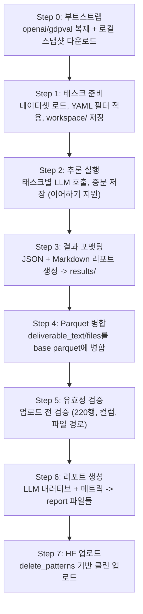
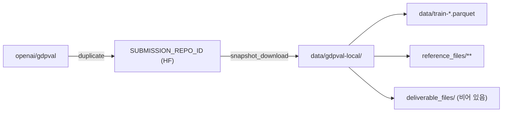
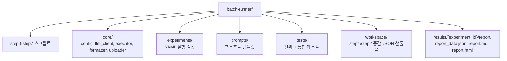
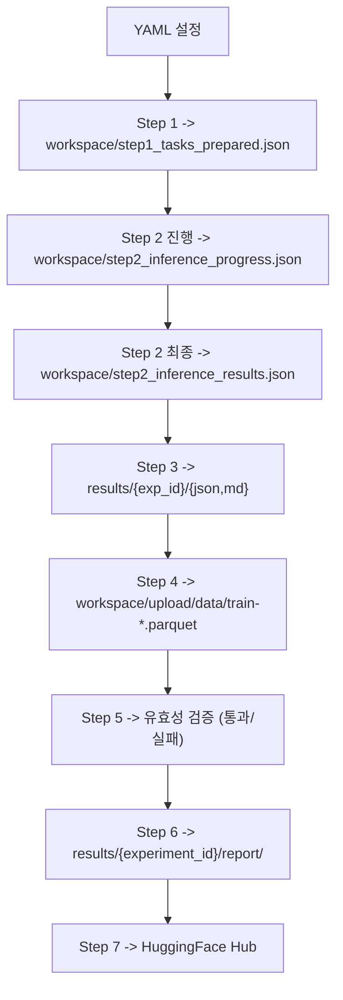

# GDPVal Batch Runner

[OpenAI GDPVal](https://huggingface.co/datasets/openai/gdpval) Gold Subset 220개 태스크에 대해 LLM 실험을 실행하고, 결과를 HuggingFace에 업로드하는 Python 파이프라인입니다.

## 아키텍처



## 빠른 시작

```bash
cd batch-runner
pip install -r requirements.txt

# 환경 변수 설정 (사용할 프로바이더에 맞게)
export HF_TOKEN="hf_xxx"
export AZURE_OPENAI_ENDPOINT="https://xxx.openai.azure.com"
export AZURE_OPENAI_API_KEY="xxx"

# Step 0: 부트스트랩 (openai/gdpval 복제 + 로컬 스냅샷)
./step0_bootstrap.sh HyeonSang/my-experiment-repo

# Step 1: 실험 YAML로 태스크 준비
./step1_prepare_tasks.sh experiments/exp999_smoke_baseline_sample.yaml

# Step 2: 추론 실행
./step2_run_inference.sh condition_a

# Step 3: 결과 포맷팅
./step3_format_results.sh

# Step 4: Parquet 채우기
./step4_fill_parquet.sh results/exp999_smoke_baseline_sample.json HyeonSang/my-experiment-repo

# Step 5: 유효성 검증
./step5_validate.sh

# Step 6: 실험 리포트 생성
./step6_report.sh

# Step 7: HuggingFace 업로드
./step7_upload_hf.sh HyeonSang/my-experiment-repo
```

## 환경 변수

| 변수명 | 필수 여부 | 설명 |
|--------|----------|------|
| `HF_TOKEN` | 필수 | HuggingFace write 토큰 (Step 0, Step 6에서 사용) |
| `AZURE_OPENAI_ENDPOINT` | Azure 사용 시 | Azure OpenAI 엔드포인트 URL |
| `AZURE_OPENAI_API_KEY` | Azure 사용 시 | Azure OpenAI API 키 |
| `OPENAI_API_KEY` | OpenAI 사용 시 | 네이티브 OpenAI API 키 |
| `ANTHROPIC_API_KEY` | Anthropic 사용 시 | Anthropic API 키 |

## 파이프라인 단계별 상세

### Step 0: 부트스트랩 (`step0_bootstrap.sh`)



- HF에 `SUBMISSION_REPO_ID`가 없으면 `openai/gdpval`을 duplicate
- `data/gdpval-local/`에 로컬 스냅샷 다운로드
- 검증: 220행, rubric 컬럼 존재, reference_files/ 존재

### Step 1: 태스크 준비 (`step1_prepare_tasks.py`)

실험 YAML 설정 읽기 → 데이터셋 로드 → 필터 적용 (sector, sample_size) → `workspace/step1_tasks_prepared.json`에 태스크 목록 + 조건 설정 저장.

### Step 2: 추론 실행 (`step2_run_inference.py`)

준비된 태스크 읽기 → 태스크별 LLM 호출 → `workspace/step2_inference_progress.json`에 증분 저장. 다중 라운드 이어하기 지원: `error`/`qa_failed` 태스크를 자동으로 재실행.

### Step 3: 결과 포맷팅 (`step3_format_results.py`)

추론 결과를 `results/<exp_id>/` 아래에 구조화된 JSON + Markdown 리포트로 변환.

### Step 4: Parquet 병합 (`step4_fill_parquet.py`)

`deliverable_text`와 `deliverable_files`를 base parquet에 병합. 원본 컬럼(rubric_json, rubric_pretty 등) 모두 보존.

### Step 5: 유효성 검증 (`step5_validate.py`)

업로드 전 무결성 검사: 220행, 필수 컬럼, deliverable 파일 경로 등.

### Step 6: 리포트 생성 (`step6_report.py`)

`workspace/result.json`을 읽어 `results/<experiment_id>/report/` 아래에 세 개의 파일을 생성합니다:

- **`report_data.json`** — 대시보드 렌더링용 구조화 JSON (메트릭 + LLM 내러티브)
- **`report.md`** — 실행 요약, 섹터 분석, QA 이슈, 권장사항이 포함된 사람이 읽을 수 있는 Markdown 리포트
- **`report.html`** — 외부 의존성 없이 브라우저에서 직접 열 수 있는 독립형 HTML 리포트

내러티브 섹션(개요, 품질 분석, 실패 패턴, 권장사항)은 실험과 동일한 모델을 사용한 단일 LLM 호출로 생성됩니다.
이 단계에서는 채점 점수가 아직 없으므로, 태스크 완료율·Self-QA 점수·레이턴시 패턴·산출물 품질에 집중합니다.

LLM 호출이 실패하면 메트릭 섹션은 그대로 생성되고, 내러티브 필드는 빈 값으로 남습니다.

### Step 7: HuggingFace 업로드 (`step7_upload_hf.sh`)

`delete_patterns`로 HF 원격의 `data/**`, `deliverable_files/**`를 삭제 후 업로드. `reference_files/**`는 제외 (duplicate된 원본 유지).

## 실험 YAML 설정

설정 파일은 `experiments/` 디렉토리에 위치합니다. 예시:

```yaml
experiment:
  id: "exp999_smoke_baseline_sample"
  name: "Smoke Baseline Run (Sample)"

data:
  source: "HyeonSang/my-experiment-repo"
  filter:
    sector: null          # null = 전체 220개 태스크
    sample_size: 3        # null = 전체; 정수 = 랜덤 샘플 (seed=42)

condition_a:
  name: "Baseline"
  model:
    provider: "azure"         # azure | openai | anthropic
    deployment: "gpt-5.2-chat"
    temperature: 0.0
    seed: 42
  prompt:
    system: "You are a helpful assistant."
    suffix: null
  qa:
    enabled: true
    min_score: 6
    max_retries: 3

execution:
  mode: "code_interpreter"    # code_interpreter | subprocess | json_renderer
  max_retries: 5
  resume_max_rounds: 3
```

`condition_b`는 선택 사항입니다. 생략하면 단일 조건 실행으로 동작합니다.

## 실행 모드

### `code_interpreter` — Azure OpenAI Responses API (권장)

**Azure OpenAI Responses API의 내장 Code Interpreter**를 활용하는 핵심 실행 모드입니다.

- 모델이 Python 코드를 자율적으로 작성하고 **Azure OpenAI가 관리하는 보안 샌드박스 컨테이너** 내에서 실행
- 파일 생성 (Excel, PDF, Word, PowerPoint, 이미지)이 샌드박스 내에서 이루어짐 — **로컬 코드 실행 없음, 의존성 관리 불필요, 보안 위험 없음**
- Responses API가 도구 호출(`code_interpreter`)을 실시간 스트리밍하며, 생성된 파일은 Files API로 회수
- 반복적 코드 실행 지원: 모델이 출력을 검사하고, 오류를 수정하고, 재시도 — 단일 API 호출 내에서 모든 것이 완료
- **Azure OpenAI** 및 **OpenAI** 엔드포인트에서 사용 가능

> 이것은 Azure OpenAI를 사용한 프로덕션 실행에 권장되는 모드로, 가장 안전하고 강력한 파일 생성 워크플로우를 제공합니다.

### `subprocess` — 로컬 코드 실행

Responses API를 지원하지 않는 프로바이더(예: Anthropic)용.

- LLM이 Python 코드 생성 → **격리된 임시 디렉토리**에서 화이트리스트 환경 변수만으로 실행
- 로컬에 Python 패키지(openpyxl, reportlab 등) 설치 필요
- 모든 모델 프로바이더에서 사용 가능

### `json_renderer` — 공정한 모델 간 비교

다른 모델 간 통제된 A/B 테스트를 위해 설계.

- LLM이 산출물 구조를 설명하는 **JSON 사양**을 출력
- **고정된 Python 렌더러**(모든 모델에 동일한 코드)가 사양을 파일로 변환
- 코드 생성 능력을 변수에서 제거하여 모델의 태스크 이해력만 비교
- 모든 모델 프로바이더에서 사용 가능

| 모드 | 지원 프로바이더 | 보안 | 적합한 용도 |
|------|---------------|------|----------|
| `code_interpreter` | Azure OpenAI, OpenAI | 샌드박스 (클라우드) | 프로덕션 실행, 복잡한 파일 생성 |
| `subprocess` | 모든 프로바이더 | 격리된 임시 디렉토리 | 비 OpenAI 모델 |
| `json_renderer` | 모든 프로바이더 | 코드 실행 없음 | 공정한 모델 간 비교 |

## 멀티 프로바이더 지원

`step2_run_inference.py`가 `condition["model"]["provider"]`를 읽어 클라이언트 선택:

| 프로바이더 | SDK | 환경 변수 |
|-----------|-----|----------|
| `azure` / `azure_openai` | `AzureOpenAI` | `AZURE_OPENAI_ENDPOINT` + `AZURE_OPENAI_API_KEY` |
| `openai` | `OpenAI` | `OPENAI_API_KEY` |
| `anthropic` | `AnthropicClient` 래퍼 | `ANTHROPIC_API_KEY` |

모든 프로바이더는 통합된 응답 형식 (`response.choices[0].message.content`)을 반환합니다.

## 프로젝트 구조



## 데이터 흐름

각 단계는 `workspace/`의 JSON 파일에서 읽으며, 이전 Python 객체가 아닌 파일 기반으로 동작합니다. 각 단계는 독립적으로 재시작 가능합니다.



## 테스트

```bash
# Mock 테스트만 (기본, API 키 불필요)
pytest

# 통합 테스트 (HF_TOKEN 및 실제 데이터 필요)
pytest -m integration

# 전체 테스트
pytest -m ""

# 개별 파일
pytest tests/test_llm_client.py -v

# 커버리지 포함
pytest --cov=core --cov-report=html
```

기본 설정: `-m "not integration"` — 통합 테스트는 기본적으로 건너뜁니다.

## 주의 사항

- **o-series 모델** (`gpt-5.x`, `o3`, `o4`)은 `temperature` 파라미터를 지원하지 않습니다. `temperature=0`을 전달하면 400 에러가 발생합니다.
- **`needs_files` 게이트**: 루브릭에서 파일 산출물을 기대하는 태스크는 파일이 생성되지 않으면 실패하여 재시도가 트리거됩니다.
- **이어하기 동작**: Step 2는 각 태스크 완료 후 진행 상태를 저장합니다. 같은 조건으로 재실행하면 `workspace/step2_inference_progress.json`에서 이어서 `error`/`qa_failed` 태스크만 재실행합니다.
- **HF 업로드**: Step 7은 `delete_patterns`로 `data/**`와 `deliverable_files/**`를 삭제 후 업로드합니다. `reference_files/**`는 제외됩니다. `results/<experiment_id>/report/`는 업로드에 포함되어 HuggingFace에서 `report_data.json`을 직접 읽을 수 있습니다.
- **`code_interpreter` 모드**는 Azure OpenAI의 Responses API와 내장 Code Interpreter를 활용하는 권장 실행 모드입니다. 보안 샌드박스에서 파일을 생성합니다. Anthropic 등 비 OpenAI 프로바이더는 `subprocess` 또는 `json_renderer`를 사용해야 합니다.

## GitHub Actions

파이프라인은 GitHub Actions로 자동화할 수 있습니다. `.github/workflows/batch-run.yml`에서 `workflow_dispatch` 설정으로 Actions 탭에서 수동 트리거하여 전체 Step 0–7 파이프라인을 실행할 수 있습니다.
