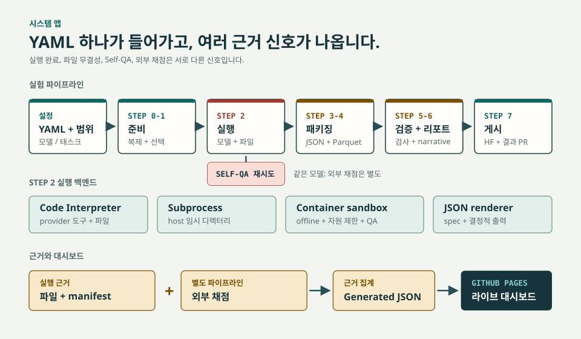

# GDPVal Batch Runner

[OpenAI GDPVal](https://huggingface.co/datasets/openai/gdpval) Gold Subset 220개 태스크에 대해 LLM 실험을 실행하고, 결과를 HuggingFace에 업로드하는 Python 파이프라인입니다.

## 여기서 시작하세요

- **게시된 근거 보기:** [라이브 대시보드](https://hyeonsangjeon.github.io/gdpval-realworks/)를 엽니다.
- **가장 작은 실제 실행 확인:**
  [`exp998_smoke_baseline_sample.yaml`](experiments/exp998_smoke_baseline_sample.yaml)을 봅니다.
- **지원되는 클라우드 경로 실행:**
  내 fork의 [Run GDPVal Batch Experiment](../../../actions/workflows/batch-run.yml)에서
  `experiment_yaml=exp998_smoke_baseline_sample`을 사용합니다.
- **결과 위치 확인:** [결과와 아티팩트](../docs/first-experiment_KR.md#7-성공-상태-확인)를 읽습니다.

첫 실행은 [초보자 가이드](../docs/first-experiment_KR.md)를 따르세요. Azure
OIDC, 일회성 Hugging Face 대상, 비용 경계, 3-task smoke test의 정본 경로입니다.

## 아키텍처

<picture>
  <source media="(max-width: 960px)" srcset="../docs/images/readme-system-map-mobile-ko.svg" />
  
</picture>

## 빠른 시작

### 권장 경로: GitHub Actions

1. 이 저장소를 fork하고
  [3-task 샘플 config](experiments/exp998_smoke_baseline_sample.yaml)의
  `data.source`만 내 Hugging Face namespace의 새 일회성 dataset으로 바꿉니다.
2. [초보자 가이드](../docs/first-experiment_KR.md#5-repository-secrets-등록)의
  repository secret 5개와 필수 identity variable을 설정합니다.
3. `main`의
  내 fork의 [Batch workflow](../../../actions/workflows/batch-run.yml)를 열고
  `exp998_smoke_baseline_sample`을 입력하며 내부 relay 필드는 기본값으로 둡니다.
4. 아래 경계를 읽은 뒤 첫 smoke에만 `dry_run: true`를 사용합니다.

> `dry_run: true`여도 Step 0, 모델 호출, Self-QA를 실행하고 relay checkpoint를
> 쓸 수 있습니다. Step 5, 최종 Step 7 게시, 결과 PR을 생략할 뿐 무료 또는
> 원격 쓰기 없는 시뮬레이션이 아닙니다.

### 로컬 단계별 디버깅

Python 3.11, Azure CLI 로그인, 실제 모델 예산, 샘플 YAML에 설정한 일회성
Hugging Face 대상이 필요합니다. Step 0은 HF에 쓰고 Step 2는 모델을 호출합니다.

```bash
cd batch-runner
python3 -m venv .venv
source .venv/bin/activate
pip install -r requirements.txt
az login

export HF_TOKEN="<전용-HF-write-token>"
export AZURE_AI_ROUTE_PROFILE="project-ci"
export AZURE_OPENAI_V1_ENDPOINT="https://<foundry-resource>.services.ai.azure.com/openai/v1/"
export FOUNDRY_PROJECT_ENDPOINT="https://<foundry-resource>.services.ai.azure.com/api/projects/<project-name>"
CONFIG="experiments/exp998_smoke_baseline_sample.yaml"

bash step0_bootstrap.sh "$CONFIG"
bash step1_prepare_tasks.sh "$CONFIG"
bash step2_run_inference.sh condition_a
bash step3_format_results.sh
bash step4_fill_parquet.sh

# 3-task smoke는 Step 5를 생략합니다. 모델 호출 없는 미게시 리포트를 만듭니다.
bash step6_report.sh --no-narrative --dry-run
```

설정 확인만을 위해 Step 7을 실행하지 마세요. 3-row smoke 결과를 의도적으로
게시하려면 먼저 `bash step6_report.sh --no-narrative`로 미게시 self-report를
교체한 뒤 `bash step7_upload_hf.sh --test`를 실행하세요. Step 7은 dry-run 또는
stale report를 거부하고 repository, prepared fingerprint, Step 2 result
fingerprint, run-specific publication generation, ordered task ID, result task
set이 현재 workspace와 일치하는지 검증합니다. 새 Step 1은 이전 finalized run을
무효화하고 relay leg는 최초 generation을 유지합니다. Parquet submitter
text/files/URL/URI도 현재 Step 2 결과와 같을 때만 대상의 원격 `data/**`,
`deliverable_files/**`, `self_report.json`을 CAS로 교체합니다.

## 인증과 환경 변수

| 변수명 | 필수 여부 | 설명 |
|--------|----------|------|
| `HF_TOKEN` | 클라우드 게시 | bootstrap, relay 저장, Step 7에 사용하는 전용 Hugging Face write token |
| `AZURE_AI_ROUTE_PROFILE` | Azure | direct inference는 `direct-v1`, Code Interpreter만 Foundry project로 보낼 때는 `project-ci` |
| `AZURE_OPENAI_V1_ENDPOINT` | Azure | 승인된 Azure/Foundry resource의 OpenAI-compatible `/openai/v1/` endpoint |
| `FOUNDRY_PROJECT_ENDPOINT` | `project-ci` | `/api/projects/<project-name>`으로 끝나는 Foundry project endpoint |
| `AZURE_OPENAI_LEGACY_ENDPOINT` | rollback 전용 | dated Azure OpenAI resource endpoint. 지원 direct/project workflow에서는 사용하지 않음 |
| `AZURE_AI_ALLOW_LEGACY_ROLLBACK` | rollback 전용 | `legacy-rollback` profile 승인을 위해 정확히 `1`이어야 함 |
| `AZURE_CLIENT_ID` | GitHub Actions + Azure | OIDC용 Entra application client ID |
| `AZURE_TENANT_ID` | GitHub Actions + Azure | OIDC용 Entra directory tenant ID |
| `AZURE_SUBSCRIPTION_ID` | GitHub Actions + Azure | `azure/login`용 Azure subscription ID |
| `AZURE_AI_EXPECTED_CLIENT_ID` | GitHub Actions + Azure | 승인된 OIDC client ID를 고정하는 독립 repository variable |
| `AZURE_AI_EXPECTED_TENANT_ID` | GitHub Actions + Azure | 승인된 OIDC tenant ID를 고정하는 독립 repository variable |
| `AZURE_AI_EXPECTED_SUBSCRIPTION_ID` | GitHub Actions + Azure | 승인된 Azure subscription ID를 고정하는 독립 repository variable |
| `AZURE_AI_EXPECTED_LEGACY_ACCOUNT` | strict rollback 전용 | `AZURE_OPENAI_LEGACY_ENDPOINT`에서 파싱한 exact account |
| `OPENAI_API_KEY` | OpenAI 사용 시 | 네이티브 OpenAI API 키 |
| `ANTHROPIC_API_KEY` | Anthropic 사용 시 | Anthropic API 키 |

지원 경로는 `AZURE_OPENAI_ENDPOINT`, `AZURE_OPENAI_API_KEY`, `AZURE_API_KEY`,
`AZURE_OPENAI_AD_TOKEN`, `AZURE_CLIENT_SECRET`을 거부합니다. CI는
`azure/login`, 로컬은 `az login`과 `DefaultAzureCredential`을 사용하며 scope는
`https://ai.azure.com/.default`입니다. inference, narrative, grading은 direct
v1 route를 사용하고 `project-ci`에서도 Code Interpreter만 project route를
사용합니다. 별도 승인한 `legacy-rollback` profile은 dated Azure OpenAI
client와 필수 audience인 `https://cognitiveservices.azure.com/.default`를
사용하며 token preflight는 typed route가 선택한 audience를 검증합니다.

GitHub Actions는 기존 repository secret 이름 `AZURE_OPENAI_ENDPOINT`를
onboarding 입력으로만 유지하고 typed runtime 변수
`FOUNDRY_PROJECT_ENDPOINT`로 매핑합니다. 기존 runtime 환경 변수는 주입하지
않습니다.

CI에는 `AZURE_AI_EXPECTED_CLIENT_ID`, `AZURE_AI_EXPECTED_TENANT_ID`,
`AZURE_AI_EXPECTED_SUBSCRIPTION_ID`, `AZURE_AI_EXPECTED_DIRECT_ACCOUNT`가 항상
필수이며, `project-ci`에는 `AZURE_AI_EXPECTED_PROJECT_ACCOUNT`와
`AZURE_AI_EXPECTED_PROJECT_NAME`도 필요합니다. 명시적으로 승인한 strict
`legacy-rollback`은 direct/project account 변수 대신
`AZURE_AI_EXPECTED_LEGACY_ACCOUNT`를 요구합니다. 로그인 전에는 secret과 독립
variable을 비교하고 로그인 후에는 active account와 Azure AI token claim을
다시 검증합니다. route fingerprint는 Azure SKU, PTU 할당, provisioned
capacity를 증명하지 않으므로 비용·처리량 민감 실험 전에 별도로 확인해야
합니다.

## 파이프라인 단계별 상세

### Step 0: 부트스트랩 (`step0_bootstrap.sh`)


- 실험 YAML 경로를 받아 `data.source`에서 대상을 읽음:
  `bash step0_bootstrap.sh experiments/exp998_smoke_baseline_sample.yaml`
- target을 먼저 read-only로 분류합니다. 대상이 없을 때만 pinned source를
  완전히 준비·검증한 뒤 public HF dataset을 생성하며, create와 upload는 각각
  최대 1회만 시도합니다. upload 결과가 불명확하면 자동 재시도·삭제하지 않습니다.
- `data/gdpval-local/`에 로컬 스냅샷 다운로드
- `openai/gdpval`의 full revision 하나를 고정하고 base data와 parquet가 선언한
  reference만 fresh staging에 다운로드. 업로드 전에 exact source column,
  ordered task prompt/taxonomy/rubric/reference assignment projection, 전체
  physical reference tree, 모든 reference SHA-256/size를 검증
- deliverable을 비우기 전에 source-derived schema-v4
  `step0_needs_files_manifest.json`을 target에 보존하고 exact task ID, active
  policy, signal field, summary, source projection, ordered reference record를 검증
- 검증: 220행, rubric 컬럼 존재, 선언된 reference가 모두 regular file인지 확인.
  Step 2와 각 upload/copy 경계에서도 model 또는 generated code 실행 전에 같은
  byte identity를 다시 검증
- 기존 대상에 `data/` 경로가 있을 때만 재사용하며, 없으면 dataset repository를
  자동 삭제하지 않고 중단함. 재사용 대상에도 canonical manifest가 있어야 하며
  stripped data에서 이를 재생성하지 않음. 매 실행마다 target의 exact full-SHA
  HEAD를 fresh staging에 받고 canonical target column, projection, manifest,
  reference tree, empty submitter state를 검증한 뒤에만 이전 local snapshot을
  교체함. 새 일회성 target을 쓰거나 확인한 partial/legacy repository를
  명시적으로 제거해야 함

### Step 1: 태스크 준비 (`step1_prepare_tasks.py`)

실험 YAML 설정 읽기 → 데이터셋 로드 → 필터 적용 (sector, sample_size) → `workspace/step1_tasks_prepared.json`에 태스크 목록 + 조건 설정 저장.

### Step 2: 추론 실행 (`step2_run_inference.py`)

준비된 태스크 읽기 → 태스크별 LLM 호출 →
`workspace/step2_inference_progress_condition_a.json` 같은 조건별 checkpoint와
`workspace/step2_inference_results_condition_a.json` 같은 최종 결과에 저장.
condition A는 호환성을 위해 legacy alias도 기록하며, 다중 라운드 resume은
`error`/`qa_failed` 태스크를 자동 재실행합니다. 기존 progress identity는 provider
client와 executor를 만들기 전에 검증하므로 stale 또는 malformed local resume이
model budget을 소비하지 않습니다.

### Step 3: 결과 포맷팅 (`step3_format_results.py`)

추론 결과를 `results/<exp_id>/` 아래에 구조화된 JSON + Markdown 리포트로 변환.

### Step 4: Parquet 병합 (`step4_fill_parquet.py`)

full source parquet를 schema-v4 manifest와 reference byte에 다시 대조한 뒤
`deliverable_text`와 `deliverable_files`를 병합합니다. 인증된 source column
(prompt, rubric, taxonomy, reference)은 그대로 보존합니다.

### Step 5: 유효성 검증 (`step5_validate.py`)

업로드 전 무결성 검사: 220행, 필수 컬럼, deliverable 파일 경로 등.

### Step 6: 리포트 생성 (`step6_report.py`)

`workspace/result.json`의 실험 identity를 검증하고 엄격한 pre-grading report를
`results/<experiment_id>/report/`에 생성합니다.

- **`report_data.json`** — 구조화된 self-report 데이터
- **`report.md`** — 사람이 읽을 수 있는 실행 요약

workspace 소유 결과에서는 `report_data.json`을
`workspace/upload/self_report.json`으로도 복사합니다. HTML은 생성하지 않으며
외부 채점은 별도 pipeline입니다.

기본 narrative 경로는 `gpt-5.4-pro`를 최대 2회 호출합니다. 설정, 호출, 파싱,
route 검증 중 하나라도 실패하면 즉시 model-free report를 만들며 실험 모델
fallback은 호출하지 않습니다. workflow는 게시 전에 report identity를
검증합니다.

### Step 7: HuggingFace 업로드 (`step7_upload_hf.sh`)

regular file이며 identity가 맞는 `self_report.json`과
`inference_provenance.json`, 모든 게시 row의 source projection, exact
deliverable tree를 다시 검증합니다. 그 뒤 원격 `data/**`,
`deliverable_files/**`, `self_report.json`을 CAS로 교체하고 오래된
`step2_inference_results.json`을 삭제합니다. Step 0에서 검증한 target HEAD를
HF CAS parent로 사용해 `README.md`, `data/train-*.parquet`,
`deliverable_files/**`, `inference_provenance.json`, `self_report.json`만
게시하므로 다른 run이 target을 바꿨으면 덮어쓰지 않고 실패합니다.
self-report identity는 prepared/result fingerprint, publication generation,
ordered task identity와 일치해야 하고, task별 summary와 deliverable 목록은
검증된 Step 2 result projection과 같아야 합니다. endpoint-free sidecar는
검증된 experiment, source, task identity, typed route fingerprint와 일치해야
합니다.
`reference_files/**`는 duplicate 원본을 유지합니다. Markdown report는 HF
report directory가 아니라 결과 PR로 기록됩니다.

## 실험 YAML 설정

첫 3-task 실행에는 체크인된
[`exp998_smoke_baseline_sample.yaml`](experiments/exp998_smoke_baseline_sample.yaml)을
사용합니다. 실행 전에 `data.source`의 owner만 바꾸고 repository 이름은 YAML
stem과 같게 유지하세요.

```yaml
experiment:
  id: "exp998_smoke_baseline_sample"

data:
  source: "YOUR_HF_USERNAME/exp998_smoke_baseline_sample"
  filter:
    sector: null
    occupation: null
    sample_size: 3

condition_a:
  model:
    provider: "azure"
    deployment: "gpt-5.2-chat"
  qa:
    enabled: true
    max_retries: 3
    min_score: 6

execution:
  mode: "code_interpreter"
  max_retries: 5
  resume_max_rounds: 3
```

실제 샘플 파일에는 전체 prompt와 Self-QA 계약이 있습니다. 일반 Batch
workflow는 단일 조건만 지원하고 credential 사용 전에 `condition_b`를
거부합니다. 두 조건 비교는 별도 versioned experiment config로 실행하세요.

필수 preprocessor와 선택적 preprocessor는 모두 credential 및 route 계획에
참여합니다. 설정된 모든 Azure preprocessor deployment는 strict route
preflight에 포함되고, optional을 포함해 설정된 OpenAI 또는 Anthropic
preprocessor에는 해당 repository secret이 필요합니다. `optional`이어도 설정된
provider는 credential 탐색에서 제외되지 않습니다.

## 실행 모드

### `code_interpreter` — Azure OpenAI Responses API (권장)

**Azure OpenAI Responses API의 내장 Code Interpreter**를 활용하는 핵심 실행 모드입니다.

- 모델이 Python 코드를 자율적으로 작성하고 **Azure OpenAI가 관리하는 보안 샌드박스 컨테이너** 내에서 실행
- 파일 생성(Excel, PDF, Word, PowerPoint, 이미지)은 provider-managed sandbox에서 이루어져 host code 실행과 로컬 dependency 위험을 줄입니다. 일반적인 cloud, prompt, data, output review 위험은 남습니다.
- Responses API가 도구 호출(`code_interpreter`)을 실시간 스트리밍하며, 생성된 파일은 Files API로 회수
- 반복적 코드 실행 지원: 모델이 출력을 검사하고, 오류를 수정하고, 재시도 — 단일 API 호출 내에서 모든 것이 완료
- **Azure Foundry project route**에서만 사용할 수 있으며, native OpenAI와 다른 프로바이더는 다른 실행 모드를 사용해야 함

> 이것은 Azure OpenAI를 사용한 프로덕션 실행에 권장되는 모드로, 가장 안전하고 강력한 파일 생성 워크플로우를 제공합니다.

### `subprocess` — 로컬 코드 실행

Responses API를 지원하지 않는 프로바이더(예: Anthropic)용.

- LLM이 Python 코드 생성 → **격리된 임시 디렉토리**에서 화이트리스트 환경 변수만으로 실행
- 로컬에 Python 패키지(openpyxl, reportlab 등) 설치 필요
- 모든 모델 프로바이더에서 사용 가능

### `json_renderer` — 공정한 모델 간 비교

다른 모델 간 통제된 A/B 테스트를 위해 설계.

- LLM이 산출물 구조를 설명하는 **JSON 사양**을 출력
- **고정된 Python 렌더러**(모든 모델에 동일한 코드)가 사양을 파일로 변환
- 코드 생성 능력을 변수에서 제거하여 모델의 태스크 이해력만 비교
- 모든 모델 프로바이더에서 사용 가능

### `sandbox` — 컨테이너 기반 멀티모달 실행

`subprocess`를 Docker 격리, task별 dependency 탐색, Agent Skills, 산출물
검증·render QA·bounded repair loop로 확장한 모드입니다. 컨테이너는 network를
끄고 memory/PID/CPU 제한과 `no-new-privileges`를 적용합니다. 정확한 image,
fallback, cache, manifest 계약은 [sandbox 문서](sandbox/README.md)를
참고하세요.

| 모드 | 지원 프로바이더 | 보안 | 적합한 용도 |
|------|---------------|------|----------|
| `code_interpreter` | Azure Foundry project route | 샌드박스 (클라우드) | 프로덕션 실행, 복잡한 파일 생성 |
| `subprocess` | 모든 프로바이더 | 격리된 임시 디렉토리 | 비 OpenAI 모델 |
| `sandbox` | 모든 프로바이더 | network 없는 container + local fallback | 멀티모달·skill 기반 재현 실행 |
| `json_renderer` | 모든 프로바이더 | 코드 실행 없음 | 공정한 모델 간 비교 |

## 멀티 프로바이더 지원

`step2_run_inference.py`가 `condition["model"]["provider"]`를 읽어 클라이언트 선택:

| 프로바이더 | SDK | 환경 변수 |
|-----------|-----|----------|
| `azure` / `azure_openai` | `OpenAI` direct v1; Code Interpreter는 `AIProjectClient` | typed route env + `DefaultAzureCredential` (로컬 `az login`, CI OIDC) |
| `openai` | `OpenAI` | `OPENAI_API_KEY` |
| `anthropic` | `AnthropicClient` 래퍼 | `ANTHROPIC_API_KEY` |

모든 프로바이더는 통합된 응답 형식 (`response.choices[0].message.content`)을 반환합니다.

## 프로젝트 구조

```text
batch-runner/
├── step0_bootstrap.sh ... step7_upload_hf.sh
├── core/                         # config, client, executor, validation
├── experiments/                  # versioned YAML 실험 config
├── prompts/                      # prompt template
├── workspace/                    # checkpoint와 upload staging
├── results/<experiment_id>/      # 포맷된 결과와 report/
└── tests/                        # model-free unit/contract test
```


## 데이터 흐름

각 단계는 `workspace/`의 JSON 파일에서 읽으며, 이전 Python 객체가 아닌 파일 기반으로 동작합니다. 각 단계는 독립적으로 재시작 가능합니다.

```text
experiment YAML
  -> workspace/step1_tasks_prepared.json
  -> workspace/step2_inference_{progress,results}_<condition>.json
  -> workspace/result.json + results/<experiment_id>/
  -> workspace/upload/{data,deliverable_files,inference_provenance.json,self_report.json}
  -> 결과 PR(report.md) + Hugging Face allowlist + Actions artifact
```


## 테스트

```bash
# Mock 테스트만 (기본, API 키 불필요)
pytest

# 통합 테스트 (HF_TOKEN 및 실제 데이터 필요)
pytest -m integration

# 전체 테스트
pytest -m ""

# 개별 파일
pytest tests/test_llm_client.py -v

# 커버리지 포함
pytest --cov=core --cov-report=html
```

기본 설정: `-m "not integration"` — 통합 테스트는 기본적으로 건너뜁니다.

## 주의 사항

- **o-series 모델** (`gpt-5.x`, `o3`, `o4`)은 `temperature` 파라미터를 지원하지 않습니다. `temperature=0`을 전달하면 400 에러가 발생합니다.
- **`needs_files` 게이트**: 루브릭에서 파일 산출물을 기대하는 태스크는 파일이 생성되지 않으면 실패하여 재시도가 트리거됩니다.
- **이어하기 동작**: Step 2는 조건별 checkpoint를 분리하고 해당 조건의 `error`/`qa_failed` 태스크만 재실행합니다.
- **HF 업로드**: Step 7은 원격 `data/**`, `deliverable_files/**`, `self_report.json`을 CAS로 교체하고 오래된 `step2_inference_results.json`을 삭제한 뒤 아래 명시적 allowlist만 업로드합니다. `reference_files/**`는 보존합니다.
- **`code_interpreter` 모드**는 typed Foundry project route를 사용하는 Azure 권장 실행 모드입니다. Native OpenAI, Anthropic 등 다른 프로바이더는 `subprocess` 또는 `json_renderer`를 사용해야 합니다.

## GitHub Actions

[Run GDPVal Batch Experiment](../../../actions/workflows/batch-run.yml)
(`workflow_dispatch`)를 신뢰된 `main` workflow 정의에서 실행합니다.
preflight는 checkout과 cloud 접근 전에 non-`main` ref 또는 workflow/event SHA
불일치를 거부합니다.

### 워크플로우 파라미터

| 파라미터 | 역할 | 기본값 | 언제 바꾸나 |
|---------|------|--------|-----------|
| `experiment_yaml` | `.yaml`을 뺀 config 파일명 | *(필수)* | 추적 중인 config stem 입력 |
| `experiment_name` | 선택적 표시 이름. 비우면 YAML에서 읽음 | *(비움)* | 보통 비워 둠 |
| `dry_run` | Step 5, 최종 Step 7 게시, 결과 PR 생략. 모델/HF 설정은 실행 | `false` | 비용·쓰기 경계를 읽은 뒤 첫 smoke에서만 사용 |
| `relay_run` | 내부 relay leg 카운터 | `0` | 수동 실행에서는 변경하지 않음 |
| `relay_lineage_id` | relay 전체에 전달되는 안정적 identity | *(비움)* | 내부용. leg 0에서는 비워 둠 |
| `source_sha` | 모든 relay leg가 요구하는 최초 `main` commit | *(비움)* | 내부용. leg 0에서는 비워 둠 |
| `wall_timeout` | `condition_a` Step 2 checkpoint watchdog `0..290`분. `0`은 YAML의 `execution.wall_timeout`에 위임하며 둘 다 `0`일 때만 비활성화 | `290` | relay 디버깅이 아니면 기본값 유지 |
| `sandbox_image_digest` | relay 전체에 전달되는 immutable sandbox image | *(비움)* | 내부용. 필요 시 workflow가 결정 |

### 3-task smoke 입력

```
experiment_yaml:       exp998_smoke_baseline_sample
experiment_name:       <비움>
dry_run:               true
relay_run:             0
relay_lineage_id:      <비움>
source_sha:            <비움>
wall_timeout:          290
sandbox_image_digest:  <비움>
```

### 이어달리기(Relay Run) 동작 원리

긴 실험은 GitHub Actions job 제한에 가까워질 수 있습니다. Step 2는 태스크
사이에서 watchdog을 확인하고, deadline을 확인하면 checkpoint를 저장한 뒤
안정적인 lineage를 다음 relay leg로 전달합니다.

```
Run 1 (직접 트리거):
  → 태스크 실행 → 설정한 wall timeout 도달
  → exact `data.source`에 content-addressed generation 하나를 업로드
  → generation revision과 progress/deliverable SHA-256 + size 전체를 검증한
    뒤에만 `current.json` marker를 전진
  → Run 2 자동 트리거 (relay_run=1)

Run 2 (자동 트리거):
  → marker의 immutable payload revision과 exact file set만 복원
  → Azure login 전에 lineage, complete ordered task set, prepared fingerprint,
    sandbox image digest, 참조 deliverable 전체를 검증
  → 미완료 태스크 이어서 실행 → 완료
  → Step 3~7 정상 진행 → PR 생성
```

이는 보장된 handoff 시간이 아니라 best-effort입니다. 진행 중인 긴 태스크나
앞선 setup이 남은 step/job 시간을 소진할 수 있습니다.

relay 시도 횟수는 실험 config가 제한합니다. workflow는 최초 `main` commit을
`source_sha`로 고정하며, `main`이 바뀌면 relay가 checkout 전에 실패합니다.
checkpoint가 없거나 잘못됐거나 불완전하면 전체 태스크를 조용히 재실행하지
않고 continuation을 실패시킵니다.

Step 0 뒤에는 비변경 HF authorization check로 exact `data.source`의 write
권한을 증명합니다. 이 검사는 task 준비, Azure login, model spend보다 먼저
실행됩니다.
Step 0은 pinned source projection과 전체 declared reference tree를 먼저 인증하고
재사용 target의 exact HEAD를 local 설치 전에 증명합니다. parquet가 선언한 모든
reference를 unique regular non-symlink path와 SHA-256/byte size로 기록하며,
Step 2와 각 executor는 upload/copy 직전에 같은 identity를 재검증합니다.
누락·변경·copy 실패가 있으면 model/container/subprocess 시작 전에 중단합니다.
Code Interpreter는 각 task 종료 뒤 provider-side input file ID를 best-effort로
삭제합니다. 삭제 실패 시 provider의 file retention 정책에 따라 남을 수 있으므로
일회성 target에 민감 자료를 넣으면 안 됩니다.

Step 7이 원격 cleanup을 하기 전 canonical GDPVal parquet shard 하나,
task 소유 `deliverable_files/<task_id>/...` path, canonical `@main` URL/URI,
parquet가 선언한 모든 output과 local upload tree의 exact 일치를 요구합니다.
Step 4와 Step 7은 model 실행 뒤 source semantics를 manifest v4에 다시 대조합니다.
게시에는 현재 HF HEAD와 Step 0 validated HEAD의 일치 및 유효한 local
`self_report.json`도 필요하며 concurrent drift는 원격 변경 없이 실패합니다.
실패 task는 재사용 target의 이전 submitter text/file metadata를 승계하지 않습니다.

Checkpoint generation은 source/lineage별 `_checkpoint/` 경로에 있습니다.
성공한 cleanup은 exact-HEAD CAS commit으로 현재 dataset tree에서 그 lineage를
제거하며 restored expected generation에 결속됩니다. cleanup lineage 또는
generation이 다르면 finality 검증이 실패합니다. 실패한 upload/cleanup은
orphan generation을 남길 수 있고, path 삭제는 이전 Hugging Face revision이나
저장 이력을 지우지 않습니다. 민감하지 않은 입력·출력만 새 public 일회성
target에 사용하고, 이력 보존이 허용되지 않으면 dataset을 명시적으로
점검하거나 삭제하세요.
`relay_run`, `relay_lineage_id`, `source_sha`, `sandbox_image_digest`를 수동으로
채우지 마세요.

GitHub concurrency를 durable queue로 사용하지 않습니다. 같은 `data.source`를
공유하는 실행을 겹쳐 dispatch하지 마세요. checkpoint와 파괴적 게시는 같은
Hugging Face 대상을 사용합니다.

## 결과와 게시

- Step 2 checkpoint와 최종 inference JSON은 `workspace/`에 있습니다.
- Step 3은 `results/<experiment_id>/`에 포맷된 결과를 씁니다.
- Step 6은 `results/<experiment_id>/report/`에 `report_data.json`과
  `report.md`를 쓰고 HF용 `self_report.json`을 staging합니다.
- Step 7은 `README.md`, `data/train-*.parquet`, `deliverable_files/**`,
  `inference_provenance.json`, `self_report.json`만 게시합니다. endpoint-free
  provenance sidecar에는 experiment, source, prepared input, ordered task,
  typed route fingerprint만 있으며 endpoint URL과 credential은 없습니다. 이
  정보는 provenance일 뿐 SKU, PTU, provisioned capacity를 증명하지 않습니다.
- 전체 Step 2 inference JSON은 30일 Actions artifact에만 남고 HF allowlist에는
  들어가지 않습니다. Step 7은 이전 게시자가 남긴 원격
  `step2_inference_results.json`도 삭제합니다.
- Step 7은 publication revision을 검증한 뒤에만 receipt를 씁니다. read-only
  finality check는 receipt-bound plan을 다시 계산하고 최종 `main`이 해당
  publication이거나 resumed run에서는 그 바로 위의 expected-generation
  cleanup commit 하나인지 검증한 뒤, 검증 중 HEAD가 전진하지 않았는지도
  확인합니다.
- non-dry workflow는 Step 7이 HF를 수정하기 전에 `report.md` 하나만 담은
  결과 PR 계약을 검증합니다.
- workflow는 `batch-runner/workspace/`와 `batch-runner/results/`를 30일
  보관합니다. 내려받은 archive root에는 `workspace/`와 `results/`가 있습니다.

외부 rubric grading은 별도 workflow입니다. Self-QA나 Step 6 pre-grading
report가 외부 채점을 의미하지 않습니다.
