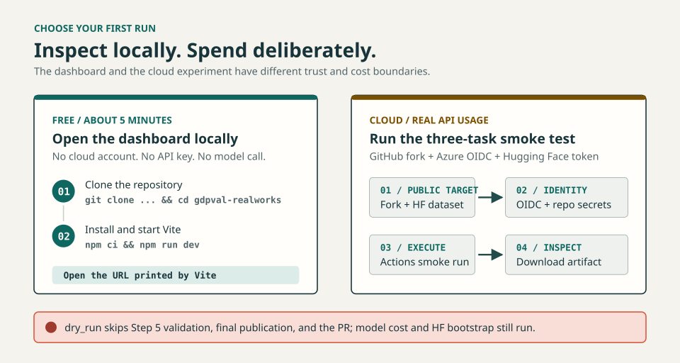

# Your First GDPVal RealWorks Run

This guide starts with a free local dashboard, then walks through the current
three-task cloud smoke test. You do not need prior GitHub Actions experience.

## Choose the run you want

- **Local dashboard:** about five minutes, free, and no cloud account required.
- **Three-task smoke experiment:** setup time plus model runtime, with GitHub,
  Azure, Hugging Face, and real API usage.

> **Important:** `dry_run: true` is not a no-cost or no-write simulation. It
> still calls the model, runs Self-QA, creates or reuses the configured Hugging
> Face dataset, and may write relay checkpoints. It skips Step 5 validation,
> the final Step 7 result upload, and the result pull request. This three-task
> smoke also skips Step 5 because of its sample size.

<p align="center">
   <picture>
      <source media="(max-width: 960px)" srcset="images/readme-first-run-mobile.svg" />
      
   </picture>
</p>

## Path A: open the dashboard locally

You need Git and Node.js 20 or newer. No API key or cloud account is required.

```bash
git clone https://github.com/hyeonsangjeon/gdpval-realworks.git
cd gdpval-realworks
npm ci
npm run dev
```

Open the URL printed by Vite. Because the project has a GitHub Pages base path,
the local URL normally ends in `/gdpval-realworks/`.

To run the same data and production checks used by CI:

```bash
npm run aggregate
npm run test:aggregate
npm run build
```

The generated site is written to `dist/`. This path reads repository data and
does not call an LLM.

## Path B: run three real tasks in GitHub Actions

A **smoke test** is a deliberately small real run used to catch setup problems.
**Self-QA** asks the generating model to inspect and possibly retry its own work;
it is not an independent grade. A **relay** continues unfinished tasks in a
later Actions job. **OpenID Connect (OIDC)** gives that job short-lived Azure
access without storing an Azure client secret.

The checked-in smoke config uses Azure deployment `gpt-5.2-chat`, selects three
tasks, and can retry Self-QA up to three times. Step 6 attempts up to two
sequential `gpt-5.4-pro` report calls; calls completed before an error can still
be billed. Any setup, call, parse, or route-validation failure immediately
produces a model-free report and does not call the experiment model. Exact time
and cost depend on output size, retries, quota, and your Azure pricing.

### 1. Prepare the accounts

You need:

- a GitHub account and a fork of this repository;
- an Azure subscription with an Azure OpenAI resource and a required deployment
   named `gpt-5.2-chat`; `gpt-5.4-pro` is optional but needed for the primary
   two-call report path;
- permission to create a Microsoft Entra app registration and assign the
  **Cognitive Services OpenAI User** role on that Azure OpenAI resource; and
- a Hugging Face account with a write token.

If your university or company owns the Azure tenant, ask its administrator for
the app registration and role assignment. Do not replace OIDC with a client
secret or Azure OpenAI API key: the batch workflow is designed for federated
identity.

### 2. Fork and use your own Hugging Face target

Fork the repository on GitHub. In your fork, edit
[`batch-runner/experiments/exp998_smoke_baseline_sample.yaml`](../batch-runner/experiments/exp998_smoke_baseline_sample.yaml)
and change only the owner in `data.source`:

```yaml
data:
  source: "YOUR_HF_USERNAME/exp998_smoke_baseline_sample"
```

Keep the repository name equal to the YAML stem. Use a new, disposable dataset.
Step 0 creates new targets as **public** datasets. It considers an existing
target bootstrapped only when at least one path starts with `data/`; otherwise
it fails closed without deleting anything. Use a new disposable target, or
remove the partial repository explicitly after inspection. If a `data/` path
already exists, Step 0 reuses that snapshot rather than replacing it. The
snapshot must also contain the source-derived `step0_needs_files_manifest.json`;
missing or inconsistent task/policy, prompt/taxonomy/rubric/reference
assignment, reference path/SHA-256/size identity aborts, and Step 0 never
regenerates this manifest from stripped data. Reused targets must also have
empty submitter text/file/URL/URI columns and no stale physical deliverables.
New targets are built from one pinned public-source revision by downloading
only base data and parquet-declared references. The complete source snapshot,
manifest, references, stripped submitter state, and frozen payload digest are
validated before target creation; create and upload are attempted once, and an
uncertain upload is preserved for inspection rather than retried or deleted.
Reused targets are downloaded
at an exact full-SHA HEAD into fresh staging; their canonical columns,
projection, manifest, complete reference tree, and empty submitter state must
pass before the previous local snapshot is replaced.

A later non-dry Step 7 CAS-replaces remote `data/**`, `deliverable_files/**`,
and `self_report.json` before uploading the new result. Do not point this config
at a dataset you need to keep.

Commit the edit to your fork's default `main` branch. Never put a token, key, or
password in this YAML.

### 3. Configure Azure OIDC once

The workflow uses
[`azure/login`](../.github/workflows/batch-run.yml) with a short-lived GitHub
OIDC token. A straightforward portal setup is:

1. In **Microsoft Entra admin center**, open **App registrations** and create an
   app for this fork.
2. Record its **Application (client) ID** and **Directory (tenant) ID**.
3. Open **Certificates & secrets > Federated credentials > Add credential**.
4. Choose **GitHub Actions deploying Azure resources**.
5. Enter your GitHub owner and repository, select **Branch**, and set the branch
   to `main`. The subject should represent
   `repo:YOUR_GITHUB_OWNER/gdpval-realworks:ref:refs/heads/main`.
6. On the Foundry resource, assign the service principal **Cognitive Services
   OpenAI User** for direct model calls. On the project used by Code
   Interpreter, assign the least-privilege **Foundry User** role. Do not assign
   subscription-wide `Contributor` or `Owner`.
7. Record the project endpoint ending in `/api/projects/<project-name>`. The
   workflow derives the direct `/openai/v1/` route from that same approved
   resource host. The sample's inference, Self-QA, narrative, and grading use
   direct v1; only Code Interpreter uses the project route.

Microsoft's reference setup is
[Use OpenID Connect with GitHub Actions](https://learn.microsoft.com/azure/developer/github/connect-from-azure-openid-connect).
This workflow requires the branch name `main`; configure the federated
credential for that exact branch.

### 4. Create the Hugging Face token

Create a token at [Hugging Face settings](https://huggingface.co/settings/tokens)
that can read the public source dataset and create, write, and delete your
disposable target dataset. Use a dedicated token scoped only to this work when
your account supports fine-grained permissions.

### 5. Add repository secrets

In your GitHub fork, open **Settings > Secrets and variables > Actions > New
repository secret** and add:

| Secret | Value |
|---|---|
| `AZURE_CLIENT_ID` | Entra application client ID |
| `AZURE_TENANT_ID` | Entra directory tenant ID |
| `AZURE_SUBSCRIPTION_ID` | Azure subscription ID |
| `AZURE_OPENAI_ENDPOINT` | Foundry project endpoint ending in `/api/projects/<project-name>`; retained as the GitHub secret name during migration |
| `HF_TOKEN` | Dedicated Hugging Face write token |

Under **Settings > Secrets and variables > Actions > Variables**, add the
expected identities used by the fail-closed route preflight:

| Variable | Value |
|---|---|
| `AZURE_AI_EXPECTED_CLIENT_ID` | Exact client ID stored independently from the secret |
| `AZURE_AI_EXPECTED_TENANT_ID` | Exact tenant ID stored independently from the secret |
| `AZURE_AI_EXPECTED_SUBSCRIPTION_ID` | Exact subscription ID stored independently from the secret |
| `AZURE_AI_EXPECTED_DIRECT_ACCOUNT` | Resource account name from the direct endpoint host |
| `AZURE_AI_EXPECTED_PROJECT_ACCOUNT` | Resource account name from the project endpoint host |
| `AZURE_AI_EXPECTED_PROJECT_NAME` | Exact Foundry project name |
| `AZURE_AI_EXPECTED_LEGACY_ACCOUNT` | Exact dated-endpoint account for an explicitly authorized local rollback only |

The three OIDC identity variables and direct account variable are always
required by the supported workflows. A missing or mismatched value aborts
before Hugging Face access, Azure login, or model calls. Project account/name
are additionally required for Code Interpreter. After login, the workflow also
matches the active account tenant/subscription and the `ai.azure.com` token's
tenant/client claims to those independent variables. The supported workflows
do not select `legacy-rollback`; an explicit local strict rollback requires the
legacy account variable instead of direct/project account variables.

The workflow maps the `AZURE_OPENAI_ENDPOINT` secret into the typed
`FOUNDRY_PROJECT_ENDPOINT` runtime variable; Python never receives the
deprecated name. Do not add `AZURE_OPENAI_API_KEY`, `AZURE_API_KEY`,
`AZURE_OPENAI_AD_TOKEN`, or `AZURE_CLIENT_SECRET`. `GITHUB_TOKEN` is supplied by
GitHub automatically.

The route fingerprint binds endpoint kind, endpoint hash, deployment name, SDK
version, and workload. It does **not** prove the Azure deployment SKU, PTU
assignment, or provisioned capacity. Confirm those properties in Azure before a
paid run when PTU routing or throughput is an experiment requirement.

For later non-dry runs, open **Settings > Actions > General > Workflow
permissions**, select **Read and write permissions**, and allow GitHub Actions
to create pull requests. Organization policy may require an administrator to do
this.

### 6. Run the smoke workflow

1. Open your fork's **Actions** tab and enable workflows if GitHub asks.
2. Select **Run GDPVal Batch Experiment**.
3. Choose **Run workflow** on branch `main`.
4. Enter `exp998_smoke_baseline_sample` for `experiment_yaml`.
5. Leave `experiment_name`, `relay_lineage_id`, `source_sha`, and
   `sandbox_image_digest` empty; keep `relay_run` at `0` and `wall_timeout` at
   `290`.
6. Set `dry_run` to `true`, acknowledge the cost warning above, and run it.

The workflow rejects any dispatch ref other than exact `main` before checkout
or cloud access and pins that commit through relay legs. Before Hugging Face or
Azure access, it validates the endpoint shapes and expected identities without
printing either URL. After OIDC login it verifies the active tenant,
subscription, and `ai.azure.com` token client/tenant claims before the first
model call. Do not overlap runs
that share one `data.source`; GitHub concurrency is not a durable queue.
Relay checkpoints use that exact `data.source`. A continuation fails before
Azure login if progress, identity, fingerprint, or referenced deliverables
cannot be restored and validated.
After Step 0, a non-mutating authorization check also requires write access to
that exact dataset before task preparation or model spend. Each relay marker
points to one immutable HF revision, sandbox image digest, and exact
SHA-256/size file manifest. Step 0 authenticates the pinned source projection,
downloads only the declared reference set, and validates the reusable target's
exact HEAD before local installation. Step 2 and each executor recheck every
reference immediately before upload/copy, failing before model or generated-code
execution.
Cleanup removes the lineage from the current tree, not from prior HF revisions;
failed operations can leave orphan generations. Never use sensitive material in
this disposable public target.

Before the non-dry Step 7 deletes remote outputs, it requires the one canonical
parquet shard, task-owned output paths, canonical repository URLs/URIs, and an
exact match between parquet declarations and the local deliverable tree. A
failed task cannot retain output metadata from an earlier run. Step 4 and Step 7
recheck each source row against manifest v4 after model execution. Publication
also requires a non-dry local `self_report.json` whose repository, prepared
fingerprint, Step 2 result fingerprint, ordered task IDs, and result task set
match the current run-specific publication generation and workspace. Its
per-task summary and deliverable files must equal the validated Step 2 result.
A new
Step 1 invalidates finalized outputs from an earlier run; relay legs retain the
initial generation. Parquet submitter text/files/URLs/URIs must equal that same
Step 2 result. If a local dry-run report was generated, rerun
`bash step6_report.sh --no-narrative` before Step 7. The Step 0 validated HF HEAD
is the CAS parent, so a concurrent target change fails without overwriting it.

The smoke config uses provider-hosted `code_interpreter`; it does not exercise
the repository's Docker sandbox or agentic preflight.

### 7. Know what success looks like

The expected path is:

| Stage | Expected smoke behavior |
|---|---|
| Inspect mode | Checks the input filename, safe YAML shape, and whether the mode belongs in the general workflow; no cloud credentials are available |
| Full config validation | Loads and validates the complete experiment config before any Hugging Face bootstrap |
| Step 0 | Publicly creates a new target or reuses one with `data/` plus the canonical source-derived manifest; partial, legacy, or inconsistent targets abort without automatic deletion |
| Step 1 | Deterministically selects three tasks |
| Step 2 | Calls the model, creates deliverables, and runs same-model Self-QA |
| Steps 3-4 | Writes JSON/Markdown results and a three-row Parquet file |
| Step 5 | Skipped because `dry_run` is true and because this sample has three tasks |
| Step 6 | Attempts up to two `gpt-5.4-pro` report calls; any narrative failure triggers an immediate model-free report before publication, with no experiment-model fallback |
| Step 7 and result PR | Skipped because `dry_run` is true |

When the credentialed batch job reaches its final `always()` step, it attempts
to upload an Actions artifact named `batch-results-<run_id>`. An early
inspect-mode rejection or job-start failure may produce no artifact. A successful
upload is retained for 30 days. Open the completed Actions run, scroll to
**Artifacts**, download `batch-results-<run_id>`, and unzip it. The archive root
contains `workspace/` and `results/`.

Check these first:

- `workspace/step2_inference_results.json` for per-task status;
- `workspace/upload/deliverable_files/<task_id>/` for generated files;
- `results/exp998_smoke_baseline_sample/` for formatted results and report; and
- the Actions log for retry, quota, or report warnings.

Self-QA is a retry signal from the same model that produced the work. It is not
independent grading and does not prove that a deliverable is professionally
correct.

## Troubleshooting

| Symptom | Check |
|---|---|
| Workflow is missing | Workflows must be enabled and the YAML must be on the fork's `main` branch |
| `AADSTS700213` or no matching federated identity | Owner, repository, branch, and federated subject must match the fork exactly |
| Azure login succeeds but inference returns 403 | Confirm the OpenAI role assignment, endpoint, and deployment access |
| Deployment not found | The smoke config expects an Azure deployment named `gpt-5.2-chat` |
| Hugging Face 401 or 403 | Check token permissions and that `data.source` uses your namespace |
| Hugging Face target behaves unexpectedly | Use a new disposable public dataset with the exact `exp998_smoke_baseline_sample` name; never reuse a dataset with files you need |
| Step 6 is yellow but the job continues | The workflow must generate and identity-check a model-free fallback report before any PR or HF publication |
| No result pull request appears | Expected when `dry_run` is true |
| Step 5 is skipped | Expected for samples of three tasks or fewer |
| Relay restore fails | Do not restart blindly; inspect the exact `data.source` checkpoint and lineage. Continuations fail closed rather than rerunning all tasks |

## After the smoke test

Copy an existing experiment YAML to a new name, keep `sample_size: 3`, and
change one variable at a time. Review the artifact before increasing the sample
size. Unchecking `dry_run` publishes results and opens a result pull request; it
does not turn a three-task config into a 220-task run.

Full runs can use substantial model quota and take multiple relay jobs. External
grading is a separate pipeline. Read the
[Batch Runner documentation](../batch-runner/README.md) and the
[sandbox documentation](../batch-runner/sandbox/README.md) before changing the
execution mode or scaling to all 220 tasks.

If this was a one-time evaluation, delete the disposable Hugging Face dataset,
revoke its dedicated token, remove the five repository secrets, and delete the
fork's federated credential. Keep them only when you intend to run more
experiments.
