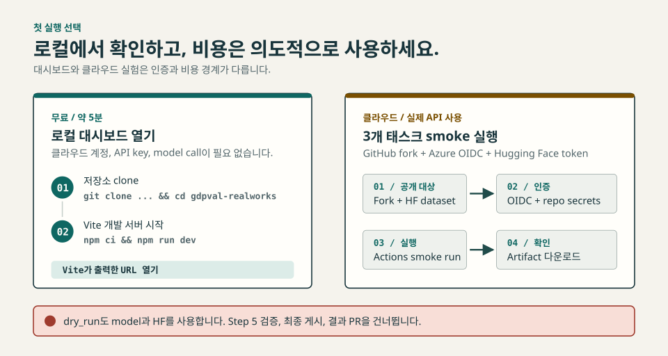

# GDPVal RealWorks 첫 실행 가이드

먼저 무료로 로컬 대시보드를 열고, 그다음 현재의 3개 태스크 클라우드
스모크 테스트를 실행합니다. GitHub Actions를 처음 써도 따라갈 수 있도록
계정과 권한부터 설명합니다.

## 실행 경로 선택

- **로컬 대시보드:** 약 5분, 무료, 클라우드 계정 불필요
- **3개 태스크 smoke 실험:** 설정 시간 + 모델 실행 시간, GitHub, Azure,
  Hugging Face, 실제 API 사용료 필요

> **중요:** `dry_run: true`는 비용과 원격 쓰기가 없는 시뮬레이션이
> 아닙니다. 모델 호출과 Self-QA를 실행하고, 설정한 Hugging Face 데이터셋을
> 만들거나 재사용하며, 필요하면 relay 체크포인트도 씁니다. Step 5 검증,
> 최종 Step 7 결과 업로드, 결과 PR을 건너뜁니다. 이 3-task smoke는 sample
> size 때문에도 Step 5를 생략합니다.

<p align="center">
   <picture>
      <source media="(max-width: 960px)" srcset="images/readme-first-run-mobile-ko.svg" />
      
   </picture>
</p>

## 경로 A: 로컬 대시보드 열기

Git과 Node.js 20 이상이 필요합니다. API 키나 클라우드 계정은 필요 없습니다.

```bash
git clone https://github.com/hyeonsangjeon/gdpval-realworks.git
cd gdpval-realworks
npm ci
npm run dev
```

Vite가 출력한 주소를 브라우저에서 여세요. GitHub Pages용 base path가 있어
로컬 주소도 보통 `/gdpval-realworks/`로 끝납니다.

CI와 같은 데이터·프로덕션 검증을 실행하려면 다음을 사용합니다.

```bash
npm run aggregate
npm run test:aggregate
npm run build
```

완성된 사이트는 `dist/`에 생성됩니다. 이 경로는 저장소 데이터를 읽을 뿐
LLM을 호출하지 않습니다.

## 경로 B: GitHub Actions에서 실제 태스크 3개 실행

**Smoke test**는 설정 오류를 찾기 위해 실제 태스크를 소량만 실행하는
테스트입니다. **Self-QA**는 생성 모델이 자기 결과를 검사하고 재시도하는
과정이며 독립 채점이 아닙니다. **Relay**는 끝나지 않은 태스크를 다음 Actions
job에서 이어갑니다. **OpenID Connect(OIDC)**는 Azure client secret을 저장하지
않고 job에 단기 Azure 권한을 부여합니다.

체크인된 스모크 설정은 Azure 배포 `gpt-5.2-chat`을 사용하고 3개 태스크를
선택하며 Self-QA를 최대 3회 재시도할 수 있습니다. Step 6은 먼저
`gpt-5.4-pro`를 순차적으로 최대 2회 호출합니다. 이 경로에서 오류가 나면
`gpt-5.2-chat` fallback을 1회 시도하며, 오류 전에 완료된 호출도 과금될 수
있습니다. 따라서 시간과 비용은 출력 크기, 재시도, 쿼터, 사용 가능한
deployment, Azure 가격에 따라 달라집니다.

### 1. 계정 준비

다음이 필요합니다.

- GitHub 계정과 이 저장소의 fork
- Azure 구독, Azure OpenAI 리소스, 필수 `gpt-5.2-chat` 배포. 기본 2-call
   report 경로를 사용하려면 선택적으로 `gpt-5.4-pro` 배포도 필요
- Microsoft Entra 앱 등록 권한과 해당 Azure OpenAI 리소스에
  **Cognitive Services OpenAI User** 역할을 부여할 권한
- 쓰기 토큰을 만들 수 있는 Hugging Face 계정

학교나 회사가 Azure tenant를 관리한다면 관리자에게 앱 등록과 역할 부여를
요청하세요. OIDC를 client secret이나 Azure OpenAI API key로 바꾸지 마세요.
배치 워크플로는 federated identity를 기준으로 설계되어 있습니다.

### 2. Fork와 개인 Hugging Face 대상 설정

GitHub에서 저장소를 fork합니다. 내 fork에서
[`batch-runner/experiments/exp998_smoke_baseline_sample.yaml`](../batch-runner/experiments/exp998_smoke_baseline_sample.yaml)을
열고 `data.source`의 소유자만 바꿉니다.

```yaml
data:
  source: "YOUR_HF_USERNAME/exp998_smoke_baseline_sample"
```

데이터셋 저장소 이름은 YAML 파일 stem과 같게 유지하세요. 새로 만든 일회성
테스트 dataset을 사용해야 합니다. Step 0은 새 대상을 기본적으로 **public
dataset**으로 만듭니다. 기존 대상에 `data/`로 시작하는 경로가 하나도 없으면
README나 metadata 같은 다른 파일이 있어도 dataset repository 전체를 삭제한
뒤 다시 만듭니다. `data/` 경로가 있으면 기존 snapshot을 재사용합니다.

나중에 non-dry Step 7을 실행하면 새 결과를 올리기 전에 원격 `data/**`와
`deliverable_files/**`를 삭제합니다. 보존해야 할 dataset을 가리키면 안 됩니다.

수정 내용을 fork의 기본 `main` 브랜치에 커밋하세요. YAML에 토큰, 키,
비밀번호를 넣지 마세요.

### 3. Azure OIDC 1회 설정

워크플로는 [`azure/login`](../.github/workflows/batch-run.yml)과 GitHub의
단기 OIDC 토큰을 사용합니다. 포털에서는 다음 순서로 설정할 수 있습니다.

1. **Microsoft Entra admin center**에서 **App registrations**를 열고 이
   fork용 앱을 만듭니다.
2. **Application (client) ID**와 **Directory (tenant) ID**를 기록합니다.
3. **Certificates & secrets > Federated credentials > Add credential**을
   엽니다.
4. **GitHub Actions deploying Azure resources**를 선택합니다.
5. 내 GitHub owner와 repository를 입력하고 **Branch**, `main`을 선택합니다.
   subject는
   `repo:YOUR_GITHUB_OWNER/gdpval-realworks:ref:refs/heads/main`을 나타내야
   합니다.
6. Azure OpenAI 리소스의 **Access control (IAM)**에서 이 앱의 service
   principal에 **Cognitive Services OpenAI User** 역할을 부여합니다.
7. Azure 구독 ID와 Azure OpenAI 리소스의 endpoint를 기록합니다.

Microsoft 공식 절차는
[GitHub Actions에서 OpenID Connect 사용](https://learn.microsoft.com/azure/developer/github/connect-from-azure-openid-connect)을
참고하세요. fork나 기본 브랜치 이름이 다르면 federated credential도 정확히
같아야 합니다.

### 4. Hugging Face 토큰 만들기

[Hugging Face 토큰 설정](https://huggingface.co/settings/tokens)에서 공개
원본 dataset을 읽고 일회성 대상 dataset을 생성, 수정, 삭제할 수 있는
token을 만듭니다. 계정이 fine-grained 권한을 지원하면 이 작업에만 한정된
전용 token을 사용하세요.

### 5. Repository secrets 등록

GitHub fork의 **Settings > Secrets and variables > Actions > New repository
secret**에서 다음을 추가합니다.

| Secret | 값 |
|---|---|
| `AZURE_CLIENT_ID` | Entra 앱의 client ID |
| `AZURE_TENANT_ID` | Entra directory tenant ID |
| `AZURE_SUBSCRIPTION_ID` | Azure subscription ID |
| `AZURE_OPENAI_ENDPOINT` | `https://YOUR_RESOURCE.openai.azure.com/` |
| `HF_TOKEN` | Hugging Face 전용 write token |

이 경로에는 `AZURE_OPENAI_API_KEY`를 추가하지 마세요. `GITHUB_TOKEN`은
GitHub가 자동으로 제공합니다.

나중에 non-dry run을 하려면 **Settings > Actions > General > Workflow
permissions**에서 **Read and write permissions**와 Actions의 PR 생성을
허용하세요. 조직 정책에 따라 관리자가 설정해야 할 수 있습니다.

### 6. 스모크 워크플로 실행

1. fork의 **Actions** 탭을 열고 요청이 나오면 workflow를 활성화합니다.
2. **Run GDPVal Batch Experiment**를 선택합니다.
3. `main` 브랜치에서 **Run workflow**를 누릅니다.
4. `experiment_yaml`에 `exp998_smoke_baseline_sample`을 입력합니다.
5. `experiment_name`은 비워 두고, `relay_run`은 `0`, `wall_timeout`은
   `290`, `sandbox_image_digest`는 빈 값으로 둡니다.
6. 위 비용 경고를 확인한 뒤 `dry_run`을 `true`로 설정하고 실행합니다.

스모크 설정은 provider-hosted `code_interpreter`를 사용합니다. 저장소의
Docker sandbox나 agentic preflight를 실행하는 테스트가 아닙니다.

### 7. 성공 상태 확인

예상 경로는 다음과 같습니다.

| 단계 | 스모크에서 예상되는 동작 |
|---|---|
| Inspect mode | cloud credential 없이 입력 파일명, 안전한 YAML 구조, 일반 workflow 허용 mode를 사전 검사 |
| 전체 config 검증 | Hugging Face bootstrap 전에 전체 experiment config를 load하고 validate |
| Step 0 | 일회성 Hugging Face dataset을 공개 생성, 파괴적 재생성 또는 재사용한 뒤 snapshot 다운로드 |
| Step 1 | seed에 따라 태스크 3개 선택 |
| Step 2 | 모델 호출, 산출물 생성, 같은 모델의 Self-QA 실행 |
| Steps 3-4 | JSON/Markdown 결과와 3-row Parquet 생성 |
| Step 5 | `dry_run`이 true이고 sample도 3개이므로 건너뜀 |
| Step 6 | `gpt-5.4-pro` 2-call report와 `gpt-5.2-chat` fallback을 시도. Narrative 실패 시 게시 전에 model-free report를 반드시 생성 |
| Step 7과 결과 PR | `dry_run`이므로 건너뜀 |

credentialed batch job이 마지막 `always()` 단계에 도달하면
`batch-results-<run_id>` Actions artifact 업로드를 시도합니다. inspect-mode의
초기 거부나 job 시작 실패에서는 artifact가 없을 수 있습니다. 업로드에
성공하면 30일 보관됩니다. 완료된 Actions run 아래의 **Artifacts**에서
`batch-results-<run_id>`를 내려받아 압축을 푸세요. archive root에는
`workspace/`와 `results/`가 있습니다.

먼저 다음을 확인하세요.

- `workspace/step2_inference_results.json`: 태스크별 상태
- `workspace/upload/deliverable_files/<task_id>/`: 생성 파일
- `results/exp998_smoke_baseline_sample/`: 포맷된 결과와 리포트
- Actions log: 재시도, 쿼터, 리포트 경고

Self-QA는 산출물을 만든 같은 모델의 재시도 신호입니다. 독립 채점이 아니며
산출물이 전문적으로 정확하다는 증거도 아닙니다.

## 문제 해결

| 증상 | 확인할 것 |
|---|---|
| workflow가 보이지 않음 | Actions가 활성화됐고 YAML이 fork 기본 브랜치에 있는지 확인 |
| `AADSTS700213` 또는 federated identity 불일치 | owner, repository, branch, federated subject가 fork와 정확히 같은지 확인 |
| Azure login은 성공하지만 inference가 403 | OpenAI 역할, endpoint, deployment 접근 권한 확인 |
| deployment를 찾지 못함 | 스모크 설정은 `gpt-5.2-chat` 이름을 기대함 |
| Hugging Face 401 또는 403 | token 권한과 `data.source`가 내 namespace인지 확인 |
| HF 대상이 예상과 다르게 동작 | 정확히 `exp998_smoke_baseline_sample` 이름의 새 일회성 public dataset 사용. 필요한 파일이 있는 dataset은 재사용하지 않음 |
| Step 6이 경고인데 job은 계속됨 | PR/HF 게시 전에 model-free fallback report 생성과 identity 검증을 반드시 통과해야 함 |
| 결과 PR이 없음 | `dry_run: true`에서는 정상 |
| Step 5가 생략됨 | 3개 이하 샘플에서는 정상 |

## 스모크 다음 단계

기존 실험 YAML을 새 이름으로 복사하고 `sample_size: 3`을 유지한 채 변수를
하나씩 바꾸세요. 샘플을 늘리기 전에 artifact를 검토해야 합니다.
`dry_run`을 해제하면 결과를 게시하고 결과 PR을 만들지만, 3-task 설정이
220-task 전체 실행으로 바뀌는 것은 아닙니다.

전체 실행은 큰 모델 쿼터를 사용할 수 있고 여러 relay job이 필요할 수
있습니다. 외부 채점은 별도 파이프라인입니다. 실행 모드를 바꾸거나 220개로
확대하기 전에 [Batch Runner 문서](../batch-runner/README_KR.md)와
[sandbox 문서](../batch-runner/sandbox/README.md)를 읽으세요.

한 번만 시험했다면 일회성 Hugging Face dataset을 삭제하고, 전용 token을
폐기하며, 5개 repository secret과 fork용 federated credential을 삭제하세요.
추가 실험을 할 계획일 때만 유지합니다.