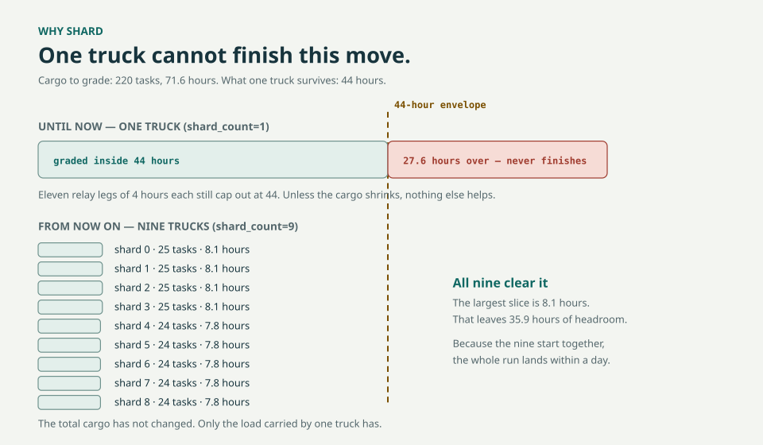
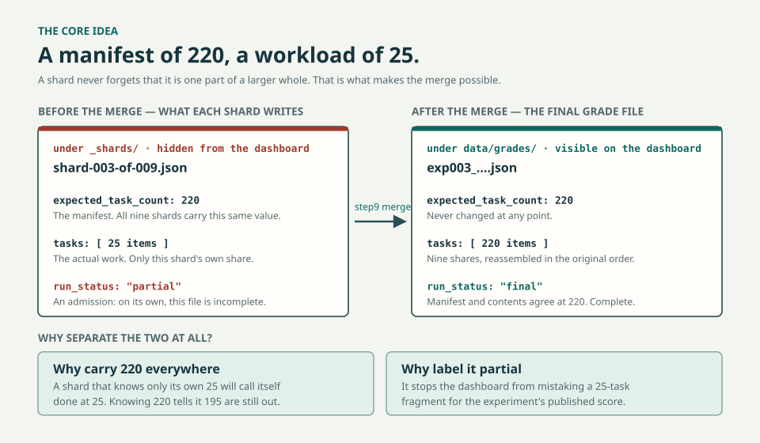
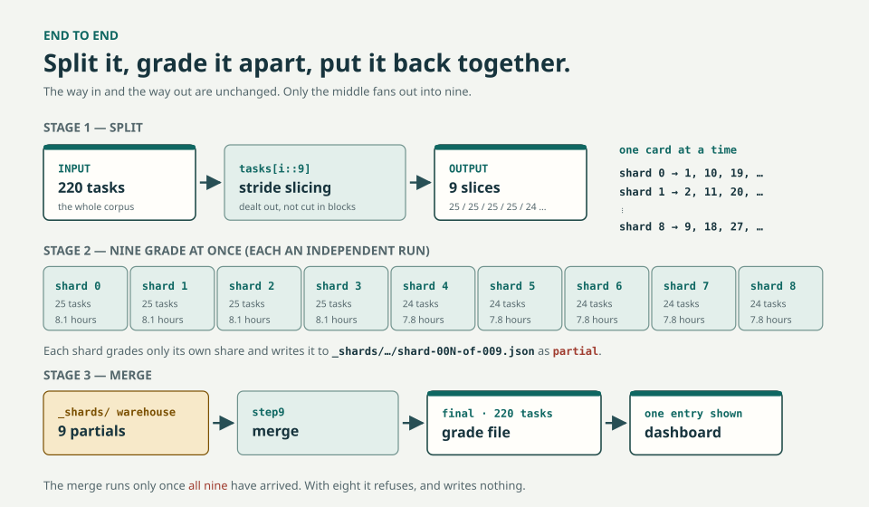

# Grading Sharding: A Complete Guide

> Why grading 220 tasks now runs on **nine machines instead of one**, what the
> design actually is, and how to run it from start to finish.
> No prior knowledge is assumed. A moving-day metaphor runs throughout.

---

## 0. Three-line summary

1. Grading 220 tasks in a single process takes **71.6 hours**, but the most a
   GitHub Actions workflow can survive is **44 hours**. It simply **could not
   reach the end.**
2. Tasks are now split into nine slices so that **nine runs grade at the same
   time.** The largest slice is **8.1 hours**, which fits inside 44 hours with
   room to spare.
3. Once **all nine** slices arrive, `step9` merges them into one. The merged
   result is **identical, character for character**, to a 71.6-hour solo run.

This shipped to `main` in PR #175 (merge SHA `a42414ae`). The default is
`shard_count=1`, so **if you specify nothing, everything behaves exactly as it
did before.**

---

## Part 1. Why this exists

### 1-1. The problem: the load was bigger than the truck

Grading works like this. There are 220 tasks, and for each one a judge model
opens the deliverable and scores it against a rubric. One task takes roughly
**19.5 minutes**.

```
220 tasks × ~19.5 min ≈ 71.6 hours
```

The problem is the container that work has to fit in. A single GitHub Actions
job cannot run forever. This repository uses a **relay** structure that stops
itself every four hours (`GRADER_TIME_BUDGET_SEC=14400`) and hands off to the
next run. That relay can be handed off **at most 11 times.**

```
4 hours × 11 legs = 44 hours   ← this is the ceiling
```

So:

```
time needed 71.6 hours  >  time available 44 hours
             ↑
        27.6 hours over → it never finishes
```

This is not "a bit slow." It is **structurally impossible.** No amount of
waiting and no number of restarts will finish it, the same way that careful
driving does not help when the load is bigger than the truck bed.

### 1-2. Why more relay legs were not the answer

There is a common objection here: "There's a relay — why not just raise 11 to
22?"

The relay count is not a number you can simply turn up. Every handoff pays a
**restart cost** — repository checkout, dependency install, authentication,
data download. More legs mean more places to fail, and more risk that a single
break sends you back to the start. The number 11 is a safety limit set at the
point where that risk stays manageable.

More fundamentally, **a relay does not reduce the load.** It only lets one
person carry the same load with breaks in between. The load is still 71.6
hours' worth.

### 1-3. So we added trucks

<p align="center">
  
</p>

**Sharding** means splitting the load across several trucks. A `shard` is one
piece.

| | 1 truck (`shard_count=1`) | 9 trucks (`shard_count=9`) |
|---|---|---|
| Tasks per truck | 220 | **25** (largest slice) |
| Time per truck | 71.6 hours | **8.1 hours** |
| 44-hour limit | ❌ 27.6 hours over | ✅ 35.9 hours to spare |
| Total elapsed | never finishes | within a day |

Not one gram of the total load went away. Only **the load one truck carries**
got smaller. That is the whole of sharding.

> **Note:** You can go up to 11 trucks (20 tasks each, 6.5 hours). But the
> truck count is also the **number of judge-model workloads billed at the same
> time**. Part 6 explains why 9 is the recommended default.

---

## Part 2. The concepts — three things to understand

### Concept 1. Why cut in stripes?

The first way most people would split 220 tasks into nine is to **cut them in
blocks**.

```
❌ Block cutting
shard 0 → tasks 1–25
shard 1 → tasks 26–50
shard 2 → tasks 51–75
```

That is risky, because datasets are usually **sorted**. Tasks 1–25 could all be
from the same sector (healthcare, say), which would make shard 0 uniquely hard
or uniquely slow. One truck gets all the refrigerators; another gets all the
pillows.

So we deal them out **one at a time instead**, like cards.

```
✅ Stripe cutting  (in Python: tasks[i::9])
shard 0 → 1, 10, 19, 28, …
shard 1 → 2, 11, 20, 29, …
shard 2 → 3, 12, 21, 30, …
   ⋮
shard 8 → 9, 18, 27, 36, …
```

Now, no matter where a sector happens to cluster, it spreads evenly across the
nine trucks. The counts even out by themselves too.

```
actual sizes of the 9 slices: 25, 25, 25, 25, 24, 24, 24, 24, 24   (total 220)
                              └──── largest minus smallest = 1 ────┘
```

In Python, `tasks[i::9]` means "start at index i and take every ninth item."
That one line is the entire splitting logic.

### Concept 2. The paperwork says 220; the load in hand is 25

This is **the most important part** of the design.

<p align="center">
  
</p>

Each shard grades only its own 25 tasks. But the file it saves says this:

```jsonc
{
  "expected_task_count": 220,        // ← paperwork: the whole is 220
  "expected_ordered_task_ids_sha256": "…",  // ← paperwork: fingerprint of that order
  "tasks": [ … 25 items … ],         // ← actual work: my share only
  "run_status": "partial"            // ← "on my own, I am incomplete"
}
```

This **separates identity from workload.** Why do it that way?

**First, it prevents a false conclusion.** A shard that knows only its own 25
will decide it is "all done" the moment it finishes 25. Knowing 220 lets it
work out for itself: "I did 25, 195 are still outstanding, so I am not the
finished article."

**Second, it makes the later merge possible.** Because all nine files carry the
same `expected_task_count: 220` and the same order fingerprint, the merge can
prove **that these nine really are one matching set.** Slices from a different
experiment, or slices graded after the rubric changed, get caught immediately.

**Third, caching and resume keep working untouched.** This repository computes
its cache keys and relay decisions entirely from the "paperwork" values. We did
not touch the paperwork, so not one line of the existing logic had to change.

> In one sentence: **sharding does not change what gets graded. It changes only
> who takes which part, and where the result gets written.**

### Concept 3. Unfinished goods in the warehouse, finished goods on the shelf

The file a shard produces is not a report card yet. If a 25-task fragment
showed up on the dashboard as "this experiment's score," that would be flatly
wrong.

So the **storage locations are separated**.

```
data/grades/
├── exp003_….json                        ← the shelf. Finished only. The dashboard reads here.
└── _shards/                             ← the warehouse. Unfinished goods.
    └── exp003_…/
        ├── shard-000-of-009.json        ← partial
        ├── shard-001-of-009.json        ← partial
        │   ⋮
        └── shard-008-of-009.json        ← partial
```

The dashboard aggregation script (`scripts/aggregate-grades.mjs`) reads **only
`.json` files directly inside** `data/grades/`. It does not descend into
subdirectories, and the extensionless name `_shards` is not a `.json` file to
begin with, so it is filtered out. On top of that, even if such a file were
read, anything with `run_status: "partial"` is excluded separately. **Two
independent barriers stand in the way.**

### The whole flow on one page

<p align="center">
  
</p>

### Concept 4 (bonus). Merged output equals the original

The most worrying question is this one: **"If you split it up, doesn't the
result change?"**

It does not. And we **measured** that.

- the result file from grading all 220 in one run (A)
- the result file from grading nine slices and merging them with `step9` (B)

Compared field by field, A and B were **completely identical**. Exactly three
things differ.

| Differing field | Why it differs |
|---|---|
| `shard_provenance` | A record that exists only under sharding (which slice did what). Naturally absent from the original. |
| `grading_wall_time_ms` | Elapsed time. Naturally different once the work is split. |
| `graded_at` | Grading timestamp. Naturally different. |

Scores, rationales, per-criterion verdicts — every grading result is the same.

---

## Part 3. How to use it

### 3-1. The inputs you need to know first

Two inputs were added to the `grade-run.yml` workflow.

| Input | Default | Meaning | Allowed range |
|---|---|---|---|
| `shard_count` | `1` | How many trucks to split across | `1`–`11` |
| `shard_index` | `0` | Which truck this run is | `0`–`shard_count - 1` |

**`shard_index` counts from 0.** With 9 trucks, the indices are
`0,1,2,3,4,5,6,7,8`. There is no `9` (and the workflow rejects it if you try).

Existing inputs that are easy to get wrong:

| Input | What to watch for |
|---|---|
| `experiment_yaml` | **Drop the extension.** `exp003_…_exec` (yes) / `exp003_….yaml` (no) |
| `grading_config` | **Keep the extension.** `default_v2_sol_max.yaml` (yes) |
| `tasks_limit` | **Cannot be combined** with sharding. If `shard_count > 1`, this must be `0`. |
| `dry_run` | If `true`, `paid_approval` must be `false` (both true is rejected). |
| `resume` / `resume_chunk` | Not for humans to set. The relay fills these in automatically. |

### 3-2. Step 0: start with the free rehearsal

**In `grade-run.yml`, `dry_run=true` runs as an entirely separate read-only
job.** It does not call the judge model, has no Azure authentication step, and
writes nothing to the repository. It only classifies and shows you what *would*
be graded. So run it first.

```bash
gh workflow run grade-run.yml --ref main \
  -f experiment_yaml=exp003_GPT52Chat_baseline_runner_exec \
  -f grading_config=default_v2_sol_max.yaml \
  -f dry_run=true \
  -f paid_approval=false \
  -f shard_count=9 \
  -f shard_index=0
```

That will catch a misspelled experiment name, a wrong config path, or a
shard index out of range.

### 3-3. Step 1: dispatch all nine — the `for` script

**The simplest possible form.** If your goal is to understand the idea, this is
enough.

```bash
for i in 0 1 2 3 4 5 6 7 8; do
  gh workflow run grade-run.yml --ref main \
    -f experiment_yaml=exp003_GPT52Chat_baseline_runner_exec \
    -f grading_config=default_v2_sol_max.yaml \
    -f dry_run=false \
    -f paid_approval=true \
    -f shard_count=9 \
    -f shard_index=$i
done
```

`$i` runs from `0` to `8`, nine times, launching one workflow each time with
only `shard_index` changed. **That is all it does.** The other six lines are
identical on all nine.

---

**For real use.** This version adds guards against mistakes. In practice, use
this one.

```bash
#!/usr/bin/env bash
# dispatch_shards.sh — dispatch grading split into N slices.
set -euo pipefail

EXPERIMENT=exp003_GPT52Chat_baseline_runner_exec   # no .yaml extension!
CONFIG=default_v2_sol_max.yaml                     # this one keeps .yaml!
N=9                                                # truck count (1-11)

# ── Guard 1: range check ──────────────────────────────────
if (( N < 1 || N > 11 )); then
  echo "❌ shard_count must be between 1 and 11 (got: $N)"; exit 1
fi

# ── Guard 2: a human confirms with their own eyes ─────────
cat <<INFO
━━━━━━━━━━━━━━━━━━━━━━━━━━━━━━━━━━━━━━━━━━━━━━━━
  experiment : $EXPERIMENT
  config     : $CONFIG
  trucks     : $N  (indices 0 - $((N - 1)))
  billing    : this bills for real. $N workloads bill concurrently.
━━━━━━━━━━━━━━━━━━━━━━━━━━━━━━━━━━━━━━━━━━━━━━━━
INFO
read -r -p "Type yes to go ahead: " ok
[[ "$ok" == "yes" ]] || { echo "Cancelled."; exit 1; }

# ── Dispatch ──────────────────────────────────────────────
for i in $(seq 0 $((N - 1))); do
  printf '  → dispatching shard %d/%d … ' "$i" "$N"
  gh workflow run grade-run.yml --ref main \
    -f experiment_yaml="$EXPERIMENT" \
    -f grading_config="$CONFIG" \
    -f dry_run=false \
    -f paid_approval=true \
    -f shard_count="$N" \
    -f shard_index="$i"
  echo "done"
  sleep 20   # reduces commit collisions from nine landing in the same second
done

echo
echo "✅ dispatched $N. Current state:"
sleep 10
gh run list --workflow=grade-run.yml --limit "$N"
```

Part 6, "Cautions," explains why the `sleep 20` is there.

### 3-4. Step 2: check progress

```bash
# what is running right now
gh run list --workflow=grade-run.yml --limit 15

# follow one specific run live
gh run watch <RUN_ID>

# how many slices have piled up in the warehouse
# (each shard commits to main as it completes)
git pull
ls data/grades/_shards/*/
```

**The nine do not finish together.** Some slices end quickly; others go through
several relay legs of four hours each. Just wait for the last one.

### 3-5. Step 3: the merge — usually automatic

**Normally you do nothing.** After committing its own result, each shard checks
"are all nine in the warehouse right now?"

- only eight → exit without doing anything (`merged=false`)
- all nine → run the merge on the spot (`merged=true`)

Whichever shard finishes last will naturally be the one that sees all nine, so
**there is always at least one shard that performs the merge.** It does not
matter which one that turns out to be.

If the automatic merge does not happen for some reason, you can run it by hand.

```bash
git pull
python batch-runner/step9_merge_shards.py \
  data/grades/_shards/<experiment-folder>/shard-*.json \
  --output data/grades/<experiment-folder>.json \
  --force
```

`step9` is **entirely offline**. No network, no API key, no billing. It reads
nine files and merges them into one. Order does not matter — however the
`shard-*.json` glob happens to expand, the result is the same.

---

## Part 4. What gets blocked automatically (the guards)

Rather than doing whatever it is told, **the workflow rejects requests that do
not make sense**. Everything below was actually tested and confirmed to be
rejected.

| What was tried | Result | Why |
|---|---|---|
| `shard_index=9` with `shard_count=9` | ❌ rejected | Indices are 0–8. There is no truck 9. |
| `shard_count=12` | ❌ rejected | 11 trucks maximum. This caps concurrent billing. |
| `shard_count=0` | ❌ rejected | You cannot move house with zero trucks. |
| `shard_count=9` with `tasks_limit=5` | ❌ rejected | "Split up all 220" and "only 5" contradict each other. |
| Merging with only eight slices | ❌ rejected | *"union has 196 task(s) but expected_task_count is 220 (24 missing)"* — an incomplete result is never promoted to a finished one. |
| Slipping `../../` into the output path | ❌ rejected | Path escape blocked. |
| Swapping the output path for a symlink | ❌ rejected | Blocks following a link to overwrite the wrong file. |
| A path outside `data/grades/` | ❌ rejected | Nothing is written outside the permitted folder. |
| `shard_count=11` with `shard_index=10` | ✅ allowed | Boundary value. This is normal. |
| `shard_count=1` (the default) | ✅ allowed | **Behaves 100% identically to before.** |

It is also safe when two shards both decide "I am the last one" and **both run
the merge**. `step9` is deterministic, so running it twice produces
a **byte-identical file**. Whichever arrives second finds nothing changed and
exits quietly.

---

## Part 5. Verification results — what was actually checked

All of the following ran before the feature was merged. **Not one paid dispatch
was made.** A fake judge model was used, so only the plumbing was tested.

| Check | Result |
|---|---|
| Splitting 220 into 9 slices | 25/25/25/25/24/24/24/24/24 = **220**. 0 duplicates, 0 missing. |
| Output paths of the nine slices | All distinct. All inside `_shards/`. No collision with the final file. |
| Workflow input validation rules | 9 valid requests passed / 5 invalid requests rejected, **messages verified** |
| Path stability across relay legs | The second relay leg wrote to the same file (slices do not fork) |
| Merge orchestration | `merged=false` 8 times, `merged=true` exactly once |
| Path security guards | All 7 kinds blocked |
| **Merged result = solo run result** | **Field-by-field exact match** (excluding the 3 timestamp/duration/provenance fields) |
| Attempting an 8-of-9 merge | Rejected. No file created. |
| Dashboard aggregation | Fed 9 slices plus 1 finished file → `✅ 1 grade file … (220/220 tasks)` |
| Full test suite | **3273 passed**, 6 skipped (3219 before sharding → +54) |

---

## Part 6. Cautions — what genuinely needs care

These are the risks that are **not** blocked automatically.

### ⚠️ 1. Nine trucks share one quota

Nine grading runs call the judge model **at the same time**. Azure's
tokens-per-minute limit (TPM) is a single pipe that all nine draw from. There is
**no** coordination mechanism for shards to yield to one another. When the limit
is hit, retries go up, and each slice can take longer than projected.

> 8.1 hours is **an average projection, not a guarantee.**

### ⚠️ 2. Commits can pile up

Each shard commits its result to `main`. 9 trucks × up to 11 relay legs =
**up to 99 pushes**. The commit step does `git pull --rebase` and then attempts
the push **exactly once** — there is no retry loop. If several land at once, the
push can fail.

**Results are not lost, though.** Even when the push fails, the grading result
file is **always** uploaded as a GitHub Actions artifact (retained 30 days).
Download it by hand and commit it. **Nothing needs regrading, so it costs
nothing.**

→ This is why the production script in 3-3 has a `sleep 20`. Spreading the
start times out lowers the collision probability.

### ⚠️ 3. If one slice dies, the merge stalls

If one of the nine fails, only eight pile up in the warehouse and the merge
**never happens.** That is the safe behavior — better than emitting an
incomplete report card. But **nothing will tell you**, so a human has to check.

```bash
# count how many slices have arrived
ls data/grades/_shards/*/shard-*.json | wc -l   # 9 means healthy
```

Just dispatch the failed slice again with the same `shard_index`.

### ⚠️ 4. All nine must start from the same place

The fingerprint of the grading logic (`grader_source_hash`) is **sensitive to
the repository path.** If the nine shards run under different directory
structures, the fingerprints diverge and the merge is rejected.

On GitHub Actions the path is always `$GITHUB_WORKSPACE/batch-runner`, so the
requirement is **satisfied automatically.** You only need to think about it when
producing slices by hand locally.

### ⚠️ 5. This document is not dispatch approval

The technical gate (`full_run_gate`) opened at `shard_count=9`, reporting
`eligible_for_owner_review` with 0 blocking reasons.
But **"now eligible for review" is not "approved."** An actual dispatch
requires the owner's explicit judgment every time. The scripts above are
examples, and they **have not been run.**

---

## Part 7. Rolling back

There is no urgency. **The default is `shard_count=1`, so if you specify
nothing, the sharding code does not run at all.** If you do need to roll back:

```bash
# (a) revert the whole feature
git revert -m 1 a42414aea3c569f00c62e8b083aa67724bcbf093

# (b) clear out only the slices in the warehouse (leaves the final file alone)
git rm -r data/grades/_shards/
git commit -m "chore(grading): drop shard partials"
```

---

## Appendix A. Glossary

| Term | In plain words |
|---|---|
| **shard** | A slice. One piece of the divided load. |
| `shard_count` | How many trucks to split across (1–11) |
| `shard_index` | Which truck this run is (counting from 0) |
| **stride slicing** | Stripe cutting. Dealt out one at a time, like cards. |
| `partial` | Unfinished. The state of a single slice. |
| `final` | Finished. The state once all 220 are gathered. |
| `expected_task_count` | "How many are there in total" — `220` on all nine slices. |
| **relay (rc=7)** | The handoff. Stops every four hours; the next run picks it up. |
| **envelope** | The limit. 4 hours × 11 legs = 44 hours. |
| `step9` | The program that merges slices into one. Offline, free. |

## Appendix B. File map

| File | What it does |
|---|---|
| `.github/workflows/grade-run.yml` | Input validation, shard execution, automatic merge orchestration |
| `batch-runner/step8_grade.py` | The actual grading. Takes `--shard-count` / `--shard-index`, grades only its own share, and saves into `_shards/` |
| `batch-runner/step9_merge_shards.py` | N slices → 1 final file. Offline and deterministic |
| `batch-runner/tests/test_shard_merge_roundtrip.py` | The regression test that keeps "merged result = solo run result" true |
| `scripts/aggregate-grades.mjs` | Dashboard aggregation. Excludes `_shards/` and `partial` on two independent paths |
| `scripts/analyze_grade_run.py` | Applies `shard_count` when judging the 44-hour gate |

---

*This document describes PR #175 (merge SHA `a42414ae`).*
