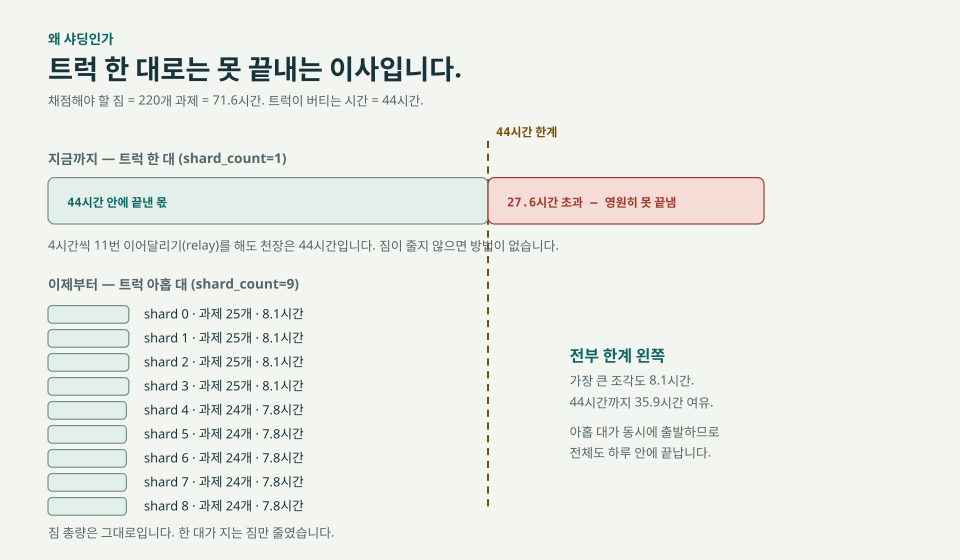
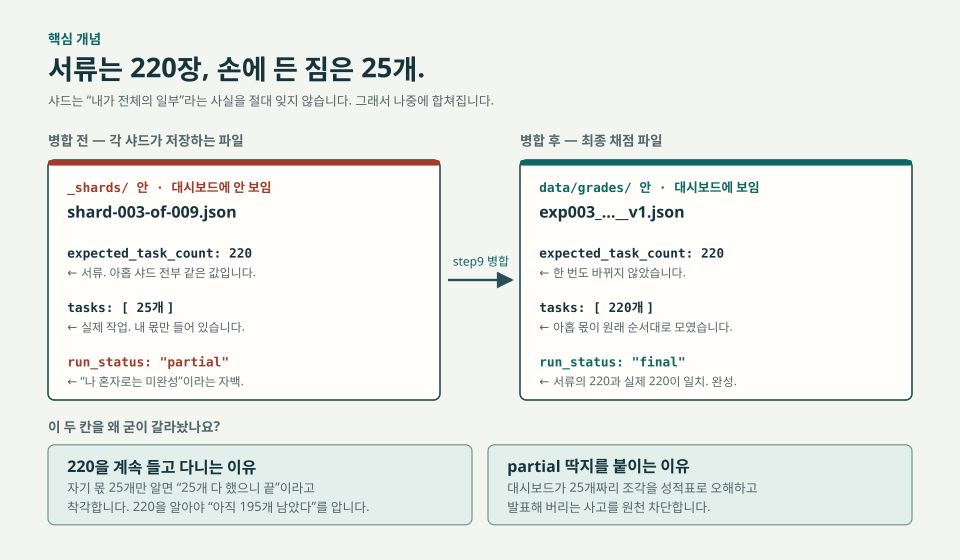
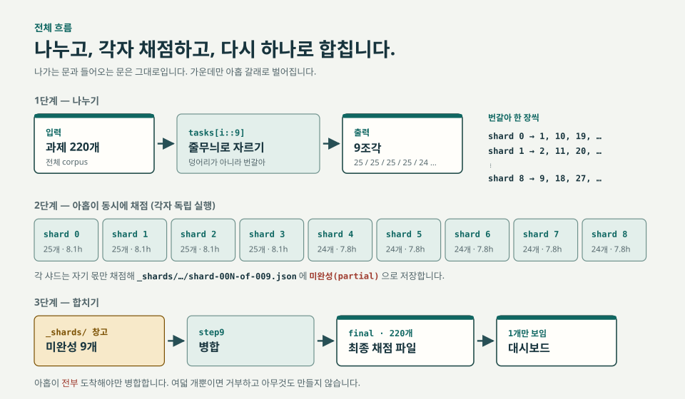

# 채점 샤딩(Grading Sharding) 완전 가이드

> 220개 과제 채점을 한 대가 아니라 **아홉 대가 나눠서** 하도록 만든 이유와,
> 그 개념, 그리고 실제로 돌리는 방법을 처음부터 끝까지 설명합니다.
> 사전 지식이 없어도 따라올 수 있도록 이사(移徙) 비유를 계속 씁니다.

---

## 0. 세 줄 요약

1. 220개 채점을 한 프로세스로 돌리면 **71.6시간**이 걸리는데, GitHub Actions 워크플로가 버틸 수 있는 최대치는 **44시간**입니다. 그래서 **끝까지 갈 수가 없었습니다.**
2. 과제를 아홉 조각으로 나눠 **아홉 개의 실행이 동시에** 채점하게 만들었습니다. 가장 큰 조각도 **8.1시간**이라 44시간 안에 넉넉히 들어옵니다.
3. 아홉 조각이 **전부** 도착하면 `step9`가 하나로 합칩니다. 합친 결과는 혼자 71.6시간 돌린 결과와 **글자 하나까지 똑같습니다.**

이 기능은 PR #175로 `main`에 들어갔습니다(merge SHA `a42414ae`). 다만 **기본값이 `shard_count=1`이라 아무것도 지정하지 않으면 예전과 완전히 동일하게 동작합니다.**

---

## 1부. 왜 만들었나 (사유)

### 1-1. 문제: 이삿짐이 트럭보다 컸습니다

채점은 이런 일입니다. 과제 220개가 있고 각 과제마다 심사 모델(judge)이 산출물을 열어보고 채점표(rubric)에 따라 점수를 매깁니다. 과제 하나에 대략 **19.5분**이 걸립니다.

```
220개 × 약 19.5분 ≈ 71.6시간
```

문제는 이 작업을 담아둘 그릇입니다. GitHub Actions에서 한 번의 실행(job)은 영원히 돌 수 없습니다. 이 저장소는 5시간(`GRADER_TIME_BUDGET_SEC=18000`)마다 스스로 멈췄다가 다음 실행으로 이어달리는 **릴레이** 구조를 씁니다. 그런데 이 릴레이는 **최대 11번**까지만 이어집니다.

```
5시간 × 11번 = 55시간   ← 이게 천장입니다
```

그러니까:

```
필요한 시간 71.6시간  >  가능한 시간 55시간
             ↑
        16.6시간 초과 → 절대 못 끝냅니다
```

이건 "조금 느리다"가 아니라 **"구조적으로 불가능하다"** 입니다. 아무리 오래 기다려도, 몇 번을 다시 돌려도 끝나지 않습니다. 이삿짐이 트럭 적재함보다 크면 운전을 잘 해도 소용없는 것과 같습니다.

### 1-2. 왜 릴레이만으로는 안 됐나

여기서 흔한 오해가 하나 있습니다. "릴레이가 있는데 왜 안 되죠? 11번을 22번으로 늘리면 되잖아요?"

릴레이 횟수는 그냥 늘릴 수 있는 숫자가 아닙니다. 이어달리기는 매번 **재시작 비용**을 냅니다 — 저장소 체크아웃, 의존성 설치, 인증, 데이터 다운로드. 이걸 늘릴수록 실패 지점도 늘어나고 중간에 한 번만 끊겨도 처음 상태로 되돌아가는 위험이 커집니다. 11이라는 숫자는 그 위험을 감당할 수 있는 선에서 정해진 안전 한도입니다.

그리고 근본적으로, **릴레이는 짐을 줄이는 방법이 아닙니다.** 같은 짐을 한 사람이 쉬어가며 나르는 것뿐입니다. 짐 자체가 71.6시간어치인 건 그대로입니다.

### 1-3. 그래서 트럭을 늘렸습니다

<p align="center">
  
</p>

**샤딩(sharding)** 은 짐을 여러 트럭에 나눠 싣는 것입니다. `shard`는 "조각"이라는 뜻입니다.

| | 트럭 1대 (`shard_count=1`) | 트럭 9대 (`shard_count=9`) |
|---|---|---|
| 한 대가 지는 과제 | 220개 | **25개** (가장 큰 조각) |
| 한 대가 쓰는 시간 | 71.6시간 | **8.1시간** |
| 44시간 한계 | ❌ 27.6시간 초과 | ✅ 35.9시간 여유 |
| 전체 소요 | 못 끝냄 | 하루 안 |

짐 총량은 1g도 줄지 않았습니다. **한 대가 지는 짐만** 줄였습니다. 이게 샤딩의 전부입니다.

> **참고:** 트럭을 11대까지 늘릴 수 있습니다(조각당 20개, 6.5시간). 하지만 트럭 대수 = **동시에 과금되는 심사 모델 워크로드 수** 이기도 합니다. 9대를 기본 권장값으로 잡은 이유는 6부에서 설명합니다.

---

## 2부. 개념 — 세 가지만 알면 됩니다

### 개념 1. 왜 "줄무늬"로 자르나요?

과제 220개를 아홉으로 나눌 때 가장 먼저 떠오르는 방법은 **덩어리로 자르기**입니다.

```
❌ 덩어리 자르기
shard 0 → 1번 ~ 25번
shard 1 → 26번 ~ 50번
shard 2 → 51번 ~ 75번
```

이 방법은 위험합니다. 데이터셋은 보통 **정렬돼 있기** 때문입니다. 1~25번이 전부 같은 업종(예: 의료)일 수 있고 그러면 shard 0만 유독 어렵거나 유독 오래 걸립니다. 어느 트럭엔 냉장고만, 어느 트럭엔 베개만 실리는 셈입니다.

그래서 **번갈아 한 장씩** 가져가는 방식을 씁니다. 카드를 돌리듯이요.

```
✅ 줄무늬 자르기  (파이썬 표현: tasks[i::9])
shard 0 → 1번, 10번, 19번, 28번, …
shard 1 → 2번, 11번, 20번, 29번, …
shard 2 → 3번, 12번, 21번, 30번, …
   ⋮
shard 8 → 9번, 18번, 27번, 36번, …
```

이러면 어떤 업종이 어디에 몰려 있든 아홉 트럭에 골고루 흩어집니다. 그리고 개수도 저절로 균등해집니다.

```
9조각의 실제 크기: 25, 25, 25, 25, 24, 24, 24, 24, 24   (합계 220)
                  └───── 가장 큰 것과 가장 작은 것의 차이 = 1 ─────┘
```

`tasks[i::9]`는 파이썬에서 "i번째부터 시작해서 9칸씩 건너뛰며 뽑기"라는 뜻입니다. 딱 이 한 줄이 분할 로직 전부입니다.

### 개념 2. 서류는 220장, 손에 든 짐은 25개

이게 이 설계에서 **가장 중요한 부분**입니다.

<p align="center">
  
</p>

각 샤드는 자기 몫 25개만 채점합니다. 하지만 저장하는 파일에는 이렇게 씁니다.

```jsonc
{
  "expected_task_count": 220,        // ← 서류: 전체가 220개라는 사실
  "expected_ordered_task_ids_sha256": "…",  // ← 서류: 220개의 순서 지문
  "tasks": [ … 25개 … ],             // ← 실제 작업: 내 몫만
  "run_status": "partial"            // ← "나 혼자로는 미완성"
}
```

**신원(정체성)과 작업량을 분리한 것**입니다. 왜 이렇게 할까요?

**첫째, 착각을 막습니다.** 샤드가 자기 몫 25개만 알고 있으면, 25개를 다 채점한 순간 "전부 끝났다"고 판단해 버립니다. 220을 알고 있어야 "나는 25개 했고, 아직 195개가 남았으니 나는 완성본이 아니다"를 스스로 압니다.

**둘째, 나중에 합칠 수 있게 합니다.** 아홉 파일이 모두 같은 `expected_task_count: 220`과 같은 순서 지문을 들고 있기 때문에, 병합할 때 **"이 아홉 개가 정말 같은 한 벌인가"** 를 증명할 수 있습니다. 서로 다른 실험의 조각이 섞이거나 채점 기준이 중간에 바뀐 조각이 끼어들면 즉시 걸립니다.

**셋째, 캐시와 재개(resume)가 그대로 동작합니다.** 이 저장소의 캐시 키와 이어달리기 판정은 전부 "서류" 쪽 값으로 계산됩니다. 서류를 건드리지 않았으니 기존 로직을 한 줄도 고칠 필요가 없었습니다.

> 한 문장으로: **샤딩은 "무엇을 채점할지"를 바꾸지 않습니다. "누가 어느 부분을 맡을지"와 "결과를 어디에 쓸지"만 바꿉니다.**

### 개념 3. 미완성품은 창고에, 완성품만 진열장에

샤드가 만든 파일은 아직 성적표가 아닙니다. 25개짜리 조각이 대시보드에 "이 실험 점수" 로 뜨면 완전한 오보입니다.

그래서 **저장 위치를 분리**했습니다.

```
data/grades/
├── exp003_….json                        ← 진열장. 완성품만. 대시보드가 여기만 봅니다.
└── _shards/                             ← 창고. 미완성품 보관소.
    └── exp003_…/
        ├── shard-000-of-009.json        ← partial
        ├── shard-001-of-009.json        ← partial
        │   ⋮
        └── shard-008-of-009.json        ← partial
```

대시보드 집계 스크립트(`scripts/aggregate-grades.mjs`)는 `data/grades/` 폴더의 **바로 아래 `.json` 파일만** 읽습니다. 하위 폴더는 들어가지 않고 확장자 없는 `_shards`라는 이름은 애초에 `.json`이 아니라서 걸러집니다. 게다가 설령 읽었더라도 `run_status: "partial"` 인 것은 별도로 또 제외합니다. **이중으로 막혀 있습니다.**

### 전체 흐름 한 장

<p align="center">
  
</p>

### 개념 4(보너스). 합치면 원본과 똑같습니다

가장 걱정되는 질문은 이겁니다. **"나눠서 하면 결과가 달라지지 않나요?"**

달라지지 않습니다. 그리고 그걸 실제로 **측정했습니다.**

- 220개를 혼자 채점한 결과 파일 (A)
- 9조각으로 나눠 채점한 뒤 `step9`로 합친 결과 파일 (B)

A와 B를 필드 하나하나 비교했더니 **완전히 동일**했습니다. 딱 세 개만 다릅니다.

| 다른 필드 | 왜 다른가 |
|---|---|
| `shard_provenance` | 샤딩에만 있는 기록(어느 조각이 무엇을 했는지). 원본엔 없는 게 당연합니다. |
| `grading_wall_time_ms` | 걸린 시간. 나눠 했으니 다른 게 당연합니다. |
| `graded_at` | 채점 시각. 다른 게 당연합니다. |

점수, 근거, 항목별 판정 — 채점 결과는 전부 같습니다.

---

## 3부. 사용법

### 3-1. 먼저 알아야 할 입력값

`grade-run.yml` 워크플로에 이번에 두 개가 추가됐습니다.

| 입력값 | 기본값 | 의미 | 허용 범위 |
|---|---|---|---|
| `shard_count` | `1` | 트럭 몇 대로 나눌지 | `1` ~ `11` |
| `shard_index` | `0` | 이 실행이 몇 번째 트럭인지 | `0` ~ `shard_count - 1` |

**`shard_index`는 0부터 셉니다.** 트럭 9대면 인덱스는 `0,1,2,3,4,5,6,7,8` 입니다. `9`는 없습니다(있으면 워크플로가 거부합니다).

기존 입력값 중 헷갈리기 쉬운 것들:

| 입력값 | 주의사항 |
|---|---|
| `experiment_yaml` | **확장자를 빼야 합니다.** `exp003_…_exec` (O) / `exp003_….yaml` (X) |
| `grading_config` | **확장자를 붙여야 합니다.** `default_v2_sol_max.yaml` (O) |
| `tasks_limit` | 샤딩과 **동시 사용 불가**. `shard_count > 1`이면 반드시 `0`. |
| `dry_run` | `true`면 `paid_approval`은 반드시 `false`여야 합니다(둘 다 true면 거부). |
| `resume` / `resume_chunk` | 사람이 손대지 않습니다. 이어달리기가 자동으로 채웁니다. |

### 3-2. 0단계: 공짜 예행연습부터

**`grade-run.yml`의 `dry_run=true`는 완전히 별도의 읽기 전용 job으로 갑니다.** 심사 모델을 호출하지 않고, Azure 인증 단계도 없고, 저장소에 아무것도 쓰지 않습니다. "무엇을 채점하게 될지"만 분류해서 보여줍니다. 그러니 부담 없이 먼저 돌려보세요.

```bash
gh workflow run grade-run.yml --ref main \
  -f experiment_yaml=exp003_GPT52Chat_baseline_runner_exec \
  -f grading_config=default_v2_sol_max.yaml \
  -f dry_run=true \
  -f paid_approval=false \
  -f shard_count=9 \
  -f shard_index=0
```

이걸로 실험 이름 오타, 설정 파일 경로, 샤드 인덱스 범위를 전부 걸러낼 수 있습니다.

### 3-3. 1단계: 아홉 대 발주 — `for` 스크립트

**가장 단순한 형태.** 이해가 목적이라면 이거면 충분합니다.

```bash
for i in 0 1 2 3 4 5 6 7 8; do
  gh workflow run grade-run.yml --ref main \
    -f experiment_yaml=exp003_GPT52Chat_baseline_runner_exec \
    -f grading_config=default_v2_sol_max.yaml \
    -f dry_run=false \
    -f paid_approval=true \
    -f shard_count=9 \
    -f shard_index=$i
done
```

`$i`가 `0`부터 `8`까지 아홉 번 돌면서 매번 `shard_index`만 바꿔 워크플로를 하나씩 띄웁니다. **그게 전부입니다.** 나머지 여섯 줄은 아홉 번 모두 완전히 똑같습니다.

---

**실전용.** 실수를 막는 장치를 붙인 버전입니다. 실제로는 이쪽을 쓰세요.

```bash
#!/usr/bin/env bash
# dispatch_shards.sh — 채점을 N조각으로 나눠 발주합니다.
set -euo pipefail

EXPERIMENT=exp003_GPT52Chat_baseline_runner_exec   # 확장자(.yaml) 없이!
CONFIG=default_v2_sol_max.yaml                     # 이쪽은 .yaml 붙여서!
N=9                                                # 트럭 대수 (1~11)

# ── 안전장치 1: 범위 확인 ─────────────────────────────────
if (( N < 1 || N > 11 )); then
  echo "❌ shard_count 는 1~11 사이여야 합니다 (지금: $N)"; exit 1
fi

# ── 안전장치 2: 사람이 눈으로 확인 ────────────────────────
cat <<INFO
━━━━━━━━━━━━━━━━━━━━━━━━━━━━━━━━━━━━━━━━━━━━━━━━
  실험      : $EXPERIMENT
  채점 설정 : $CONFIG
  트럭 대수 : $N  (인덱스 0 ~ $((N - 1)))
  과금      : 실제로 발생합니다. $N 개 워크로드가 동시 과금됩니다.
━━━━━━━━━━━━━━━━━━━━━━━━━━━━━━━━━━━━━━━━━━━━━━━━
INFO
read -r -p "정말 진행하려면 yes 를 입력하세요: " ok
[[ "$ok" == "yes" ]] || { echo "취소했습니다."; exit 1; }

# ── 발주 ──────────────────────────────────────────────────
for i in $(seq 0 $((N - 1))); do
  printf '  → shard %d/%d 발주 … ' "$i" "$N"
  gh workflow run grade-run.yml --ref main \
    -f experiment_yaml="$EXPERIMENT" \
    -f grading_config="$CONFIG" \
    -f dry_run=false \
    -f paid_approval=true \
    -f shard_count="$N" \
    -f shard_index="$i"
  echo "완료"
  sleep 20   # 아홉 개가 같은 초에 몰려 커밋 충돌 나는 걸 줄입니다
done

echo
echo "✅ $N 개 발주 완료. 현재 상태:"
sleep 10
gh run list --workflow=grade-run.yml --limit "$N"
```

`sleep 20`이 왜 있는지는 6부 "주의사항"에서 설명합니다.

### 3-4. 2단계: 진행 확인

```bash
# 지금 돌고 있는 것들
gh run list --workflow=grade-run.yml --limit 15

# 특정 실행 하나를 실시간으로 따라가기
gh run watch <RUN_ID>

# 창고에 조각이 몇 개나 쌓였는지 (샤드는 완료될 때마다 main 에 커밋됩니다)
git pull
ls data/grades/_shards/*/
```

**아홉 개가 동시에 끝나지 않습니다.** 짧게 끝나는 조각과 이어달리기(4시간 릴레이)를 여러 번 하는 조각이 섞입니다. 마지막 하나가 끝날 때까지 기다리면 됩니다.

### 3-5. 3단계: 병합 — 대개 자동입니다

**보통은 아무것도 안 해도 됩니다.** 각 샤드는 자기 결과를 커밋한 뒤 "지금 창고에 아홉 개가 다 있나?"를 확인합니다.

- 여덟 개뿐이면 → 아무것도 하지 않고 종료(`merged=false`)
- 아홉 개가 다 있으면 → 그 자리에서 병합 실행(`merged=true`)

가장 늦게 끝난 샤드가 자연히 아홉 개를 다 보게 되므로 **병합하는 주체는 항상 하나 이상 존재합니다.** 누가 마지막일지 몰라도 상관없습니다.

만약 자동 병합이 어떤 이유로 안 됐다면 손으로 돌릴 수 있습니다.

```bash
git pull
python batch-runner/step9_merge_shards.py \
  data/grades/_shards/<실험폴더명>/shard-*.json \
  --output data/grades/<실험폴더명>.json \
  --force
```

`step9`는 **완전히 오프라인**입니다. 네트워크도, API 키도, 과금도 없습니다. 파일 아홉 개를 읽어서 하나로 합칠 뿐입니다. 순서도 상관없습니다(`shard-*.json` 글로브가 어떤 순서로 풀리든 결과는 같습니다).

---

## 4부. 자동으로 막히는 것들 (안전장치)

시키는 대로 다 해주는 게 아니라 **말이 안 되는 요청은 워크플로가 먼저 거부**합니다. 아래는 전부 실제로 테스트해서 거부되는 것을 확인한 항목입니다.

| 시도한 것 | 결과 | 이유 |
|---|---|---|
| `shard_index=9` + `shard_count=9` | ❌ 거부 | 인덱스는 0~8. 9번 트럭은 없습니다. |
| `shard_count=12` | ❌ 거부 | 최대 11대. 동시 과금 규모를 묶어두는 상한입니다. |
| `shard_count=0` | ❌ 거부 | 트럭 0대로 이사할 수 없습니다. |
| `shard_count=9` + `tasks_limit=5` | ❌ 거부 | "220개를 나눠서" 와 "5개만" 은 모순입니다. |
| 여덟 조각만으로 병합 | ❌ 거부 | *"union has 196 task(s) but expected_task_count is 220 (24 missing)"* — 불완전한 결과를 완성본으로 승격하지 않습니다. |
| 저장 경로에 `../../` 끼워넣기 | ❌ 거부 | 경로 탈출 차단. |
| 저장 경로를 심볼릭 링크로 바꿔치기 | ❌ 거부 | 링크를 타고 엉뚱한 파일을 덮어쓰는 것 차단. |
| `data/grades/` 밖 경로 | ❌ 거부 | 허용된 폴더 밖에는 쓰지 않습니다. |
| `shard_count=11` + `shard_index=10` | ✅ 허용 | 경계값. 정상입니다. |
| `shard_count=1` (기본값) | ✅ 허용 | **예전과 100% 동일하게 동작합니다.** |

그리고 두 샤드가 동시에 "내가 마지막이다"라고 판단해 **둘 다 병합해 버리는 경우**도 안전합니다. `step9`는 결정적(deterministic)이라 두 번 돌려도 **바이트 단위로 똑같은 파일**이 나옵니다. 나중에 도착한 쪽은 "바뀐 게 없다"며 조용히 끝납니다.

---

## 5부. 검증 결과 — 실제로 무엇을 확인했나

병합 전에 다음을 전부 돌렸습니다. **실제 발주(과금)는 한 건도 없었습니다.** 가짜 심사 모델로 배관만 검사했습니다.

| 검증 | 결과 |
|---|---|
| 220개 → 9조각 분할 | 25/25/25/25/24/24/24/24/24 = **220**. 중복 0, 누락 0. |
| 아홉 조각 저장 경로 | 전부 다름. 전부 `_shards/` 안. 최종본과 충돌 없음. |
| 워크플로 입력 검증 규칙 | 정상 9건 통과 / 잘못된 요청 5건 **메시지까지 확인**하며 거부 |
| 이어달리기 후 경로 유지 | 2번째 이어달리기도 같은 파일에 씀 (조각이 갈라지지 않음) |
| 병합 오케스트레이션 | 8회 `merged=false`, 정확히 1회 `merged=true` |
| 경로 보안 가드 | 7종 전부 차단 |
| **합친 결과 = 혼자 돌린 결과** | **필드 단위 완전 일치** (시각/시간/샤드기록 3개 제외) |
| 8-of-9 병합 시도 | 거부됨. 파일 생성 안 됨. |
| 대시보드 집계 | 조각 9개 + 완성본 1개를 넣었더니 → `✅ 1 grade file … (220/220 tasks)` |
| 전체 테스트 스위트 | **3273 passed**, 6 skipped (샤딩 도입 전 3219 → +54) |

---

## 6부. 주의사항 — 진짜 조심해야 하는 것

솔직하게 적습니다. 자동으로 막히지 **않는** 위험들입니다.

### ⚠️ 1. 아홉 대가 같은 할당량을 나눠 씁니다

아홉 개의 채점이 **동시에** 심사 모델을 호출합니다. Azure의 분당 토큰 한도(TPM)는 이 아홉이 함께 쓰는 하나의 파이프입니다. 샤드끼리 서로 양보하는 조율 장치는 **없습니다.** 한도에 부딪히면 재시도가 늘고 그만큼 각 조각이 예상보다 길어질 수 있습니다.

> 8.1시간은 **평균 예측치이지 보장치가 아닙니다.**

**같이 쓰는 할당량은 심사 모델만이 아닙니다.** 아홉 대가 심사 모델에 닿기 전에, 먼저 아홉 대 모두가 HuggingFace에서 같은 629개 파일 데이터셋을 내려받습니다. R1 팬아웃 때 다섯 대가 바로 이 지점에서 HTTP 429로 죽었습니다. 토큰은 붙어 있었으니 익명 호출 한도가 아니라, 허브가 한 데이터셋에 동시에 들어오는 읽기를 조인 것입니다. 다운로드는 첫 모델 호출보다 앞이라 돈은 한 푼도 안 나갔지만, 유료 샤드 다섯 개를 손으로 다시 발주해야 했습니다.

이제 다운로드가 스스로 방어합니다. 운영자가 할 일은 없습니다. 각 샤드는 첫 허브 요청 전에 `20초 × shard_index`만큼 기다리고, 모든 허브 호출은 429나 허브 5xx를 만나면 지수 백오프로 재시도합니다. 샤드 0은 하나도 기다리지 않으니 카나리아 속도는 예전 그대로입니다. 이건 3-3 발주 스크립트의 `sleep 20`과는 별개이고, 별개여야 합니다 — 자동 재개되는 이어달리기 구간은 스스로를 다시 트리거하므로 그 스크립트를 아예 거치지 않기 때문입니다. 간격을 바꾸려면 `HF_DOWNLOAD_SHARD_STAGGER_SEC`를, 아예 끄려면 `0`을 넣으면 됩니다.

### ⚠️ 2. 커밋이 몰릴 수 있습니다

각 샤드는 결과를 `main`에 커밋합니다. 9대 × 최대 11번 이어달리기 = **최대 99번의 push**가 발생할 수 있습니다. 커밋 단계는 `git pull --rebase` 후 push를 **한 번만** 시도합니다 — 재시도 루프가 없습니다. 동시에 몰리면 실패할 수 있습니다.

**다만 결과가 날아가지는 않습니다.** push가 실패해도 채점 결과 파일은 GitHub Actions 아티팩트로 **항상** 업로드됩니다(30일 보관). 손으로 내려받아 커밋하면 됩니다. **다시 채점할 필요가 없으니 돈은 안 듭니다.**

→ 3-3의 실전 스크립트에 `sleep 20`을 넣은 이유가 이것입니다. 시작 시점을 흩어놓으면 충돌 확률이 줄어듭니다.

### ⚠️ 3. 한 조각이 죽으면 병합이 멈춥니다

아홉 중 하나가 실패하면 창고에 여덟 개만 쌓이고 병합은 **영원히 일어나지 않습니다.** 이건 안전한 동작입니다(불완전한 성적표가 나오는 것보다 낫습니다). 하지만 **아무도 알려주지 않으니** 사람이 확인해야 합니다.

```bash
# 조각이 몇 개 쌓였는지 세어보기
ls data/grades/_shards/*/shard-*.json | wc -l   # 9가 나와야 정상
```

실패한 조각만 같은 `shard_index`로 다시 발주하면 됩니다.

### ⚠️ 4. 아홉 대가 모두 같은 위치에서 출발해야 합니다

채점 로직의 지문(`grader_source_hash`)은 **저장소 경로에 민감합니다.** 아홉 샤드가 서로 다른 폴더 구조에서 실행되면 지문이 달라져 병합이 거부됩니다.

GitHub Actions에서는 항상 `$GITHUB_WORKSPACE/batch-runner`로 고정되므로 **자동으로 만족됩니다.** 로컬에서 손으로 조각을 만들 때만 신경 쓰면 됩니다.

### ⚠️ 5. 이 문서는 "발주 승인"이 아닙니다

기술적 관문(`full_run_gate`)은 `shard_count=9`에서 열렸습니다 — `eligible_for_owner_review`, 차단 사유 0건. 하지만 **"검토 자격이 생겼다"는 "승인됐다"가 아닙니다.** 실제 발주는 매번 소유자의 명시적 판단이 필요합니다. 위 스크립트는 **실행하지 않은 상태로** 제공된 예제입니다.

---

## 7부. 되돌리기

급하지 않습니다. **기본값이 `shard_count=1`이라 아무것도 지정하지 않으면 샤딩 코드는 아예 동작하지 않습니다.** 그래도 되돌려야 한다면:

```bash
# (가) 기능 전체를 되돌리기
git revert -m 1 a42414aea3c569f00c62e8b083aa67724bcbf093

# (나) 창고에 쌓인 조각만 치우기 (최종본은 그대로 둡니다)
git rm -r data/grades/_shards/
git commit -m "chore(grading): drop shard partials"
```

---

## 부록 A. 용어 사전

| 용어 | 쉬운 말 |
|---|---|
| **shard** | 조각. 나눠진 짐 한 덩이. |
| `shard_count` | 트럭 몇 대로 나눌지 (1~11) |
| `shard_index` | 이 실행이 몇 번째 트럭인지 (0부터) |
| **stride slicing** | 줄무늬 자르기. 카드 돌리듯 번갈아 한 장씩. |
| `partial` | 미완성. 조각 하나의 상태. |
| `final` | 완성. 220개가 다 모인 상태. |
| `expected_task_count` | "전체가 몇 개인가" — 아홉 조각 전부 `220`. |
| **relay (rc=7)** | 이어달리기. 4시간마다 멈췄다 다음 실행이 이어받음. |
| **envelope** | 봉투/한도. 4시간 × 11번 = 44시간. |
| `step9` | 조각들을 하나로 합치는 프로그램. 오프라인, 무료. |

## 부록 B. 파일 지도

| 파일 | 하는 일 |
|---|---|
| `.github/workflows/grade-run.yml` | 입력 검증, 샤드 실행, 자동 병합 오케스트레이션 |
| `batch-runner/step8_grade.py` | 실제 채점. `--shard-count` / `--shard-index` 를 받아 자기 몫만 채점하고 `_shards/` 에 저장 |
| `batch-runner/step9_merge_shards.py` | 조각 N개 → 최종본 1개. 오프라인·결정적 |
| `batch-runner/tests/test_shard_merge_roundtrip.py` | "합친 결과 = 혼자 돌린 결과" 를 지키는 회귀 테스트 |
| `scripts/aggregate-grades.mjs` | 대시보드 집계. `_shards/` 와 `partial` 을 이중으로 제외 |
| `scripts/analyze_grade_run.py` | `shard_count` 를 반영해 44시간 관문을 판정 |

---

*이 문서는 PR #175 (merge SHA `a42414ae`) 기준입니다.*
