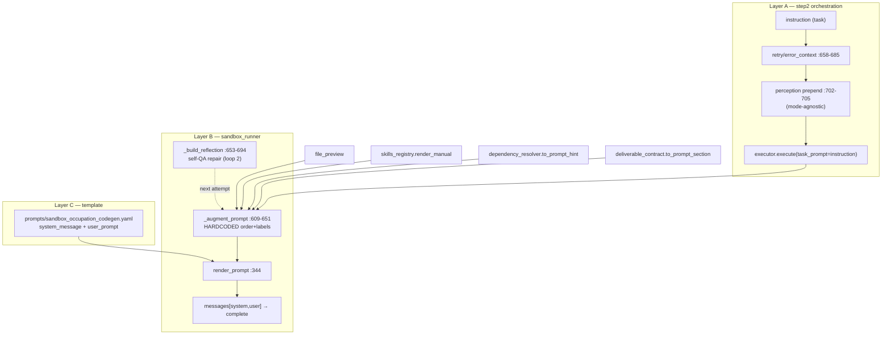
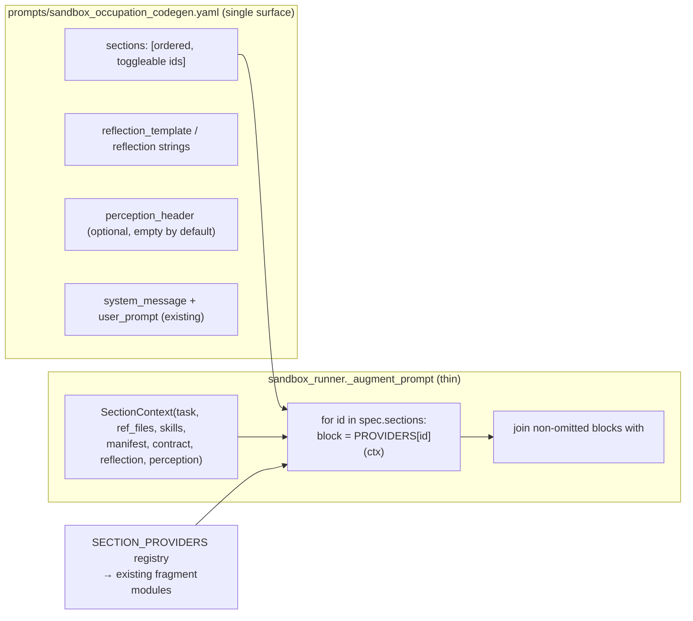
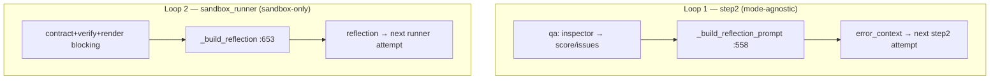

# Sandbox Prompt Consolidation — Single Authoring Surface (Design)

> **Scope:** sandbox execution mode only. `subprocess`, `code_interpreter`,
> `json_renderer` stay behavior-unchanged. Owner: Hyeonsang Jeon. Tracks under
> PR #57 (branch `hyeonsangjeon-sandbox-skills-multimodal-eval`) — this doc is a
> design artifact only; **no code is changed by this document**.

## TL;DR — biggest decisions & risks
- **Decision:** Make `core/sandbox_runner.py::_augment_prompt` a *thin assembler*
  that iterates an ordered `sections:` list authored in
  `prompts/sandbox_occupation_codegen.yaml`, filling each slot from a small
  `SectionProvider` registry. Order, labels, toggles, and reflection wording move
  to YAML; the fragment modules stay put. Alternate specs are selected via the
  **already-wired** `execution.sandbox.prompt_name` key — no new exp-YAML plumbing.
- **Biggest risk:** silent **byte drift** in the assembled prompt (separator/empty
  section semantics, `str.format` brace handling, and the step2↔runner perception
  interplay). Mitigated by a **mandatory P0 golden snapshot test** that is the
  arbiter of "zero default drift" before any extraction lands.
- **Do-not-do:** do **not** merge the two reflection loops — the step2 QA-retry
  loop is mode-agnostic; pulling its wording into a sandbox-only spec would change
  behavior for `subprocess`/`code_interpreter` and violate the scope constraint.

---

## 1. Goal & non-goals

**Goal.** One clear place — the sandbox prompt-spec YAML — where a researcher or
engineer authors *all* sandbox prompt structure: section wording, section order,
section toggles, the self-QA reflection/repair text, and the perception-injection
label. A researcher should be able to reorder/re-word without reading Python.

**Explicit goals**
- **Single authoring surface** for sandbox prompt text + order + labels + reflection.
- **Minimal experiment-YAML change** — reuse the existing prompt-override hook
  (`condition.prompt` prefix/body/suffix) and the existing spec selector
  (`execution.sandbox.prompt_name`); add nothing new unless it earns its keep.
- **Zero default behavior drift** — byte-identical assembled prompt for exp026 by
  default; a golden test enforces this in P0 before anything else lands.
- **Other executor modes untouched** — no signature/branch changes that alter
  `subprocess`, `code_interpreter`, or `json_renderer` output.

**Non-goals**
- Not changing *what* the fragment providers emit (skills manual, deps hint,
  contract section, previews, perception JSON). Only their **order/labels/presence**
  become spec-driven.
- Not unifying the two reflection loops into one source of truth (documented,
  deliberately deferred — see §8).
- Not touching the container/executor/security path, caching, or the output-QA
  render pipeline.
- Not restructuring `render_prompt`'s system/user precedence.

---

## 2. Current-state architecture (verified file:line)

The sandbox prompt is assembled across **three layers**.

**Layer A — orchestration: `batch-runner/step2_run_inference.py`**
- `step2:635` `instruction = task_info["instruction"]`.
- `step2:649-656` "legacy mode" manual prefix/body/suffix assembly (legacy only).
- `step2:658-685` retry paths: no-files feedback (`:662`), `[REFLECTION` prepend
  (`:671`, `error_context + instruction`, no `\n\n`), infra-error append (`:676`).
- `step2:71-163` `_run_preprocessors(...)` returns the perception prefix
  (`[AUDIO ANALYSIS]…`/`[VIDEO ANALYSIS]…`); `include_task_instruction` toggles at
  `:108` / `:134`.
- `step2:702-705` **mode-agnostic** prepend: `instruction = preprocessor_prefix +
  "\n\n" + instruction` (runs for *all* executor modes).
- `step2:737-744` `executor.execute(task_prompt=instruction,
  experiment_prompt=experiment_prompt, …)`.

**Layer B — runner: `batch-runner/core/sandbox_runner.py`**
- `run()` `:254`: `registry.select(...)` `:274`, `infer_deliverable_contract(...)`
  `:275`, attempt loop `:287-311` bounded by `repair_cfg.max_attempts` (default 1).
- `_run_attempt()` `:324`: `resolve(...)` deps manifest → `_augment_prompt()`
  `:341` → `render_prompt()` `:344` → `messages=[system,user]` `:350` →
  `complete(..., reasoning_effort=…)` `:354`.
- `_augment_prompt()` **`:609-651`** — hardcoded order, joined by `"\n\n"`:
  1. `reflection` (if any) 2. `build_file_structure_info(ref_files)`
  3. `registry.render_manual(skills)` 4. `manifest.to_prompt_hint()`
  5. `contract.to_prompt_section()` 6. `task_prompt`
  7. `generate_all_previews(ref_files)` 8. `available files` f-string.
  Emptiness rules differ per block (`if x:` for 1–4,7; unconditional for 5,6,8).
- `_build_reflection()` **`:653-694`** — hardcoded `[REFLECTION]…[/REFLECTION]`
  wording: blocking (`[:12]`), warnings (`[:6]`), `contract.to_prompt_section()`,
  sanitized stdout/stderr tails (`_sanitize_tail`, limit 800), prior code if
  `len ≤ 4000`. Fed to the **next attempt** (`reflection_for_next` `:416-418`).

**Layer C — template: `batch-runner/core/prompt_loader.py` + `prompts/sandbox_occupation_codegen.yaml`**
- `load_prompt()` `:36-69` requires keys `system_message`, `user_prompt` (`:64`).
- `render_prompt()` `:72-127`: system = codegen `system_message` wins (persona,
  `:100-106`); user = exp `prefix` + exp `body` + codegen `user_prompt` (with
  `{task_prompt}`) + exp `suffix` (`:109-122`). Uses `str.format` on **templates
  only**; exp `prefix/body/suffix` are `.strip()`+joined, **not** formatted.
- The sandbox YAML already externalizes system persona + a rich user template
  (SANDBOX & SKILLS, RULES, FORMAT, EXAMPLE, CONFIDENCE TAG, `TASK: {task_prompt}`).

**Fragment providers (each already isolated, returns a labeled block):**
`skills_registry.render_manual` (`:184`), `dependency_resolver.DependencyManifest.to_prompt_hint`
(`:233`), `deliverable_contract.DeliverableContract.to_prompt_section` (`:144`),
`file_preview.build_file_structure_info` (`:301`) + `generate_all_previews` (`:85`),
and the step2 perception producers `audio_analyzer` (label at `:126`/`:217`) /
`video_analyzer`.

**Spec-selection chain (already wired — key finding):**
`exp026 execution.sandbox.*` → `step2:946 sandbox_options = execution_cfg.get("sandbox")`
→ `step2:1038-1041 TaskExecutor(sandbox_options=…)` → `executor.py:89
prompt_name or opts.get("prompt_name") or DEFAULT_PROMPT` → `sandbox_runner:196
load_prompt(prompt_name)`.



**Two reflection loops (distinct, must not merge):**
1. **Loop 1 — step2, mode-agnostic:** `step2:_build_reflection_prompt(qa_score,
   qa_issues, qa_suggestion)` (`:558+`) driven by the experiment `qa:` block +
   `error_context` retry (`:658-685`). Runs for **every** executor mode.
2. **Loop 2 — runner, sandbox-only:** `sandbox_runner:_build_reflection` (`:653-694`)
   self-QA repair inside `max_attempts`.
Both emit `[REFLECTION…`-prefixed text but have **different producers and inputs**.

---

## 3. Pain points today

| Persona | To change… | They must touch | Why it's error-prone |
|---|---|---|---|
| Researcher | section **order** or a **label** | `sandbox_runner.py:609-651` (Python) | order is a hardcoded list; must edit code + not break `"\n\n".join` semantics |
| Researcher | the **repair reflection** wording | `sandbox_runner.py:653-694` (Python) | wording is interleaved with slicing/redaction logic; easy to break byte layout |
| Researcher | the **perception label** | `audio_analyzer.py:126/217`, `video_analyzer.py` | label lives in two producers; open/close tag pair; audio≠video |
| Engineer | add a new augmentation block | `_augment_prompt` + a provider module | insertion point, emptiness rule, and separator all hand-managed |
| Anyone | tune the persona/user template | `sandbox_occupation_codegen.yaml` | `str.format` **brace pitfalls** — a stray `{`/`}` in the template raises at render |

Net: a single conceptual change ("move perception above the contract") can require
edits in **2–3 files across two layers**, with no guardrail proving the output
didn't drift. The `str.format` brace trap (documented in the YAML header) is a
latent footgun whenever template text grows.

---

## 4. Target architecture — single authoring surface

The spec YAML becomes the **one place** that owns sandbox prompt *structure*. Python
becomes a thin, dumb assembler over a provider registry.



**`SectionProvider` abstraction.** Each provider is a pure function
`(ctx: SectionContext) -> Optional[str]`, where `None` means *omit this section*
(preserving today's per-block emptiness rules) and a string is emitted verbatim.
Providers are thin adapters over the **existing** modules — no fragment logic moves.

```python
# core/prompt_sections.py  (NEW, sandbox-only)
@dataclass(frozen=True)
class SectionContext:
    task_prompt: str
    ref_files: list[str]
    skills: object
    manifest: "DependencyManifest"
    contract: "DeliverableContract | None"
    reflection: str | None
    perception_text: str | None            # P3; None in P0-P2
    registry: "SkillsRegistry"

SECTION_PROVIDERS: dict[str, Callable[[SectionContext], str | None]] = {
    "reflection":       lambda c: c.reflection or None,
    "file_structure":   lambda c: build_file_structure_info(c.ref_files) or None,
    "skills_manual":    lambda c: c.registry.render_manual(c.skills) or None,
    "deps_hint":        lambda c: c.manifest.to_prompt_hint() or None,
    "contract":         lambda c: (c.contract.to_prompt_section()
                                   if c.contract is not None else None),
    "perception_analysis": lambda c: c.perception_text or None,   # P3
    "task":             lambda c: c.task_prompt,                  # always emit
    "previews":         lambda c: (generate_all_previews(c.ref_files) or None
                                   if c.ref_files else None),
    "available_files":  lambda c: (_available_files_line(c.ref_files)
                                   if c.ref_files else None),
}
```

**Spec-driven ordering/toggling.** `_augment_prompt` reads `prompt_data["sections"]`
(falling back to a Python `DEFAULT_SECTIONS` constant that reproduces today's order
for backward compatibility), iterates in order, skips `enabled: false` entries,
skips providers returning `None`, and joins with `"\n\n"`. An unknown id raises
loudly (fail-fast, never silently drops a section).

**Per-section input plumbing (no absolute-path leakage).** Providers read only
from `SectionContext`. `ref_files` are absolute host paths *inside the runner*, but
the providers that surface filenames already basename them (`available_files` uses
`os.path.basename`; previews render filename + structure, not host roots). Reflection
tails are already redacted by `_sanitize_tail` (`:93-107`). The context therefore
carries host paths only to feed `build_file_structure_info`/`generate_all_previews`,
which are responsible for emitting *sanitized* text — an invariant we lock with a
test asserting no `/Users/…`, temp roots, or `~` appear in the assembled prompt.

---

## 5. Concrete YAML spec schema + before/after

Extend `prompts/sandbox_occupation_codegen.yaml`. **Brace discipline:** every
template string below is `str.format`-ed **exactly once** with a fixed named-slot
dict; **slot VALUES are never re-parsed** (so dynamic content like stdout tails or
prior code may contain `{ }` safely). Literal braces *in the template text* must be
escaped `{{` `}}`. Keep code examples brace-free (as the current file already does).

```yaml
# ── NEW: ordered, toggleable section list (owns ORDER + PRESENCE) ──────────
# If this key is absent, the runner falls back to DEFAULT_SECTIONS (today's order).
sections:
  - id: reflection          # self-QA repair block (loop 2), first so model addresses it
  - id: file_structure      # build_file_structure_info(ref_files)
  - id: skills_manual       # registry.render_manual(skills) → "AVAILABLE SKILLS"
  - id: deps_hint           # manifest.to_prompt_hint() → "Likely libraries"
  - id: contract            # contract.to_prompt_section()
  # - id: perception_analysis   # ENABLED IN P3 (see §7); placed immediately before task
  - id: task                # the (possibly perception-prefixed in P0-P2) task text
  - id: previews            # generate_all_previews(ref_files)
  - id: available_files     # "Files available in the sandbox working directory: [...]"

# ── NEW: optional perception label (empty by default → byte-identical) ─────
# The analyzers already emit self-labeled [AUDIO ANALYSIS]…[/AUDIO ANALYSIS] /
# [VIDEO ANALYSIS] blocks that the exp026 system prompt references by name.
# Leave empty unless you deliberately want an extra wrapper (would double-label).
perception_header: ""

# ── NEW: reflection wording (owns loop-2 text only). Two supported shapes: ──
# (Recommended P1) STRING-TABLE — Python keeps the layout/slicing; only literals move:
reflection_strings:
  open_tag: "[REFLECTION]"
  close_tag: "[/REFLECTION]"
  intro: >-
    Your previous attempt did NOT satisfy the deliverable contract. Regenerate the
    COMPLETE solution and fix every issue below.
  blocking_title: "Blocking problems to fix:"
  warnings_title: "Secondary warnings (address if relevant):"
  stdout_title: "Previous stdout (tail):"
  stderr_title: "Previous stderr/error (tail):"
  prior_code_title: "Your previous code (fix and resend in full):"
  prior_code_fence: "----"

# (Optional, later) MONOLITHIC TEMPLATE — clearer to author, needs careful newline
# matching; Python pre-renders each optional block to "" or a full chunk, then ONE format:
# reflection_template: |
#   {open_tag}
#   {intro}
#
#   {blocking_title}
#   {blocking_errors}{warnings_block}
#   {contract_section}{stdout_block}{stderr_block}{prior_code_block}
#   {close_tag}
```

**Before/after `_augment_prompt`.**

```python
# BEFORE (core/sandbox_runner.py:609-651) — hardcoded order + emptiness + separators
def _augment_prompt(self, task_prompt, reference_files, skills, manifest,
                    contract=None, reflection=None) -> str:
    parts = []
    if reflection:
        parts.append(reflection)
    fsi = build_file_structure_info(reference_files or [])
    if fsi: parts.append(fsi)
    sm = self.registry.render_manual(skills)
    if sm: parts.append(sm)
    dh = manifest.to_prompt_hint()
    if dh: parts.append(dh)
    if contract is not None: parts.append(contract.to_prompt_section())
    parts.append(task_prompt)
    if reference_files:
        prev = generate_all_previews(reference_files)
        if prev: parts.append(prev)
        names = [os.path.basename(f) for f in reference_files]
        parts.append(f"📁 Files available in the sandbox working directory "
                     f"(use them directly): {names}")
    return "\n\n".join(parts)

# AFTER — thin, spec-driven; order/labels/toggles live in YAML
def _augment_prompt(self, task_prompt, reference_files, skills, manifest,
                    contract=None, reflection=None, perception_text=None) -> str:
    ctx = SectionContext(task_prompt, reference_files or [], skills, manifest,
                          contract, reflection, perception_text, self.registry)
    spec = self.prompt_data.get("sections") or DEFAULT_SECTIONS
    parts = []
    for entry in spec:
        if not entry.get("enabled", True):
            continue
        sid = entry["id"]
        provider = SECTION_PROVIDERS.get(sid)
        if provider is None:
            raise ValueError(f"Unknown prompt section id: {sid!r}")  # fail loud
        block = provider(ctx)
        if block is not None:                 # None == omit (preserves emptiness rules)
            parts.append(block)
    return "\n\n".join(parts)
```

> **Byte-identity note:** `DEFAULT_SECTIONS` = the 8 ids in the exact order above.
> The provider table reproduces each block's current emptiness rule (`or None` for
> 1–4/7, unconditional for `contract`/`task`/`available_files`). The P0 golden test
> is the arbiter that this matches `_augment_prompt` pre-refactor byte-for-byte.

---

## 6. Experiment-YAML impact (minimal)

**exp026 stays essentially unchanged.** The default spec ships the `sections:` and
reflection strings; exp026's `condition.prompt` (system/suffix) and
`execution.sandbox.*` are untouched. The audio/video `preprocessors:` and `qa:`
blocks are untouched.

**Two existing override paths cover researcher needs — no new keys required:**

1. **Wrap/inject text (unchanged hook):** `condition.prompt.prefix/body/suffix`
   still wraps the assembled user prompt via `render_prompt` (`:109-122`).
2. **Select a different structure (already wired):** point at an alternate spec file
   with **one line** — `execution.sandbox.prompt_name` flows through
   `step2:946 → executor.py:89 → load_prompt`:

```yaml
# exp026 (illustrative override — NOT needed for the default run)
execution:
  sandbox:
    prompt_name: "sandbox_occupation_codegen_reorder"   # alternate sections/wording
```

> Recommendation: **reuse `prompt_name`** as the spec selector. If a friendlier
> alias is desired, accept `execution.sandbox.prompt_spec` as a synonym in
> `executor.py` (`opts.get("prompt_name") or opts.get("prompt_spec")`) — a 1-line,
> additive, sandbox-only change. Do not invent a parallel loader.

---

## 7. Perception injection — options & recommendation

Today perception is a **mode-agnostic** prefix glued onto `instruction` at
`step2:702-705`, so it rides *inside* the `task` block (slot 6) of the assembled
prompt. Labels (`[AUDIO ANALYSIS]…[/AUDIO ANALYSIS]`, `[VIDEO ANALYSIS]…`) are
produced by the analyzers (`audio_analyzer.py:126/217`, `video_analyzer.py`), which
own the open/close tag pair and the per-modality wording.

| Option | What moves | Byte-identity | Touches other modes? | Single-surface win |
|---|---|---|---|---|
| **A — relocate to spec slot (recommended)** | ORDER+PRESENCE → spec `perception_analysis`; label stays with producer; step2 passes perception through for **sandbox only** | Provable (see below) | No — mode branch keeps non-sandbox prepend identical | High: perception becomes a real ordered/toggleable section |
| B — relocate + spec-owned label | also move label into `perception_header`; analyzers return raw JSON | Higher risk (analyzer return-contract change; single header can't express open/close + audio≠video) | No, but more surgery | Highest, but violates zero-drift ease |
| C — document in place | nothing moves; spec only *documents* that perception heads the task | Trivially identical | No | Low: order/presence not actually spec-controlled |

**Recommended: Option A.** Rationale + byte proof:

- Today (sandbox path): runner receives `task_prompt = perception + "\n\n" +
  error_context + instruction`; assembled as `… contract \n\n [perception \n\n
  error_context+instruction] \n\n previews …`.
- Under A: step2 stops prepending **for sandbox mode only**, passes `perception_text`
  through `executor.execute → run → _augment_prompt`; the spec places
  `perception_analysis` immediately **before** `task`, joined by `"\n\n"`. Result:
  `… contract \n\n perception \n\n (error_context+instruction) \n\n previews …`
  — **identical bytes** (perception is the outermost prefix in both).
- **Other modes untouched:** keep the `step2:702-705` prepend for
  non-sandbox modes (a `if execution_mode == "sandbox": pass_through else: prepend`
  branch). Add `perception_text: Optional[str] = None` to `executor.execute` and
  `SandboxRunner.run`; other runners simply ignore it (no branch/behavior change).
- **`perception_header` stays empty by default** — the analyzers already emit
  self-labeled blocks that the exp026 system prompt references by name
  (`exp026:148-156`); a non-empty header would double-label and drift.

Ship A in **P3**, gated behind the golden harness, with a fixture that includes a
retry/`error_context` **and** perception (the interplay is the sharp edge).

---

## 8. Reflection-loop reconciliation

There are **two independent producers** of `[REFLECTION…`-shaped text:

| | Loop 1 (step2) | Loop 2 (sandbox_runner) |
|---|---|---|
| Fn | `_build_reflection_prompt` `:558+` + `error_context` `:658-685` | `_build_reflection` `:653-694` |
| Driver | experiment `qa:` block (score/issues/suggestion) + infra retries | contract/verify/render blocking errors |
| Consumed by | next **step2 attempt** as `error_context` | next **runner attempt** as `reflection` |
| Scope | **mode-agnostic** (all executors) | **sandbox-only** |



**Recommendation: keep them separate; give only Loop 2 a spec home in P1.**
- The spec `reflection_strings`/`reflection_template` owns **Loop 2 only**.
- **Do NOT** move Loop 1 wording into the sandbox spec: Loop 1 runs for
  `subprocess`/`code_interpreter` too, so coupling it to a sandbox-only file would
  change those modes' retry text — a direct scope violation.
- Document both in the spec header comment so an author isn't surprised that editing
  `reflection_strings` doesn't touch the step2 QA-retry text.
- **Risk if ignored:** an author edits `reflection_strings` expecting all retry
  prompts to change; only Loop 2 changes. Mitigate with an explicit header note and
  a naming that says "sandbox self-QA repair (loop 2)".
- **Optional future (out of scope):** a shared `reflection_templates:` map keyed by
  loop, loaded by both step2 and the runner — only worth it if Loop 1 also migrates
  to a per-mode spec, which is a separate initiative.

---

## 9. Phased migration plan (independently shippable)

Each phase is small, reversible, and green-before-next. **P0 is mandatory first.**

### P0 — Golden snapshot harness (no behavior change)
- **Scope:** capture the *current* `_augment_prompt` and `_build_reflection` output
  byte-for-byte on fixtures; add the test that will guard every later phase.
- **Files:** `tests/test_sandbox_prompt_golden.py` (new), `tests/fixtures/prompt/*`
  (canned skills/manifest/contract/ref-file previews/reflection inputs).
- **Test:** assert assembled prompt == stored golden for (a) doc-only task,
  (b) audio+video+doc task, (c) repair attempt with reflection + error_context.
- **Rollback:** delete test file; zero prod impact.

### P1 — Extract Loop-2 reflection wording → `reflection_strings`
- **Scope:** `_build_reflection` reads literals from `prompt_data["reflection_strings"]`
  (fallback to current constants); Python keeps slicing/redaction/layout.
- **Files:** `core/sandbox_runner.py`, `prompts/sandbox_occupation_codegen.yaml`.
- **Test:** P0 golden (byte-identical) + a unit test that overriding a string
  changes exactly that literal.
- **Rollback:** revert the file read to inline constants; YAML key is inert.

### P2 — Spec-driven section ordering (`sections:` + `SECTION_PROVIDERS`)
- **Scope:** introduce `core/prompt_sections.py`, `SectionContext`,
  `SECTION_PROVIDERS`, `DEFAULT_SECTIONS`; convert `_augment_prompt` to the thin loop.
- **Files:** `core/prompt_sections.py` (new), `core/sandbox_runner.py`,
  `prompts/sandbox_occupation_codegen.yaml`.
- **Test:** P0 golden unchanged; new tests for reorder/toggle and *unknown id →
  raises*; schema-key assertions.
- **Rollback:** `sections:` absent ⇒ `DEFAULT_SECTIONS` path ⇒ identical to pre-P2.

### P3 — Perception label unification (Option A)
- **Scope:** add `perception_analysis` provider + `perception_header` (empty
  default); step2 passes perception through for **sandbox only**, keeps prepend for
  other modes; enable the section in the shipped spec.
- **Files:** `step2_run_inference.py` (mode branch at the perception injection),
  `core/executor.py` (+`perception_text` kwarg), `core/sandbox_runner.py`,
  `prompts/sandbox_occupation_codegen.yaml`.
- **Test:** P0 golden re-baselined with the paired proof (perception+retry fixture);
  a test asserting **non-sandbox** instruction bytes are unchanged.
- **Rollback:** disable the `perception_analysis` section + revert step2 branch to
  unconditional prepend.

### P4 — Docs & authoring guide
- **Scope:** spec header comments (brace rules, two-loops note), a short
  `prompts/README` "how to author a sandbox spec", cross-links in exp026 comments.
- **Files:** docs/comments only.
- **Test:** none (doc); optional `str.format` self-render smoke on the shipped spec.
- **Rollback:** trivial.

---

## 10. Risk analysis & mitigations

| Risk | Likelihood | Mitigation |
|---|---|---|
| **Byte drift** in assembled prompt (separators, per-block emptiness) | Med | P0 golden test is the gate; providers return `None` to preserve exact emptiness rules; `DEFAULT_SECTIONS` fallback for missing key |
| **`str.format` brace injection** from dynamic content (stdout/prior code with `{ }`) | Med | Format each template **once** with named slots; dynamic values are passed as arguments (never re-parsed); escape literal braces `{{`; keep code examples brace-free; add a test formatting the reflection template with a `{payload}`-laden tail |
| **Section-input plumbing regression** (perception threaded wrong) | Med | Optional `perception_text` kwarg, default `None`, ignored by other runners; mode branch in step2; test asserting non-sandbox bytes unchanged |
| **Unknown/misordered section silently dropped** | Low | Assembler raises on unknown id; schema-key test; toggles are explicit `enabled: false` |
| **Test flakiness** (LibreOffice/vision/Docker) | Low | Golden path is model-free via local fallback (`use_docker="never"`, `complete` patched, as existing `test_sandbox_runner.py` does); vision QA already `enabled: false` in exp026 |
| **Privacy leakage** (`/Users/…`, temp roots, session-state, testenv, emails) into prompts/manifest | Med | `_sanitize_tail` redaction retained; `available_files` basenames; add an assertion that the assembled prompt and manifest contain no host roots / `~` / email-like tokens |
| **Coupling Loop 1 into sandbox spec** breaks other modes | Low (if guarded) | §8 explicitly forbids it; header note; scope test |

---

## 11. Test strategy

- **Golden byte-identical assembly (P0, mandatory):** fixture task set = {doc-only,
  audio+video+doc, repair-with-reflection+error_context}. Assert
  `_augment_prompt(...) == golden` and full `render_prompt` user message ==
  golden. Model-free (patch `complete`, `use_docker="never"`), mirroring
  `tests/test_sandbox_runner.py`.
- **Per-section unit tests:** each provider returns expected text / `None` on empty
  inputs; reorder changes only order; `enabled: false` omits a section;
  perception slot emits only when `perception_text` present.
- **Schema-key assertions:** `load_prompt` still enforces `system_message`,
  `user_prompt`; new `sections` entries validate against the known id set;
  `reflection_strings` keys present or fall back cleanly.
- **Fail-loud guard:** unknown section id → `ValueError`; a mis-typed id in a test
  spec must raise, not silently drop.
- **Brace-safety test:** format the reflection template with a stdout tail
  containing `"{oops} {0} {task_prompt}"` and prior code with dict/set literals;
  assert no exception and literal preservation.
- **Privacy guard:** assert assembled prompt + `manifest.json` contain no
  `/Users/`, temp roots, `~`, or `user@host`-style tokens.
- **Other-modes invariance:** run a non-sandbox path and assert the `instruction`
  bytes (with perception) are unchanged by P3.

---

## 12. Definition of done & open questions

**Definition of done**
- [ ] P0 golden test committed and green; it fails if any later phase drifts a byte.
- [ ] `_augment_prompt` is a thin spec-driven loop; order/labels/toggles live in
      `prompts/sandbox_occupation_codegen.yaml`.
- [ ] Loop-2 reflection wording authored in the spec; Loop 1 documented and untouched.
- [ ] Perception is a spec-controlled, ordered section (Option A) with byte-identity
      proven; non-sandbox modes verified unchanged.
- [ ] exp026 runs byte-identical by default; a one-line `prompt_name` override
      selects an alternate spec.
- [ ] `subprocess`/`code_interpreter`/`json_renderer` tests unchanged and green.
- [ ] Authoring guide (P4) explains brace rules and the two reflection loops.
- [ ] PR #57 remains open; changes land as additive commits on the sandbox branch.

**Resolved decisions (owner, 2026-07-07)**
1. **Spec selector:** Keep the existing `execution.sandbox.prompt_name` **only** —
   no `prompt_spec` synonym. Zero new experiment-YAML wiring; avoids duplicate keys.
2. **Reflection shape:** Ship P1 as the safe **string-table** (Python keeps
   layout/slicing/redaction; only literals move to YAML). Promote to a monolithic
   `reflection_template` later only if authors ask for it.
3. **Perception depth:** **Option A** — analyzers keep their self-labeled
   `[AUDIO ANALYSIS]`/`[VIDEO ANALYSIS]` blocks; sandbox receives that text as a
   named `perception_analysis` section and controls only placement/order. No
   analyzer return-contract change; non-sandbox modes untouched.
4. **Golden fixtures:** **Four** — audio `4b894ae3` + 4K video `a941b6d8` (both
   already run locally), one **doc-only/no-reference** task (covers empty
   perception/preview sections), and one **accounting/spreadsheet** task (covers
   contract extension inference). The concrete xlsx task id is picked during P0
   from local reference-heavy data.
5. **Section-toggle exposure:** **Spec-only for now** (YAGNI). Section on/off lives
   in the prompt-spec YAML; per-run A/B is done via an alternate spec selected with
   `prompt_name`. Do not add an experiment-YAML `sections` override layer until
   there is real demand.

---

### Suggested `task.md` entry

```markdown
### Phase 0-4: Sandbox Prompt Consolidation (single authoring surface)
- **Decision:** Move sandbox prompt ORDER + LABELS + TOGGLES + loop-2 reflection
  wording into prompts/sandbox_occupation_codegen.yaml; make _augment_prompt a thin
  spec-driven assembler over a SectionProvider registry. Reuse the already-wired
  execution.sandbox.prompt_name selector; keep other modes and Loop-1 untouched.
- **Critical Path:**
  - [ ] P0: golden byte-identical assembly test (doc / audio+video+doc / repair) — model-free
  - [ ] P1: extract loop-2 reflection literals → reflection_strings (golden stays green)
  - [ ] P2: sections: + SECTION_PROVIDERS + DEFAULT_SECTIONS; unknown id raises
  - [ ] P3: perception_analysis section (Option A) + step2 sandbox-only pass-through; verify non-sandbox bytes unchanged
  - [ ] P4: authoring guide (brace rules, two-loop note); exp026 byte-identical by default
```
